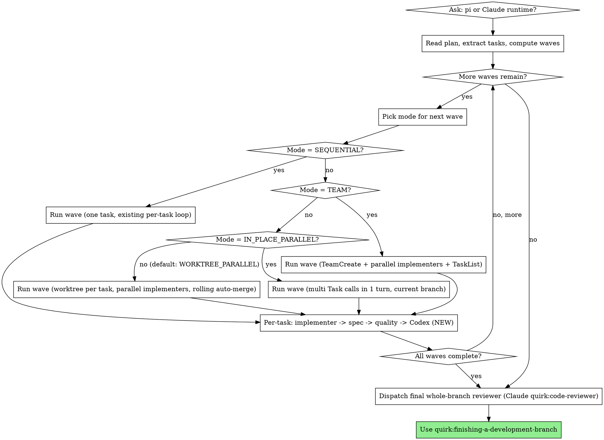

# SDD `/design:implement` Feature Port — Implementation Plan

> **Historical plan (completed).** Predates the `quirk:writing-plans` Contract+Acceptance format; its embedded code is preserved as a record and is **not** a template for new plans.

> **For agentic workers:** REQUIRED SUB-SKILL: Use quirk:subagent-driven-development (recommended) or quirk:executing-plans to implement this plan task-by-task. Steps use checkbox (`- [ ]`) syntax for tracking.

**Goal:** Port adaptive parallel execution and Codex adversarial review from `/design:implement` into the `quirk:subagent-driven-development` skill (with worktree-isolated parallel as a third execution mode), and add an optional plan-format extension to `quirk:writing-plans` for declaring task independence and scope.

**Architecture:** This is a documentation-only change to two skill files (`subagent-driven-development/SKILL.md`, `writing-plans/SKILL.md`) plus four new prompt-template asset files. No code is added. The "tests" for each task are validation checks: file existence, section presence, cross-reference resolution, frontmatter integrity. The implementation is self-bootstrapping: the new parallel modes won't exist until this plan completes, so this plan itself runs under existing **sequential** SDD.

**Tech Stack:** Markdown skill files. Validation via `test`, `grep`, `awk`. No runtime dependencies introduced.

**Spec:** `docs/specs/2026-05-08-sdd-design-implement-port-design.md`

---

## File Structure

| Path | Status | Responsibility |
|---|---|---|
| `skills/subagent-driven-development/assets/codex-adversarial-prompt.md` | NEW | Claude-path Codex adversarial reviewer prompt template (PAL clink invocation) |
| `skills/subagent-driven-development/assets/pi-codex-adversarial-prompt.md` | NEW | Pi-path Codex adversarial reviewer prompt template (`pi -p` codex, read-only) |
| `skills/subagent-driven-development/assets/merge-resolver-prompt.md` | NEW | Claude-path merge resolver subagent template (worktree mode only) |
| `skills/subagent-driven-development/assets/pi-merge-resolver-prompt.md` | NEW | Pi-path merge resolver subagent template (worktree mode only) |
| `skills/subagent-driven-development/SKILL.md` | MODIFIED | Adds wave compute step, four-mode decision tree, mode mechanics, Codex review pass, merge resolver references; updates Runtime, Prompts, Red Flags, Fallback, Integration sections |
| `skills/writing-plans/SKILL.md` | MODIFIED | Documents the optional task fields (`independent`, `dependencies`, `scope.files`, `cooperative`) |
| `skills/subagent-driven-development/assets/implementer-prompt.md` | UNCHANGED | — |
| `skills/subagent-driven-development/assets/spec-reviewer-prompt.md` | UNCHANGED | — |
| `skills/subagent-driven-development/assets/code-quality-reviewer-prompt.md` | UNCHANGED | — |
| `skills/subagent-driven-development/assets/pi-implementer-prompt.md` | UNCHANGED | — |
| `skills/subagent-driven-development/assets/pi-spec-reviewer-prompt.md` | UNCHANGED | — |
| `skills/subagent-driven-development/assets/pi-code-quality-reviewer-prompt.md` | UNCHANGED | — |

All paths are relative to the quirk plugin root: `/Users/zpyoung/ProjectWorkspaces/quirk-workspace/quirk/`.

## Task Independence (for future re-runs under wave-mode SDD)

Once the parallel modes built by this plan are in place, a future re-run of similar work could use the `independent: true` and `scope.files` flags. Declared here for dogfooding documentation:

- **Tasks 1–4** are mutually independent (different files, no shared state). They form a parallel wave eligible for `WORKTREE_PARALLEL` or `IN_PLACE_PARALLEL` mode.
- **Tasks 5–10** all modify `skills/subagent-driven-development/SKILL.md`. They share scope; they must run sequentially.
- **Task 11** is independent of Tasks 5–10 (different file).
- **Task 12** depends on all prior tasks completing.

For this initial run under existing SDD, every task runs sequentially.

---

## Task 1: Create `codex-adversarial-prompt.md` (Claude path)

**Files:**
- Create: `skills/subagent-driven-development/assets/codex-adversarial-prompt.md`

**Independence:** `independent: true`. Scope: this single new file.

- [ ] **Step 1: Confirm the target path is empty**

```bash
test ! -e skills/subagent-driven-development/assets/codex-adversarial-prompt.md && echo "OK: path is free" || echo "FAIL: file exists"
```
Expected: `OK: path is free`

- [ ] **Step 2: Write the file**

Create `skills/subagent-driven-development/assets/codex-adversarial-prompt.md` with this exact content:

```markdown
# Codex Adversarial Reviewer Prompt Template

Use this template when dispatching the **third per-task review pass** — the Codex adversarial reviewer.

**Purpose:** Find gaps between the task spec and its implementation that the spec-compliance and code-quality reviewers may have missed. Adversarial: only critique, never validate.

**Only dispatch after both spec compliance review and code quality review have passed.**

**Fix loop cap:** 2 cycles. After two cycles of CRITICAL/HIGH findings, remaining issues carry forward to the final whole-branch reviewer (do not block the task indefinitely).

## Invocation

```
mcp__pal__clink:
  cli_name: "codex"
  role: "codereviewer"
  absolute_file_paths: [<every file the implementer created or modified for this task>]
  prompt: |
    You are an adversarial code reviewer for a single task in an implementation plan.
    Find GAPS between the task spec and its implementation. Do NOT validate — only critique.

    IMPORTANT: You have the actual implementation files via absolute_file_paths.
    You MUST read and inspect the code directly. Do NOT trust worker self-reports —
    verify every claim against the files.

    ## Task Spec
    Title: [task title]
    Body: [full task body from plan — paste verbatim]
    Files declared: [list from task]

    ## Implementer Self-Report
    [paste implementer's structured output]

    ## Prior Reviewer Outputs
    Spec compliance: [verdict + summary]
    Code quality: [verdict + summary]

    ## Review Protocol
    For EACH requirement in the task body:
    1. Find the file:line where it's implemented — cite evidence.
    2. Verify the implementation matches task intent.
    3. Check for hidden complexities (over-engineering, unrequested features).
    4. Check error handling and edge cases.
    5. Verify any cross-file consistency the task implies.

    If a claim cannot be located in the files, rate as CRITICAL.
    If a previous reviewer's PASS verdict appears unsupported by the files, flag as HIGH.

    ## Output Format
    For each finding:
    SEVERITY: [CRITICAL | HIGH | MEDIUM | LOW]
    REQUIREMENT: [which task requirement, if applicable]
    FILE: [file path and line range]
    FINDING: [what's wrong, 1-2 sentences]
    SUGGESTED_FIX: [how to fix, 1-2 sentences]

    End with:
    SUMMARY: [total counts per severity]
    VERDICT: [PASS | NEEDS_FIXES | CRITICAL_ISSUES]
```

## Handling the verdict

- **PASS / LOW only:** mark task complete (or, in `WORKTREE_PARALLEL` mode, proceed to rolling auto-merge).
- **NEEDS_FIXES (MEDIUM):** note in the final report; do not block task completion.
- **NEEDS_FIXES / CRITICAL_ISSUES (CRITICAL or HIGH):** dispatch the **same implementer subagent** with the findings. Re-run Codex. Repeat up to **2 cycles** total. After cycle 2, mark the task complete with unresolved findings flagged for the final whole-branch reviewer.
```

- [ ] **Step 3: Verify file structure**

```bash
test -f skills/subagent-driven-development/assets/codex-adversarial-prompt.md && \
  grep -q "^# Codex Adversarial Reviewer Prompt Template$" skills/subagent-driven-development/assets/codex-adversarial-prompt.md && \
  grep -q "mcp__pal__clink:" skills/subagent-driven-development/assets/codex-adversarial-prompt.md && \
  grep -q "Fix loop cap" skills/subagent-driven-development/assets/codex-adversarial-prompt.md && \
  echo "OK"
```
Expected: `OK`

- [ ] **Step 4: Commit**

```bash
git add skills/subagent-driven-development/assets/codex-adversarial-prompt.md
git commit -m "feat(sdd): add Claude-path Codex adversarial reviewer prompt template"
```

---

## Task 2: Create `pi-codex-adversarial-prompt.md` (Pi path)

**Files:**
- Create: `skills/subagent-driven-development/assets/pi-codex-adversarial-prompt.md`

**Independence:** `independent: true`. Scope: this single new file.

- [ ] **Step 1: Confirm the target path is empty**

```bash
test ! -e skills/subagent-driven-development/assets/pi-codex-adversarial-prompt.md && echo "OK: path is free" || echo "FAIL: file exists"
```
Expected: `OK: path is free`

- [ ] **Step 2: Write the file**

Create `skills/subagent-driven-development/assets/pi-codex-adversarial-prompt.md` with this exact content:

```markdown
# Pi Codex Adversarial Reviewer Dispatch Template

Use this when the runtime is **pi** (see SKILL.md → Runtime Selection).

The Codex adversarial reviewer model is **pi codex** (`openai-codex/gpt-5.3-codex:xhigh`), invoked read-only.

**Only dispatch after both pi spec compliance review and pi code quality review have passed.**

**Fix loop cap:** 2 cycles. After two cycles of CRITICAL/HIGH findings, remaining issues carry forward to the final whole-branch reviewer (Claude `quirk:code-reviewer`, regardless of runtime).

## Prompt body

The Claude path uses `mcp__pal__clink` with the codex codereviewer role (see
`codex-adversarial-prompt.md`). The pi path needs the same review prompt
inlined, because pi has no awareness of PAL clink role definitions.

Build the prompt body using the same review protocol as the Claude path:

- `TASK_TITLE`: from the task in the plan
- `TASK_BODY`: full task body, pasted verbatim
- `FILES_DECLARED`: list of files the task body declared as in scope
- `IMPLEMENTER_REPORT`: the implementer's structured self-report
- `SPEC_REVIEW`: verdict + summary from the spec compliance reviewer
- `QUALITY_REVIEW`: verdict + summary from the code quality reviewer

The prompt MUST instruct the reviewer to:

- Read the actual implementation files (pi codex has filesystem access via
  `--tools read,bash`); do not trust the implementer self-report blindly.
- For each task requirement, find the file:line where it's implemented and
  cite evidence.
- Flag CRITICAL when a claim cannot be located in the files.
- Flag HIGH when a previous reviewer's PASS appears unsupported.
- Output SEVERITY-tagged findings with REQUIREMENT / FILE / FINDING /
  SUGGESTED_FIX, ending with SUMMARY (counts per severity) and VERDICT
  (`PASS | NEEDS_FIXES | CRITICAL_ISSUES`).

End the prompt with: "Be adversarial. Do NOT validate — only critique."

## Invocation

Write the assembled prompt body to `codex-adversarial-prompt.md` in the
worktree, then:

```bash
cd <worktree>
pi -p \
  --no-session \
  --offline \
  --model openai-codex/gpt-5.3-codex:xhigh \
  --tools read,bash \
  @codex-adversarial-prompt.md
```

`--tools read,bash` keeps the reviewer read-only. The prompt body forbids
modifications.

For the hardened multi-arg recipe, see **quirk:pi-dev → Canonical headless
dispatch recipe**.

## Output parsing

The reviewer's final message contains SEVERITY-tagged findings and a final
SUMMARY + VERDICT line. Parse pi's stdout for that structure.

If pi's response is unparseable, apply **quirk:pi-dev → Reviewer JSON parse
fallback** (cascade: whole-message JSON → fenced block → balanced braces →
synthesize a NEEDS_FIX verdict). Never count an unparseable response as PASS.

## Handling the verdict

Same as the Claude path:

- **PASS / LOW only:** mark task complete (or proceed to rolling auto-merge in
  `WORKTREE_PARALLEL` mode).
- **NEEDS_FIXES (MEDIUM):** note in the final report; do not block.
- **CRITICAL or HIGH:** dispatch the same pi implementer subagent with the
  findings; re-run pi codex review. Cap: 2 cycles total.

## Failure detection

Apply **quirk:pi-dev → Failure detection** rules. On auth/billing failure,
fall back to Claude (PAL clink codex) for the rest of the plan
(SKILL.md → Fallback).
```

- [ ] **Step 3: Verify file structure**

```bash
test -f skills/subagent-driven-development/assets/pi-codex-adversarial-prompt.md && \
  grep -q "^# Pi Codex Adversarial Reviewer Dispatch Template$" skills/subagent-driven-development/assets/pi-codex-adversarial-prompt.md && \
  grep -q "openai-codex/gpt-5.3-codex:xhigh" skills/subagent-driven-development/assets/pi-codex-adversarial-prompt.md && \
  grep -q "tools read,bash" skills/subagent-driven-development/assets/pi-codex-adversarial-prompt.md && \
  grep -q "quirk:pi-dev" skills/subagent-driven-development/assets/pi-codex-adversarial-prompt.md && \
  echo "OK"
```
Expected: `OK`

- [ ] **Step 4: Commit**

```bash
git add skills/subagent-driven-development/assets/pi-codex-adversarial-prompt.md
git commit -m "feat(sdd): add pi-path Codex adversarial reviewer dispatch template"
```

---

## Task 3: Create `merge-resolver-prompt.md` (Claude path)

**Files:**
- Create: `skills/subagent-driven-development/assets/merge-resolver-prompt.md`

**Independence:** `independent: true`. Scope: this single new file.

- [ ] **Step 1: Confirm the target path is empty**

```bash
test ! -e skills/subagent-driven-development/assets/merge-resolver-prompt.md && echo "OK: path is free" || echo "FAIL: file exists"
```
Expected: `OK: path is free`

- [ ] **Step 2: Write the file**

Create `skills/subagent-driven-development/assets/merge-resolver-prompt.md` with this exact content:

```markdown
# Merge Resolver Subagent Prompt Template (Claude path)

Use this template when `git merge` reports overlapping-hunk conflicts during the rolling auto-merge phase of `WORKTREE_PARALLEL` mode.

**Purpose:** Resolve true merge conflicts (overlapping line edits between two task branches) so the orchestrator can complete the rolling merge without escalating to the user.

**Triggered when:** `git merge --no-ff <task-branch>` exits non-zero AND `git status` reports `Unmerged paths`.

**Not triggered when:** Two tasks merely touched the same file with non-overlapping hunks. Git resolves those automatically; the resolver is not needed.

## Invocation

```
Task tool (general-purpose):
  description: "Resolve merge conflict between [branch-a] and [branch-b]"
  prompt: |
    You are a merge conflict resolver. The orchestrator has attempted to merge a
    completed task's branch into the parent branch and git reports overlapping-hunk
    conflicts. Resolve them so the merge can complete cleanly.

    ## Conflict Context

    Parent branch: [parent-branch-name]
    Incoming branch: [task-branch-name]
    Incoming task title: [task title]
    Incoming task body: [full task body — paste verbatim]

    ## Other branches already merged in this wave
    [list of (task-id, task title) tuples for branches that were already merged
     into the parent branch ahead of this one]

    ## Conflict markers

    Working directory: [absolute path to the repo / worktree where the merge was attempted]

    Files with conflicts (verify with `git status`):
    [list of files reported by `git diff --name-only --diff-filter=U`]

    ## Your Job

    1. Run `git status` and `git diff` to inspect the conflict markers.
    2. For each conflicted file:
       - Read both sides of the conflict (`<<<<<<<`, `=======`, `>>>>>>>` markers).
       - Read the full file with markers removed for context (consult both parent
         branch's prior commit and the incoming branch's commit if needed).
       - Decide the correct resolution. Both task bodies are authoritative; merge
         the intent of both, not just text.
       - Edit the file to remove conflict markers and produce a coherent result.
    3. Stage the resolved files: `git add <files>`.
    4. Complete the merge: `git commit --no-edit` (preserves the merge commit
       message git generated, augmented with a one-line resolution summary).

    ## Rules

    - Do NOT modify code beyond conflict resolution. If you find latent bugs in
      either branch, note them in your report — don't fix them here.
    - Do NOT fall back to "accept theirs" / "accept ours" wholesale unless one
      side is clearly a strict superset (rare).
    - If a conflict requires reconciling semantically incompatible designs that
      neither task body anticipated, STOP and report UNRESOLVABLE — do not
      paper over the disagreement.

    ## Report Format

    Status: SUCCESS | UNRESOLVABLE
    Files resolved: [comma-separated paths]
    Resolution summary: [1-3 sentences explaining how each conflict was resolved]
    Concerns: [any latent-bug observations, or empty]

    If UNRESOLVABLE:
    - Do NOT commit the merge.
    - Leave conflict markers in place.
    - Explain why both task bodies cannot be satisfied simultaneously.
```

## Handling the result

- **SUCCESS:** orchestrator continues with the next branch in the rolling merge sequence; teardown the merged worktree via `quirk:using-git-worktrees`.
- **UNRESOLVABLE:** orchestrator escalates to the user. The worktree and the conflicted state are preserved. The user can resolve manually, abort the wave, or split the conflicting task into smaller pieces and re-run.
```

- [ ] **Step 3: Verify file structure**

```bash
test -f skills/subagent-driven-development/assets/merge-resolver-prompt.md && \
  grep -q "^# Merge Resolver Subagent Prompt Template (Claude path)$" skills/subagent-driven-development/assets/merge-resolver-prompt.md && \
  grep -q "WORKTREE_PARALLEL" skills/subagent-driven-development/assets/merge-resolver-prompt.md && \
  grep -q "UNRESOLVABLE" skills/subagent-driven-development/assets/merge-resolver-prompt.md && \
  echo "OK"
```
Expected: `OK`

- [ ] **Step 4: Commit**

```bash
git add skills/subagent-driven-development/assets/merge-resolver-prompt.md
git commit -m "feat(sdd): add Claude-path merge resolver subagent prompt template"
```

---

## Task 4: Create `pi-merge-resolver-prompt.md` (Pi path)

**Files:**
- Create: `skills/subagent-driven-development/assets/pi-merge-resolver-prompt.md`

**Independence:** `independent: true`. Scope: this single new file.

- [ ] **Step 1: Confirm the target path is empty**

```bash
test ! -e skills/subagent-driven-development/assets/pi-merge-resolver-prompt.md && echo "OK: path is free" || echo "FAIL: file exists"
```
Expected: `OK: path is free`

- [ ] **Step 2: Write the file**

Create `skills/subagent-driven-development/assets/pi-merge-resolver-prompt.md` with this exact content:

```markdown
# Pi Merge Resolver Dispatch Template

Use this when the runtime is **pi** (see SKILL.md → Runtime Selection) AND
`git merge --no-ff <task-branch>` reports overlapping-hunk conflicts during
the rolling auto-merge phase of `WORKTREE_PARALLEL` mode.

The merge resolver model is **pi codex** (`openai-codex/gpt-5.3-codex:xhigh`),
invoked with full edit/commit tools.

**Triggered when:** `git merge` exits non-zero AND `git status` reports
`Unmerged paths`.

**Not triggered when:** Two tasks merely touched the same file with
non-overlapping hunks (git auto-resolves those).

## Prompt body

The Claude path uses the `Task` tool with a general-purpose subagent (see
`merge-resolver-prompt.md`). The pi path inlines the same instructions.

Build the prompt body with the following placeholders:

- `PARENT_BRANCH`: name of the branch the merge target lives on
- `TASK_BRANCH`: name of the task branch being merged in
- `TASK_TITLE`: incoming task's title
- `TASK_BODY`: incoming task's full body, pasted verbatim
- `ALREADY_MERGED`: list of (task-id, title) tuples already merged in this wave
- `WORKDIR`: absolute path to the worktree where the merge was attempted
- `CONFLICTED_FILES`: output of `git diff --name-only --diff-filter=U`

The prompt MUST instruct the resolver to:

- Inspect conflicts via `git status` and `git diff`.
- Read both sides of each conflict marker, plus surrounding context.
- Decide the correct resolution that satisfies BOTH task bodies' intent.
- Edit files to remove conflict markers; stage with `git add`; complete via
  `git commit --no-edit`.
- Refuse to "accept theirs" / "accept ours" wholesale unless one side is a
  clear strict superset.
- Report `UNRESOLVABLE` (no commit, markers left in place) if the two task
  bodies are semantically incompatible.

End the prompt with: "Output `Status: SUCCESS | UNRESOLVABLE`, `Files resolved`,
`Resolution summary`, `Concerns`."

## Invocation

Write the assembled prompt body to `merge-resolver-prompt.md` in the worktree,
then:

```bash
cd <worktree>
pi -p \
  --no-session \
  --offline \
  --model openai-codex/gpt-5.3-codex:xhigh \
  --tools read,bash,edit,write \
  @merge-resolver-prompt.md
```

`--tools read,bash,edit,write` is required: the resolver must edit files and
run git commands. (Contrast with the read-only reviewer tools.)

For the hardened multi-arg recipe, see **quirk:pi-dev → Canonical headless
dispatch recipe**.

## Output parsing

The resolver's final message contains a `Status:` line followed by `Files
resolved:`, `Resolution summary:`, and `Concerns:`. Parse pi's stdout for
that structure.

If pi's response is unparseable, apply **quirk:pi-dev → Reviewer JSON parse
fallback** to extract a structured verdict. Treat anything other than a clear
SUCCESS as UNRESOLVABLE — do not silently proceed.

## Handling the result

Same as the Claude path:

- **SUCCESS:** orchestrator continues with the next branch in the rolling
  merge sequence; teardown the merged worktree via `quirk:using-git-worktrees`.
- **UNRESOLVABLE:** orchestrator escalates to the user with the resolver's
  report. Worktree and conflicts are preserved.

## Failure detection

Apply **quirk:pi-dev → Failure detection** rules. On auth/billing failure,
fall back to the Claude merge resolver (`Task` general-purpose) for the rest
of the plan (SKILL.md → Fallback).
```

- [ ] **Step 3: Verify file structure**

```bash
test -f skills/subagent-driven-development/assets/pi-merge-resolver-prompt.md && \
  grep -q "^# Pi Merge Resolver Dispatch Template$" skills/subagent-driven-development/assets/pi-merge-resolver-prompt.md && \
  grep -q "openai-codex/gpt-5.3-codex:xhigh" skills/subagent-driven-development/assets/pi-merge-resolver-prompt.md && \
  grep -q "tools read,bash,edit,write" skills/subagent-driven-development/assets/pi-merge-resolver-prompt.md && \
  grep -q "UNRESOLVABLE" skills/subagent-driven-development/assets/pi-merge-resolver-prompt.md && \
  echo "OK"
```
Expected: `OK`

- [ ] **Step 4: Commit**

```bash
git add skills/subagent-driven-development/assets/pi-merge-resolver-prompt.md
git commit -m "feat(sdd): add pi-path merge resolver dispatch template"
```

---

## Task 5: Update SKILL.md Runtime Selection — add Codex + merge resolver rows

**Files:**
- Modify: `skills/subagent-driven-development/SKILL.md` (the `## Runtime Selection` section)

**Scope:** `skills/subagent-driven-development/SKILL.md`

- [ ] **Step 1: Confirm the existing Runtime Selection table shape**

```bash
grep -n "^| Role | Claude path | Pi path |" skills/subagent-driven-development/SKILL.md
```
Expected: a single line in the 50–60 range matching the table header.

- [ ] **Step 2: Replace the Runtime Selection table**

Find the table that currently has these rows:
- Implementer
- Spec reviewer
- Code-quality reviewer
- Final whole-branch reviewer

Replace the entire table (header + separator + 4 rows) with:

```markdown
| Role | Claude path | Pi path |
|---|---|---|
| Implementer | `Task` (general-purpose) + `assets/implementer-prompt.md` | `pi -p` codex (`openai-codex/gpt-5.3-codex:xhigh`) + `assets/pi-implementer-prompt.md` |
| Spec reviewer | `Task` (general-purpose) + `assets/spec-reviewer-prompt.md` | `pi -p` gemini (`google/gemini-3.1-pro-preview:high`) + `assets/pi-spec-reviewer-prompt.md` |
| Code-quality reviewer | `Task` (quirk:code-reviewer) + `assets/code-quality-reviewer-prompt.md` | `pi -p` gemini (`google/gemini-3.1-pro-preview:high`) + `assets/pi-code-quality-reviewer-prompt.md` |
| Codex adversarial reviewer | `mcp__pal__clink` (cli_name=`codex`, role=`codereviewer`) + `assets/codex-adversarial-prompt.md` | `pi -p` codex (`openai-codex/gpt-5.3-codex:xhigh`, `--tools read,bash`) + `assets/pi-codex-adversarial-prompt.md` |
| Merge resolver (worktree mode only) | `Task` (general-purpose) + `assets/merge-resolver-prompt.md` | `pi -p` codex (`openai-codex/gpt-5.3-codex:xhigh`, `--tools read,bash,edit,write`) + `assets/pi-merge-resolver-prompt.md` |
| Final whole-branch reviewer | `Task` (quirk:code-reviewer) | `Task` (quirk:code-reviewer) — always Claude |
```

The narrative paragraphs above the table (the locked-once choice, the always-Claude final reviewer) and below the table (the `quirk:pi-dev` consult) stay unchanged.

- [ ] **Step 3: Verify the new rows are present**

```bash
grep -c "^| Codex adversarial reviewer " skills/subagent-driven-development/SKILL.md
grep -c "^| Merge resolver " skills/subagent-driven-development/SKILL.md
```
Expected: `1` and `1`.

- [ ] **Step 4: Verify the table still parses (header + separator + 6 data rows)**

```bash
awk '/^\| Role \| Claude path \| Pi path \|/,/^$/' skills/subagent-driven-development/SKILL.md | grep -c "^| "
```
Expected: `8` (1 header + 1 separator + 6 data rows).

- [ ] **Step 5: Commit**

```bash
git add skills/subagent-driven-development/SKILL.md
git commit -m "feat(sdd): add Codex adversarial + merge resolver rows to runtime matrix"
```

---

## Task 6: Update SKILL.md "The Process" — add wave compute + four-mode decision tree + mode mechanics

**Files:**
- Modify: `skills/subagent-driven-development/SKILL.md` (the `## The Process` section, plus a one-line addition to `## When to Use`)

**Scope:** `skills/subagent-driven-development/SKILL.md`

- [ ] **Step 1: Confirm the section anchor**

```bash
grep -n "^## The Process$" skills/subagent-driven-development/SKILL.md
```
Expected: a single line number (currently around line 67).

- [ ] **Step 2: Add a one-line note to "When to Use"**

In `## When to Use`, immediately after the closing of the existing dot graph (the `}` of the `digraph when_to_use` block) and before the `**vs. Executing Plans` paragraph, insert this line:

```markdown
**Parallel by default:** when the chosen path is `subagent-driven-development`, the orchestrator computes waves from declared task independence and selects per-wave between `SEQUENTIAL`, `IN_PLACE_PARALLEL`, `WORKTREE_PARALLEL`, and `TEAM` mode. Sequential is reserved for tasks with hard declared dependencies. See **The Process → Step 0b**.
```

- [ ] **Step 3: Replace the "The Process" section in full**

Replace the entire `## The Process` section (from the `## The Process` heading through the line ending with `assets/pi-implementer-prompt.md` (pi), and so on.`) with this content:

````markdown
## The Process



`<runtime>` in asset paths is `` (empty) for the Claude path and `pi-` for the
pi path. So the implementer template is `assets/implementer-prompt.md` (Claude)
or `assets/pi-implementer-prompt.md` (pi); the Codex adversarial template is
`assets/codex-adversarial-prompt.md` (Claude) or `assets/pi-codex-adversarial-prompt.md` (pi);
and so on for spec reviewer, code-quality reviewer, and merge resolver.

### Step 0: Runtime selection (above)

### Step 0b: Read plan, extract tasks, compute waves

1. Read the plan file once. Extract every task with its full text and surrounding context.
2. Build a TodoWrite list of all tasks.
3. For each task, look for these optional fields (added by **quirk:writing-plans**):
   - `independent: true` — task can run alongside any other task in its eligible wave
   - `dependencies: [task-id, ...]` — task must wait for all listed tasks to complete
   - `scope.files: [path, ...]` — files this task is expected to touch
   - `cooperative: true` — task needs live negotiation with other tasks in its wave (TEAM mode)
4. Topologically sort tasks by `dependencies`.
5. Build successive waves: a wave contains tasks whose dependencies have all been satisfied AND that are mutually compatible (see Step 0c).

### Step 0c: Pick the mode for the current wave

```
if |wave| == 1:
    mode = SEQUENTIAL
elif any task in wave has cooperative: true:
    mode = TEAM
elif |wave| <= N_INPLACE_THRESHOLD AND scopes are provably disjoint at file level:
    mode = IN_PLACE_PARALLEL
else:
    mode = WORKTREE_PARALLEL    # default for 2+ independent tasks
```

`N_INPLACE_THRESHOLD = 2` by default. "Scopes provably disjoint at file level"
means every task in the wave declared `scope.files` AND no two tasks share
any file path.

If a task declared neither `independent: true`, `dependencies`, nor
`scope.files`, place it in its own singleton wave (= SEQUENTIAL). This is
the safe fallback for plans that haven't adopted the new format.

### Mode mechanics

#### SEQUENTIAL

Single Task call; existing per-task pipeline:
implementer -> spec compliance -> code quality -> Codex adversarial -> mark complete.

#### IN_PLACE_PARALLEL

1. Dispatch all wave implementers in **one message turn** via multiple
   `Task` calls (or multiple `pi -p` invocations on the Pi path).
2. All implementers operate on the current branch in the current worktree.
3. As each implementer finishes, its three-pass review chain
   (spec -> quality -> Codex) fires concurrently — per-implementer, not
   wave-batched.
4. By gate (Step 0c), in-place is only used when scopes are provably
   disjoint at file level — concurrent edits to the same file cannot happen,
   so the merge resolver is not invoked in this mode. If the gate is
   somehow violated and an implementer reports a `git` conflict during
   commit, abort the wave and escalate to the user (this is a gate bug,
   not a normal flow).

#### WORKTREE_PARALLEL (default for 2+ independent tasks)

1. For each task in the wave, create a worktree on a task-named branch via
   **quirk:using-git-worktrees**. Branch naming convention:
   `<parent-branch>/sdd/<task-id>`.
2. Dispatch all wave implementers in **one message turn**, each into its own
   worktree.
3. Per-task review chain (spec -> quality -> Codex) runs **inside the
   worktree on the implementer's commits**, before merge. Reviewers see
   clean, isolated diffs.
4. When a task's chain reaches PASS, run **rolling auto-merge**:
   `git merge --no-ff <branch>` from the parent branch. Merges are
   sequential (one at a time) as tasks finish; there is no wave-level
   barrier.
5. On true overlapping-hunk conflict during merge: dispatch the **merge
   resolver** (`assets/<runtime>merge-resolver-prompt.md`). Worktree is
   preserved until resolution.
   - On `Status: SUCCESS`: continue with the next branch in the rolling
     merge sequence.
   - On `Status: UNRESOLVABLE`: escalate to the user; preserve the worktree
     and the conflicted state.
6. After successful merge, tear down the worktree via
   **quirk:using-git-worktrees**.

#### TEAM (rare, opt-in via `cooperative: true`)

Adopts the persistent-team pattern: TeamCreate -> spawn all wave
implementers in one message turn -> TaskList coordination -> SendMessage
for cross-component negotiation -> TeamDelete after wave completes.

Per-task review chain fires per implementer as each completes. This is
the only mode where the "fresh subagent per task" guarantee is relaxed
within a wave; the relaxation is justified only when tasks need live
negotiation that the orchestrator cannot mediate after the fact.

### Per-task review chain (all modes)

Every task — regardless of mode — proceeds through:

```
implementer
  -> spec compliance reviewer  (existing — Task general-purpose / pi gemini)
  -> code quality reviewer     (existing — Task quirk:code-reviewer / pi gemini)
  -> Codex adversarial reviewer (NEW — PAL clink codex / pi codex; gap-finder, severity-tagged)
  -> mark task complete
```

The Codex adversarial reviewer:

- Reads files via `absolute_file_paths` (Claude path) or via the worktree
  filesystem (pi path with `--tools read,bash`).
- Returns SEVERITY-tagged findings (`CRITICAL | HIGH | MEDIUM | LOW`) with
  file:line citations and a final `VERDICT: PASS | NEEDS_FIXES |
  CRITICAL_ISSUES`.
- On CRITICAL/HIGH: dispatch the same implementer subagent with the
  findings; re-run Codex. **Cap: 2 cycles** total. After cycle 2, mark the
  task complete with unresolved findings flagged for the final
  whole-branch reviewer.
- MEDIUM: noted in the final report; does not block.
- LOW / VERDICT=PASS: task complete.

Existing spec-compliance and code-quality fix loops remain unbounded
(unchanged).

### Example (parallel wave under WORKTREE_PARALLEL)

```
You: I'm using Subagent-Driven Development to execute this plan.

[Read plan; extract 3 tasks]
[Plan declares: T1 independent, T2 independent, T3 depends: [T1]]
[Wave 1 = {T1, T2} (size 2, both independent, scopes overlap on README.md)]
  -> mode = WORKTREE_PARALLEL (overlap forbids IN_PLACE)

[Create worktrees: main/sdd/T1, main/sdd/T2]
[Dispatch implementers for T1 and T2 in one message turn]

T1 implementer finishes -> spec review (PASS) -> quality review (PASS) -> Codex review (PASS)
  -> rolling merge: git merge --no-ff main/sdd/T1 -> clean -> teardown worktree

T2 implementer finishes -> spec review (NEEDS_FIX) -> implementer fixes
  -> spec review (PASS) -> quality review (PASS) -> Codex review (CRITICAL_ISSUES)
  -> implementer fixes -> Codex review (PASS) [cycle 2 of 2]
  -> rolling merge: conflict on README.md -> dispatch merge resolver
  -> resolver: SUCCESS -> teardown worktree

[Wave 1 complete; T3's deps satisfied]
[Wave 2 = {T3} (singleton -> SEQUENTIAL)]
[Run T3 normally]

[All waves done]
[Dispatch final quirk:code-reviewer over the whole branch]
[Use quirk:finishing-a-development-branch]
```
````

- [ ] **Step 4: Verify section structure**

```bash
grep -c "^## The Process$" skills/subagent-driven-development/SKILL.md
grep -c "^### Step 0b: " skills/subagent-driven-development/SKILL.md
grep -c "^### Step 0c: " skills/subagent-driven-development/SKILL.md
grep -c "^#### SEQUENTIAL$" skills/subagent-driven-development/SKILL.md
grep -c "^#### IN_PLACE_PARALLEL$" skills/subagent-driven-development/SKILL.md
grep -c "^#### WORKTREE_PARALLEL " skills/subagent-driven-development/SKILL.md
grep -c "^#### TEAM " skills/subagent-driven-development/SKILL.md
grep -c "Codex adversarial reviewer" skills/subagent-driven-development/SKILL.md
```
Expected: `1`, `1`, `1`, `1`, `1`, `1`, `1`, and a count >= `3`.

- [ ] **Step 5: Verify the When-to-Use note was added**

```bash
grep -c "Parallel by default" skills/subagent-driven-development/SKILL.md
```
Expected: `1`.

- [ ] **Step 6: Commit**

```bash
git add skills/subagent-driven-development/SKILL.md
git commit -m "feat(sdd): add wave compute, mode decision tree, and per-mode mechanics"
```

---

## Task 7: Update SKILL.md "Prompt Templates" — reference new assets

**Files:**
- Modify: `skills/subagent-driven-development/SKILL.md` (the `## Prompt Templates` section)

**Scope:** `skills/subagent-driven-development/SKILL.md`

- [ ] **Step 1: Confirm the section anchor**

```bash
grep -n "^## Prompt Templates$" skills/subagent-driven-development/SKILL.md
```
Expected: a single line number.

- [ ] **Step 2: Replace the "Prompt Templates" section**

Replace the entire `## Prompt Templates` section (from `## Prompt Templates` through the line just before the next `## ` heading) with:

```markdown
## Prompt Templates

All templates live in `assets/`. The dispatch path is selected by the runtime
chosen in **Runtime Selection**.

**Claude path:**
- `assets/implementer-prompt.md` — dispatch implementer via `Task` (general-purpose)
- `assets/spec-reviewer-prompt.md` — dispatch spec compliance reviewer via `Task` (general-purpose)
- `assets/code-quality-reviewer-prompt.md` — dispatch code quality reviewer via `Task` (quirk:code-reviewer)
- `assets/codex-adversarial-prompt.md` — dispatch Codex adversarial reviewer via `mcp__pal__clink` (cli_name=`codex`, role=`codereviewer`)
- `assets/merge-resolver-prompt.md` — dispatch merge resolver via `Task` (general-purpose) — only used in `WORKTREE_PARALLEL` mode

**Pi path:**
- `assets/pi-implementer-prompt.md` — `pi -p` codex with `--tools read,bash,edit,write`
- `assets/pi-spec-reviewer-prompt.md` — `pi -p` gemini with `--tools read,bash` (read-only review)
- `assets/pi-code-quality-reviewer-prompt.md` — `pi -p` gemini with `--tools read,bash` (read-only review)
- `assets/pi-codex-adversarial-prompt.md` — `pi -p` codex with `--tools read,bash` (read-only review)
- `assets/pi-merge-resolver-prompt.md` — `pi -p` codex with `--tools read,bash,edit,write` — only used in `WORKTREE_PARALLEL` mode

The pi templates reference **quirk:pi-dev** for the canonical hardened dispatch
recipe (timeout wrapper, exit-code capture, JSONL events file) and failure-detection
rules. Use that recipe verbatim when scripting; the pi templates show the minimum
interactive form.
```

- [ ] **Step 3: Verify all asset references resolve**

```bash
for f in $(grep -oE 'assets/[a-z-]+\.md' skills/subagent-driven-development/SKILL.md | sort -u); do
  test -f "skills/subagent-driven-development/$f" || echo "MISSING: $f"
done
echo "DONE"
```
Expected: only `DONE` printed (no `MISSING:` lines).

- [ ] **Step 4: Commit**

```bash
git add skills/subagent-driven-development/SKILL.md
git commit -m "feat(sdd): reference new Codex + merge resolver assets in Prompt Templates"
```

---

## Task 8: Update SKILL.md "Red Flags" — revise per spec section 6

**Files:**
- Modify: `skills/subagent-driven-development/SKILL.md` (the `## Red Flags` section)

**Scope:** `skills/subagent-driven-development/SKILL.md`

- [ ] **Step 1: Confirm the section anchor**

```bash
grep -n "^## Red Flags$" skills/subagent-driven-development/SKILL.md
```
Expected: a single line number.

- [ ] **Step 2: Edit the "Red Flags" section as follows**

Inside the existing `**Never:**` bulleted list (in the Red Flags section), make these targeted edits:

**Remove this exact bullet:**
```
- Dispatch multiple implementation subagents in parallel (conflicts)
```

**Add these new bullets** (insert immediately before the `**If subagent asks questions:**` paragraph that closes the `Never` list):

```
- Skip the wave gate / dispatch parallel implementers without computing a wave first
- Run reviews against a merged branch instead of the worktree's pre-merge commits
- Auto-merge a worktree branch before its review chain has reached PASS
- Force-resolve a merge conflict manually as orchestrator instead of dispatching the merge resolver
- Exceed 2 Codex adversarial fix cycles
```

Leave every other bullet in the section untouched.

- [ ] **Step 3: Verify Red Flags edits**

```bash
grep -c "Dispatch multiple implementation subagents in parallel" skills/subagent-driven-development/SKILL.md
grep -c "Skip the wave gate" skills/subagent-driven-development/SKILL.md
grep -c "Run reviews against a merged branch" skills/subagent-driven-development/SKILL.md
grep -c "Auto-merge a worktree branch before" skills/subagent-driven-development/SKILL.md
grep -c "Force-resolve a merge conflict" skills/subagent-driven-development/SKILL.md
grep -c "Exceed 2 Codex adversarial fix cycles" skills/subagent-driven-development/SKILL.md
```
Expected: `0`, `1`, `1`, `1`, `1`, `1`.

- [ ] **Step 4: Commit**

```bash
git add skills/subagent-driven-development/SKILL.md
git commit -m "feat(sdd): revise Red Flags for parallel/worktree/Codex modes"
```

---

## Task 9: Update SKILL.md "Fallback (Pi runtime only)" — extend to new pi roles

**Files:**
- Modify: `skills/subagent-driven-development/SKILL.md` (the `## Fallback (Pi runtime only)` section)

**Scope:** `skills/subagent-driven-development/SKILL.md`

- [ ] **Step 1: Confirm the section anchor**

```bash
grep -n "^## Fallback (Pi runtime only)$" skills/subagent-driven-development/SKILL.md
```
Expected: a single line number.

- [ ] **Step 2: Append new failure-handling guidance**

Locate the existing failure table inside `## Fallback (Pi runtime only)` (the table whose header is `| Failure | Action |`). Immediately after the closing `|` of the last data row of that table (the row mentioning the `Pi version` preflight check) and before the paragraph beginning `When falling back, mark`, insert this paragraph:

```markdown
The same failure-detection rules apply uniformly to the new pi roles introduced for parallel mode and Codex review:

- **Codex adversarial reviewer (pi codex)** — same auth/billing/rate-limit/timeout/empty-events handling as the implementer. On unrecoverable failure for this role only, fall back to the **Claude PAL clink codex** path (`assets/codex-adversarial-prompt.md`). Never count an unparseable Codex review as PASS.
- **Merge resolver (pi codex)** — same auth/billing/rate-limit/timeout/empty-events handling. On unrecoverable failure, fall back to the **Claude `Task` general-purpose** path (`assets/merge-resolver-prompt.md`). On UNRESOLVABLE verdict, escalate to the user; do not retry the resolver in a loop.
```

The rest of the section (preamble, the failure table itself, and the closing "When falling back" paragraph) stays unchanged.

- [ ] **Step 3: Verify**

```bash
grep -c "Codex adversarial reviewer (pi codex)" skills/subagent-driven-development/SKILL.md
grep -c "Merge resolver (pi codex)" skills/subagent-driven-development/SKILL.md
```
Expected: `1`, `1`.

- [ ] **Step 4: Commit**

```bash
git add skills/subagent-driven-development/SKILL.md
git commit -m "feat(sdd): extend pi fallback rules to Codex and merge resolver roles"
```

---

## Task 10: Update SKILL.md "Integration" — note worktrees as load-bearing

**Files:**
- Modify: `skills/subagent-driven-development/SKILL.md` (the `## Integration` section)

**Scope:** `skills/subagent-driven-development/SKILL.md`

- [ ] **Step 1: Confirm the section anchor**

```bash
grep -n "^## Integration$" skills/subagent-driven-development/SKILL.md
```
Expected: a single line number.

- [ ] **Step 2: Replace the "Required workflow skills" subsection**

Inside `## Integration`, locate the bulleted list under `**Required workflow skills:**`. Replace that **list only** (leave the `**Required workflow skills:**` line and the surrounding sections untouched) with:

```markdown
- **quirk:using-git-worktrees** — REQUIRED: Set up isolated workspace before starting. **Now load-bearing in `WORKTREE_PARALLEL` mode**: orchestrator creates one worktree per task in the wave (branch convention `<parent-branch>/sdd/<task-id>`), runs reviews inside the worktree pre-merge, rolling-merges back to the parent branch as each task's review chain passes, and tears down the worktree on success.
- **quirk:writing-plans** — Creates the plan this skill executes. Plans may declare optional task fields (`independent`, `dependencies`, `scope.files`, `cooperative`) that the orchestrator uses for wave compute and mode decision in **Step 0b** / **Step 0c**.
- **quirk:requesting-code-review** — Code review template for reviewer subagents.
- **quirk:finishing-a-development-branch** — Complete development after all tasks.
```

The rest of the Integration section (Pi requirement, subagent guidance, alternative workflow) stays unchanged.

- [ ] **Step 3: Verify**

```bash
grep -c "Now load-bearing in .WORKTREE_PARALLEL." skills/subagent-driven-development/SKILL.md
grep -c "independent.*dependencies.*scope.files.*cooperative" skills/subagent-driven-development/SKILL.md
```
Expected: `1`, `1`.

- [ ] **Step 4: Commit**

```bash
git add skills/subagent-driven-development/SKILL.md
git commit -m "feat(sdd): mark worktrees as load-bearing; document new plan task fields"
```

---

## Task 11: Update writing-plans/SKILL.md — document optional task fields

**Files:**
- Modify: `skills/writing-plans/SKILL.md`

**Scope:** `skills/writing-plans/SKILL.md`

- [ ] **Step 1: Confirm current file shape**

```bash
grep -n "^## Bite-Sized Task Granularity$" skills/writing-plans/SKILL.md
grep -n "^## Task Structure$" skills/writing-plans/SKILL.md
```
Expected: two distinct line numbers.

- [ ] **Step 2: Add a new `## Task Independence (optional)` section between `## Bite-Sized Task Granularity` and `## Plan Document Header`**

Find the line `## Bite-Sized Task Granularity` and the section that follows it (ends just before `## Plan Document Header`). Immediately after the end of `## Bite-Sized Task Granularity`'s body (i.e., just before the line `## Plan Document Header`), insert this new section:

````markdown
## Task Independence (optional)

When the plan will be executed by **quirk:subagent-driven-development**, you can opt into the orchestrator's parallel modes by declaring task independence and scope. All four fields are optional — plans without them produce singleton waves (one task per wave, executed sequentially), which is the legacy behaviour.

Declare any of these fields directly in the task heading area, in a fenced YAML-like block immediately under the `### Task N: ...` heading:

```yaml
independent: true                     # this task can run alongside any other independent task in its eligible wave
dependencies: [T1, T3]                # task ids that must complete before this one starts
scope:
  files: [path/to/a.py, path/to/b.py] # files this task is expected to touch (used for IN_PLACE_PARALLEL gate)
cooperative: true                     # task needs live cross-task negotiation (TEAM mode only — rare)
```

**Guidance:**

- Most tasks should use `independent: true` (with optional `scope.files`) when they truly stand alone. The orchestrator will then group them into parallel waves.
- Use `dependencies` whenever a task needs another task's output — e.g., a test task that requires a feature task to ship first.
- Use `scope.files` when you want the orchestrator to consider `IN_PLACE_PARALLEL` mode (lower overhead than worktrees). The gate fires only when every task in the wave declares `scope.files` and no two scopes overlap.
- Use `cooperative: true` very rarely — only when two or more tasks in the same wave need to negotiate interfaces during work (the orchestrator uses TEAM mode in that case, which relaxes the "fresh subagent per task" guarantee within the wave).
- Tasks that declare none of these fields fall back to a singleton wave (`SEQUENTIAL` mode). This is safe and matches legacy behaviour.

See **quirk:subagent-driven-development → The Process → Step 0b** for the full wave-compute and mode-decision logic.
````

- [ ] **Step 3: Verify the new section landed cleanly**

```bash
grep -c "^## Task Independence (optional)$" skills/writing-plans/SKILL.md
grep -c "cooperative: true" skills/writing-plans/SKILL.md
grep -c "scope:" skills/writing-plans/SKILL.md
```
Expected: `1`, at least `1`, at least `1`.

- [ ] **Step 4: Commit**

```bash
git add skills/writing-plans/SKILL.md
git commit -m "feat(writing-plans): document optional task independence fields"
```

---

## Task 12: End-to-end validation pass

**Files:**
- Read-only: `skills/subagent-driven-development/SKILL.md`, `skills/subagent-driven-development/assets/*.md`, `skills/writing-plans/SKILL.md`, `docs/specs/2026-05-08-sdd-design-implement-port-design.md`

**Scope:** validation only — no edits expected. If validation fails, report the specific failure and stop; do not silently fix.

- [ ] **Step 1: Verify all expected new asset files exist**

```bash
for f in codex-adversarial-prompt.md pi-codex-adversarial-prompt.md merge-resolver-prompt.md pi-merge-resolver-prompt.md; do
  test -f "skills/subagent-driven-development/assets/$f" || echo "MISSING: $f"
done
echo "DONE"
```
Expected: only `DONE` printed.

- [ ] **Step 2: Verify SKILL.md asset references all resolve**

```bash
cd skills/subagent-driven-development && \
for f in $(grep -oE 'assets/[a-z-]+\.md' SKILL.md | sort -u); do
  test -f "$f" || echo "MISSING: $f"
done && cd - >/dev/null
echo "DONE"
```
Expected: only `DONE` printed.

- [ ] **Step 3: Verify SKILL.md frontmatter is intact**

```bash
head -4 skills/subagent-driven-development/SKILL.md
```
Expected: starts with `---`, then `name: subagent-driven-development`, then `description: Use when executing implementation plans with independent tasks in the current session`, then `---`.

- [ ] **Step 4: Verify all four execution modes are documented**

```bash
for mode in SEQUENTIAL IN_PLACE_PARALLEL WORKTREE_PARALLEL TEAM; do
  count=$(grep -c "$mode" skills/subagent-driven-development/SKILL.md)
  echo "$mode: $count occurrences"
done
```
Expected: each count >= 2 (one in the decision tree, one in the mechanics section at minimum).

- [ ] **Step 5: Verify the wave compute step exists**

```bash
grep -c "^### Step 0b: " skills/subagent-driven-development/SKILL.md
grep -c "^### Step 0c: " skills/subagent-driven-development/SKILL.md
```
Expected: `1`, `1`.

- [ ] **Step 6: Verify the runtime matrix has all six rows**

```bash
awk '/^\| Role \| Claude path \| Pi path \|/,/^$/' skills/subagent-driven-development/SKILL.md | grep -c "^| "
```
Expected: `8` (header + separator + 6 data rows).

- [ ] **Step 7: Verify the writing-plans extension is present**

```bash
grep -c "^## Task Independence (optional)$" skills/writing-plans/SKILL.md
grep -c "independent: true" skills/writing-plans/SKILL.md
grep -c "cooperative: true" skills/writing-plans/SKILL.md
grep -c "Step 0b" skills/writing-plans/SKILL.md
```
Expected: `1`, at least `1`, at least `1`, `1`.

- [ ] **Step 8: Verify spec coverage — every spec deliverable has at least one Task touching it**

Run each line and confirm output is non-empty / non-zero where expected:

```bash
echo "Spec deliverable: codex-adversarial-prompt.md"
test -f skills/subagent-driven-development/assets/codex-adversarial-prompt.md && echo OK || echo FAIL

echo "Spec deliverable: pi-codex-adversarial-prompt.md"
test -f skills/subagent-driven-development/assets/pi-codex-adversarial-prompt.md && echo OK || echo FAIL

echo "Spec deliverable: merge-resolver-prompt.md"
test -f skills/subagent-driven-development/assets/merge-resolver-prompt.md && echo OK || echo FAIL

echo "Spec deliverable: pi-merge-resolver-prompt.md"
test -f skills/subagent-driven-development/assets/pi-merge-resolver-prompt.md && echo OK || echo FAIL

echo "Spec deliverable: SKILL.md Process rewrite (Step 0b/0c)"
grep -q "^### Step 0b: " skills/subagent-driven-development/SKILL.md && echo OK || echo FAIL

echo "Spec deliverable: SKILL.md Runtime matrix (Codex + merge resolver)"
grep -q "^| Codex adversarial reviewer " skills/subagent-driven-development/SKILL.md && echo OK || echo FAIL

echo "Spec deliverable: SKILL.md Red Flags revised"
grep -q "Dispatch multiple implementation subagents in parallel" skills/subagent-driven-development/SKILL.md && echo FAIL || echo OK

echo "Spec deliverable: writing-plans extension"
grep -q "^## Task Independence (optional)$" skills/writing-plans/SKILL.md && echo OK || echo FAIL
```

Expected: every line that prints `OK | FAIL` prints `OK`.

- [ ] **Step 9: If any check failed, report which one and STOP — do not silently fix**

If everything is `OK`, proceed to step 10.

- [ ] **Step 10: Final commit (no-op if no changes)**

```bash
git status --short
```

If there are no changes: this task contributes no commit. Report DONE.

If there are changes: investigate before committing — validation is read-only, so any pending changes mean the validation suggested a fix that the implementer should NOT make silently. Report DONE_WITH_CONCERNS with specifics.
