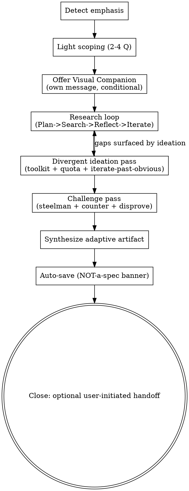

# Exploring-Ideas Skill Design Specification

**Date**: 2026-06-16 (rev. 2026-06-17)
**Status**: Approved for implementation
**Version**: 2 — adds intensity dial, technique reference-files, insight-pairing + quality gate, and evals (mechanics adapted from [KorroAi/drunk-claude](https://github.com/KorroAi/drunk-claude), MIT)

---

## Executive Summary

This spec defines `quirk:exploring-ideas` — a blended **deep-research + brainstorming** skill that helps the user explore a topic *without* converging to a spec or implementation plan. It reuses the `brainstorming` skill's process shape and Visual Companion GUI, but inverts its terminal gate: where `brainstorming` drives *fuzzy idea → approved spec → writing-plans*, `exploring-ideas` deliberately **dead-ends at an exploratory artifact** (a cited briefing and/or idea-landscape), with any move toward building left entirely to the user.

It is a single blended skill governed by **two orthogonal dials**: **emphasis** (research-heavy ↔ ideation-heavy — *what kind of work*) and **intensity** (`--wild 0.1–1.0` — *how far past the obvious to push*). Emphasis is auto-detected from the request (confirmed only when genuinely ambiguous); intensity defaults to 0.5 and is user-settable.

---

## Decision

Ship `exploring-ideas` as a **peer skill** at `skills/exploring-ideas/`, alongside `brainstorming`. It copies the Visual Companion scripts in (self-contained), reuses the existing `web-research-agent`/`deep-research-agent` types as its research engine, and drives a divergent-thinking toolkit delivered as **progressive-disclosure technique files** (`references/techniques/*.md`). A user-settable **intensity dial** (`--wild 0.1–1.0`) modulates how unconventional the ideation gets, every divergent direction must carry a grounded insight (pass an explicit quality gate), and a hard "no spec" gate keeps it exploratory. Output auto-saves to `docs/quirk/explorations/`. A thin `/quirk:explore` command provides an explicit entry point in addition to natural-language triggering, and a shipped `evals/evals.json` makes behavior testable.

---

## Locked Decisions

| # | Area | Question | Answer |
|---|------|----------|--------|
| 1 | Scope | Structure | **One blended skill** — research and brainstorm on a spectrum, one pipeline |
| 2 | Scope | Trigger | **Natural language + slash command** (`using-quirk` description match + `/quirk:explore`) |
| 3 | Scope | Ambiguous intent | **Auto-detect emphasis**, confirm with one quick question only when unclear |
| 4 | Output | Primary output | **Adaptive exploration doc** — cited briefing (research) ↔ clustered idea-landscape (brainstorm); always framing + findings/ideas + open questions; **no locked decisions** |
| 5 | Output | Location | **`docs/quirk/explorations/YYYY-MM-DD-<topic>.md`** |
| 6 | Output | Save trigger | **Auto-save at end**, with an explicit NOT-a-spec banner |
| 7 | Output | After exploration | **Dead-end with optional, user-initiated handoff** to `brainstorming` → `writing-plans` |
| 8 | Reuse | Visual Companion | **Copy scripts into the skill** (self-contained) |
| 9 | Reuse | Research engine | **Reuse agent types + iterative loop** (Plan→Search→Reflect→Iterate; `web-research-agent` breadth, `deep-research-agent` depth) |
| 10 | Reuse | Up-front scoping | **Light scoping (2–4 questions)** — not the full gray-areas drill-in |
| 11 | Reuse | Packaging | **Inside the quirk plugin** (`skills/exploring-ideas/`) |
| 12 | Safeguards | Divergent techniques | **Curated toolkit as progressive-disclosure technique files** — `references/techniques/*.md`, applied selectively; de-branded keepers added (extreme-casing, stream-dump, deliberately-wrong, contrarian-inversion, overlooked-value, the-avoided-idea) alongside SCAMPER/analogy/first-principles/assumption-reversal |
| 13 | Safeguards | Convergence guard | **Quota + iterate-past-obvious** — N distinct directions before drilling; push past clichéd first ideas |
| 14 | Safeguards | Anti-sycophancy | **Built-in challenge passes** — steelman + strongest counter-argument + "what would disprove this" |
| 15 | Safeguards | No-spec enforcement | **Hard gate** — must not emit specs, requirements, locked decisions, or implementation actions |
| 16 | Identity | Name | **`exploring-ideas`** (`quirk:exploring-ideas`, command `/quirk:explore`) |
| 17 | Safeguards | Intensity dial | **`--wild 0.1–1.0`** (orthogonal to emphasis; default 0.5) modulating idea count, unconventionality, risk tolerance, and which techniques fire |
| 18 | Safeguards | Idea quality | **Insight-pairing** (every direction carries a grounded "why this might work") + **REJECT gate** (clichéd / weird-without-insight / duplicate); the insight bar stays constant at all intensities |
| 19 | Reuse | Techniques packaging | **`references/techniques/*.md`** progressive disclosure — SKILL.md stays lean; a file is read only when its technique is selected |
| 20 | Testing | Evals | **`evals/evals.json`** — prompt→expected-behavior assertions (no-spec, banner, handoff-not-auto-invoked, challenge notes, insight annotations) |

---

## Why a Peer Skill (vs. extending `brainstorming`)

| | `brainstorming` | `exploring-ideas` |
|---|---|---|
| **Goal** | Fuzzy idea → approved spec | Explore a topic; surface findings + idea-landscape |
| **Convergence** | Converges; locks decisions | Refuses to converge; preserves tensions |
| **Terminal state** | Invokes `writing-plans` | Dead-ends at exploration doc; handoff is opt-in |
| **Output** | `docs/quirk/specs/…-design.md` | `docs/quirk/explorations/…md` (NOT-a-spec) |
| **Research role** | Side input to design decisions | The main event (when research-heavy) |
| **When** | You intend to build something | You want to learn / ideate, build decision deferred |

Extending `brainstorming` would have meant a mode flag on a skill whose entire spine (HARD-GATE → spec → writing-plans) assumes convergence. A peer skill keeps each skill's gate coherent and lets `exploring-ideas` reuse machinery without inheriting the convergence pressure.

---

## Identity, Triggers & the Inverted Gate

- **Skill id:** `quirk:exploring-ideas` · **Command:** `/quirk:explore`
- **Command syntax:** `/quirk:explore [topic] [--wild 0.1–1.0]`. The `--wild` flag (or a bare number, drunk-claude style) sets intensity; absent, intensity defaults to 0.5 and the user can adjust mid-session ("dial it up / keep it grounded").
- **Natural-language triggers** (via `using-quirk` description match): "do deep research on X", "research X", "let's brainstorm ideas around X", "explore X", "what are some ideas for X".
- **Description routing guard:** scope the description to exploration/research/brainstorm intent that explicitly does **not** ask to build, so it does not steal creative-build requests from `brainstorming`. When the user clearly wants to build, `brainstorming` wins (process-skill priority is unchanged).

### Inverted HARD-GATE

```
<HARD-GATE>
This skill explores. It MUST NOT produce a spec, requirements, locked
decisions, acceptance criteria, an implementation plan, or any
implementation action. The only artifact is an exploration document.
Moving toward building is ALWAYS user-initiated.
</HARD-GATE>
```

This mirrors `brainstorming`'s HARD-GATE in form but inverts its content: `brainstorming` forbids *implementing before design approval*; `exploring-ideas` forbids *converging at all*.

---

## Emphasis Auto-Detection

Detection only shifts weight between the two engines; most runs are blended.

| Signal in request | Lean | Effect |
|---|---|---|
| research, investigate, find, sources, evidence, compare, "what is", "state of" | Research-heavy | Deeper research loop (more rounds / `deep-research-agent`); ideation pass kept short |
| brainstorm, ideas, "what if", "ways to", "could we", imagine, riff | Ideation-heavy | Stronger divergent pass; research loop kept to grounding breadth |
| mixed / unclear | Blended | Balanced; **one** quick confirm question if genuinely ambiguous |

---

## Intensity Dial (`--wild`)

Orthogonal to emphasis: emphasis chooses *what kind of work*; intensity chooses *how far past the obvious the ideation pushes*. Adapted from drunk-claude's `0.1→1.0` slider, de-gimmicked. Default **0.5**; user-settable and adjustable mid-session.

| Range | Label | Behavior |
|---|---|---|
| 0.1–0.3 | **Grounded** | Adjacent, low-risk variations; mostly conventional framing; quota ≥3 |
| 0.4–0.6 | **Exploratory** (default 0.5) | Genuine divergence; cross-domain analogies welcome; quota ≥5 |
| 0.7–0.9 | **Bold** | Unconventional, contrarian, risk-tolerant; provocation techniques (deliberately-wrong, contrarian-inversion, extreme-casing) fire; quota ≥7 |
| 1.0 | **Radical** | No filter — provocative directions that would "unsettle a boardroom"; full technique set; as many as genuinely land |

Intensity modulates: **idea count / quota N**, **unconventionality** (how far past-obvious), **risk tolerance** (how provocative), and **technique selection** (higher intensity pulls in the more disruptive techniques).

**Invariant — the bar that does NOT move with intensity:** every idea must still pass the insight-pairing quality gate (§ Divergent Ideation Engine), factual claims stay accurate, and the no-spec HARD-GATE holds. This is the key departure from drunk-claude, which *lowers* its substance bar and *raises* a "viral" bar at the extremes — we hold the insight bar constant so high intensity yields *wilder grounded ideas*, never noise.

---

## Process / Architecture



The Research loop and Divergent pass are weighted by emphasis (one may be brief), and feed each other: research grounds ideation; ideation surfaces new gaps to research.

### Component: Light Scoping (2–4 questions)

`AskUserQuestion`, recommended-option-first, no "you decide". Kept intentionally light so exploration stays open.

- **Research-leaning:** depth (quick scan / standard / deep multi-round), recency window, source preferences or exclusions, the curiosity/decision it serves.
- **Ideation-leaning:** the goal/problem, hard constraints, what "good" looks like, directions already considered (to avoid re-treading).

### Component: Research Engine (Plan → Search → Reflect → Iterate)

1. **Plan** — decompose the scoped topic into facets / sub-questions.
2. **Search (breadth)** — parallel `web-research-agent` (haiku) across facets, dispatched in a single message.
3. **Reflect** — identify gaps, contradictions, and unanswered questions.
4. **Iterate (depth)** — for deep requests, spawn `deep-research-agent` (sonnet, depth=2) on the highest-value gaps; loop **1–3 gap-driven rounds**. Stop when marginal new information drops off (guard against both premature stop *and* runaway).
5. **Provenance + anti-hallucination** — maintain a claim→source map; run a verification pass so only sourced claims enter the artifact (the "ReviewAgent" pattern). Mark unverifiable claims explicitly.

### Component: Divergent Ideation Engine

Intensity-aware. The engine reads the relevant technique file(s) from `references/techniques/` only when selected (progressive disclosure), runs them, then filters through an explicit quality gate.

- **Technique toolkit (`references/techniques/*.md`)** — each file follows **When to Use → The Method (numbered) → Example (concrete before→after) → Why It Works**. Selection is intensity-aware (pick the 1–2 most relevant; Bold/Radical add the disruptive ones). The set:
  - *Classic:* `scamper.md`, `analogical-transfer.md`, `first-principles.md`, `assumption-reversal.md`
  - *Disruptive (de-branded from drunk-claude, rooted in de Bono / lateral thinking):* `extreme-casing.md` (push to the absurd version that still works, to reveal the middle path), `stream-dump.md` (unfiltered brain-dump, then mine the tangent — "the 5th idea is the real one"), `deliberately-wrong.md` (intentionally dumb twist to bypass the reality-check filter, then take it seriously — de Bono's *po*), `contrarian-inversion.md` (argue the opposite of the universal assumption; find the edge case where it wins), `overlooked-value.md` (find value in the boring/ignored part — attention arbitrage), `radical-simplification.md` (strip to the common-sense structural core), `the-avoided-idea.md` (name the bold idea everyone circles but nobody says; deadline pressure surfaces it)
- **Quota** — surface **N distinct directions** before drilling into any one (N scales with intensity: Grounded ≥3 → Radical "as many as genuinely land").
- **Iterate-past-obvious** — after the first pass, explicitly push for more unconventional variants and discard clichés (first ideas reflect training-data defaults).
- **Insight-pairing (required)** — every surviving direction carries a one-line grounded **"why this might actually work"** — the real insight beneath the surface. A direction with no defensible insight is not a direction.
- **Quality gate (explicit REJECT)** — before a direction enters the artifact it must clear: *clichéd / obvious? → REJECT. Weird with no insight underneath ("random ≠ creative")? → REJECT. A restatement of an existing direction? → REJECT or merge.*
- **Grounding** — seed directions with the research loop's findings so ideas are informed, not free-floating.

### Component: Challenge Pass (anti-sycophancy)

For each surviving direction / finding cluster: **steelman** it, then surface the **strongest counter-argument** and **"what would disprove this / why might this fail."** Light and constructive — the goal is honesty, not demolition. Captured into the artifact's Challenge notes.

### Component: Adaptive Output Artifact

Single template, adapts by emphasis; auto-saved to `docs/quirk/explorations/YYYY-MM-DD-<topic>.md`:

```markdown
> 🧭 EXPLORATION — not a spec. No locked decisions; nothing here is build-ready.

# Exploring: <topic>
**Date** · **Emphasis**: research-heavy | blended | ideation-heavy · **Intensity**: 0.x (Grounded|Exploratory|Bold|Radical)

## Framing
The question/goal and how it was scoped.

## What was explored
Facets / sub-questions investigated (research) and/or directions generated (brainstorm).

## Findings / Idea landscape
Cited findings grouped by theme (research) and/or clustered idea directions
(brainstorm). NO winner declared. Each idea direction is insight-paired:

  ### Direction: <name>
  <the idea — one or two lines>
  *why this might actually work:* <one-line grounded insight>
  *surfaced by:* <technique>  ·  *sits at intensity:* <Grounded…Radical>

## Tensions & trade-offs
Where findings/directions conflict — preserved, not resolved.

## Challenge notes
Counter-arguments, failure modes, disproof conditions.

## Open questions & gaps
What's still unknown / worth exploring next.

## Sources
URLs / provenance for every cited claim.
```

No "Decisions Locked", no requirements, no implementation steps — by gate.

### Component: Visual Companion (reused)

Copy `server.cjs`, `helper.js`, `frame-template.html`, `start-server.sh`, `stop-server.sh` verbatim into `skills/exploring-ideas/scripts/`, plus a `visual-companion.md` (mechanics). Offered **once, in its own message**, only when visual output is anticipated (idea-landscape, option/cluster map, mind map, comparison matrix). Per-question rule unchanged: browser for visual artifacts, terminal for text choices.

### Close: Optional Handoff

End with a short recap and: *"This is exploration only. If you later want to turn a direction into something buildable, invoke `quirk:brainstorming` → `writing-plans`. Say the word and I'll carry [direction] over."* Never automatic.

---

## Files Changed

| File | Change |
|------|--------|
| `skills/exploring-ideas/SKILL.md` | **Create** — frontmatter + process (checklist + dot flow + the components above) |
| `skills/exploring-ideas/exploration-artifact-template.md` | **Create** — the adaptive artifact template |
| `skills/exploring-ideas/references/techniques/*.md` | **Create** — technique files (When-to-use/Method/Example/Why-it-works): `scamper`, `analogical-transfer`, `first-principles`, `assumption-reversal`, `extreme-casing`, `stream-dump`, `deliberately-wrong`, `contrarian-inversion`, `overlooked-value`, `radical-simplification`, `the-avoided-idea` |
| `skills/exploring-ideas/evals/evals.json` | **Create** — prompt→expected-behavior assertions |
| `skills/exploring-ideas/visual-companion.md` | **Create** — copied/trimmed companion mechanics |
| `skills/exploring-ideas/scripts/server.cjs` | **Create** — copied verbatim from `brainstorming` |
| `skills/exploring-ideas/scripts/helper.js` | **Create** — copied verbatim |
| `skills/exploring-ideas/scripts/frame-template.html` | **Create** — copied verbatim |
| `skills/exploring-ideas/scripts/start-server.sh` | **Create** — copied verbatim |
| `skills/exploring-ideas/scripts/stop-server.sh` | **Create** — copied verbatim |
| `commands/explore.md` | **Create** — thin `/quirk:explore` entry point that invokes the skill |
| `.claude-plugin/plugin.json` | **Edit** — bump 5.6.2 → 5.7.0; add keywords `research`, `deep-research`, `exploration`, `ideation`, `creative-techniques` |
| `.claude-plugin/marketplace.json` | **Edit** — bump 5.6.2 → 5.7.0 |
| `README.md` | **Edit** — skill count 19 → 20; add "deep research & exploration" to description |

---

## Differentiation from Neighbors

- **vs `quirk:brainstorming`** — brainstorming converges to a spec and invokes `writing-plans`; `exploring-ideas` refuses to converge and dead-ends at an exploration doc.
- **vs the `deep-research` harness / `deep-research-agent`** — those are research-only pipelines producing a cited report; `exploring-ideas` wraps research with divergent ideation, the brainstorming GUI, anti-convergence safeguards, and the no-spec gate. It *uses* the research agents as an engine rather than competing with them.
- **vs `adhd`** — `adhd` is a point-in-time generator of N non-obvious options at a decision; `exploring-ideas` is a full session that may *use* divergent techniques but spans research + ideation + synthesis into a durable artifact.

---

## Error Handling & Fallbacks

- **Research agents unavailable / offline** — proceed in offline mode; mark findings "(offline — unverified)" and lean on the ideation engine; note the gap in the artifact.
- **Partial agent failure** — synthesize from what returned; record which facets lack coverage under Open questions & gaps.
- **`deep-research-agent` fails** — substitute two parallel `web-research-agent` calls (same fallback `brainstorming` uses).
- **Visual Companion can't launch** — fall back to terminal-only; never block the exploration on the GUI.
- **Topic too broad** — surface this early (like `brainstorming`'s scope check) and offer to split into sub-topics, each its own exploration.
- **Convergence pressure detected** ("just give me the plan / write the spec") — honor the user (user instructions outrank the skill) by offering the explicit handoff to `brainstorming`, rather than silently producing a spec inside this skill.

---

## Testing / Verification

- **Skill quality** — review against `quirk:writing-skills` (frontmatter, description triggering, progressive disclosure).
- **Scripts smoke test** — Visual Companion launches, serves the newest HTML, and captures `[data-choice]` clicks to the events file.
- **Evals (`evals/evals.json`)** — shipped prompt→expected-behavior pairs covering a research prompt, an ideation prompt, and a high-intensity (`--wild 0.9`) prompt. Each asserts: (a) no spec/requirements emitted, (b) artifact saved to `docs/quirk/explorations/` with the NOT-a-spec banner, (c) handoff offered but not auto-invoked, (d) challenge notes present, (e) every idea direction is insight-paired.
- **Intensity-modulation test** — the same prompt at `--wild 0.2` vs `0.9` yields visibly different idea count / unconventionality, while both still pass the insight gate and stay factually accurate.
- **Routing test** — a clear build request ("build me X") still routes to `brainstorming`, not `exploring-ideas`.

---

## Industry Insights

Distilled from 2026 research swarm (Phase A). Findings that shaped decisions:

- **Deep-research has a converged loop** — Plan → Search → Read → Reflect → Iterate → Synthesize is now standard across OpenAI/Gemini/Anthropic-style systems; multi-agent + a review/attribution pass materially outperforms single-agent and curbs hallucinated citations. → drove the Research Engine design and the provenance/verification pass. Sources: [Deep Research Agent Architectures](https://zylos.ai/research/2026-04-21-deep-research-agent-architectures), [OpenResearcher (arXiv)](https://arxiv.org/pdf/2603.20278), [Gemini Deep Research docs](https://ai.google.dev/gemini-api/docs/deep-research).
- **Divergent vs convergent are complementary, scaffolded — not separate modes** — modern systems blend them and scaffold the transition. → drove the single blended skill + emphasis spectrum. Sources: [Exploration vs. Fixation (arXiv)](https://arxiv.org/pdf/2512.18388), [Brainstorming vs Divergent Thinking](https://medium.com/creativity-hub-by-ideatrapp/brainstorming-vs-divergent-thinking-09d05719c64a).
- **The "idea landscape / briefing" is the right archetype for non-spec output** — maximum coverage, minimal forced conclusion, explicit blindspots; distinct from a decision document. → drove the adaptive artifact (no winner declared, tensions preserved). Source: [Gemini Deep Research docs](https://ai.google.dev/gemini-api/docs/deep-research).
- **AI brainstorming fails via sycophancy, premature convergence, and clichéd first ideas** — AI won't volunteer challenge; it must be structurally prompted, and obvious first ideas need active pushing-past. → drove the quota + iterate-past-obvious guard and the built-in challenge pass. Sources: [AI Sycophancy](https://www.seangoedecke.com/ai-sycophancy/), [Scaffolding Creativity: Divergent/Convergent LLM Personas (arXiv)](https://arxiv.org/pdf/2510.26490), [AI Can Supercharge Divergent Thinking](https://medium.com/@yujiisobe/ai-can-supercharge-divergent-thinking-modern-ai-like-chatgpt-can-generate-a-high-volume-of-ideas-b37e24c380cc).
- **Techniques that translate to a conversational AI partner** — SCAMPER, analogical/cross-domain transfer, first-principles, assumption-reversal, "how might we", persona lenses. → drove the curated toolkit.
- **Mechanics adapted from [KorroAi/drunk-claude](https://github.com/KorroAi/drunk-claude) (MIT)** — its `0.1→1.0` intensity slider, technique-as-reference-file structure (When-to-use/Method/Example/Why-it-works), per-idea insight-pairing ("why it's not stupid"), and explicit REJECT quality gate were adopted **de-gimmicked** (no persona/slang/drink theming). Several of its branded techniques (hold-my-beer, what-if-but-wrong, bar-fight, …) are de Bono / lateral-thinking moves in costume; we kept the mechanics under neutral names. Its key error mode — *lowering* the substance bar at high intensity in favor of "virality" — is explicitly corrected here by holding the insight gate constant across all intensities.

---

## Deferred Ideas

Captured during discussion; out of scope for v1:

- **`deep-research` harness delegation** — wholesale delegating the research portion to the existing `deep-research` harness (rejected for v1 in favor of reusing agent types directly, for control over exploratory framing). Revisit if maintaining the loop proves costly.
- **Full gray-areas drill-in** — the heavier `brainstorming`-style multiSelect + per-area drill-in (rejected for v1 as over-gating; light scoping chosen instead).
- **"Seed a brainstorm" auto-carry** — automatically piping a chosen direction into `brainstorming` with context (kept as a manual, user-initiated offer in v1).
- **Shared Visual Companion module** — extracting the companion scripts into one shared location instead of copying per skill (deferred; self-contained copy chosen for v1 robustness).
- **Persona / mood / cosmetic theming (from drunk-claude)** — the slang voice, 5 moods, drink-type emojis, and "would it go viral" optimization were deliberately **not** adopted; they conflict with a serious exploration tool. A small set of neutral thinking *lenses* (skeptic / systems / first-principles) could be revisited later, folded into the technique files rather than a separate moods subsystem.

---

*Generated via the `quirk:brainstorming` process (research swarm + gray-area resolution). Terminal state: implementation plan via `quirk:writing-plans`.*
