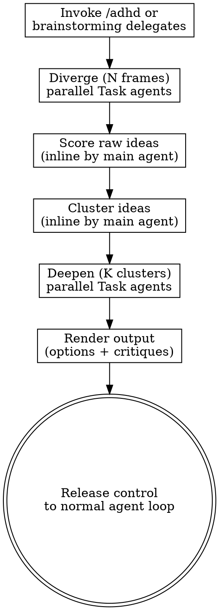

# ADHD: Divergent Ideation Framework

A structured process for generating and evaluating multiple non-obvious options when you need to make a decision. This skill uses parallel thinking frames to surface alternatives you might not naturally consider.

## When to use

Use ADHD when:
- You're at a decision point with multiple viable approaches
- You want to ensure you've considered non-obvious alternatives
- The decision has meaningful stakes (implementation cost, architectural impact, user experience)
- You're unsure which direction to take

**Do NOT use for**:
- Trivial decisions (variable names, obvious bug fixes)
- Decisions already made or constrained by requirements
- Linear problems with a single clear solution
- Time-sensitive situations where rapid execution matters more than thoroughness

## Cost profile

ADHD is 5-10× more expensive than normal ideation:
- N parallel divergence agents (typically 5-7)
- K parallel deepen agents (typically 3)
- Inline scoring and clustering by main agent

Use this when the decision justifies the cost.

## Process Overview



## The Process

### 1. Diverge (N frames in parallel)

Spawn N parallel Task agents (model: haiku for speed), each using a different thinking frame from `frames.md`. Each agent generates 3-5 raw ideas through their assigned frame's lens.

**All divergence Tasks MUST be dispatched in a single message** (parallel execution is mandatory).

Available frames (choose 5-7 based on context):
1. Constraint inversion
2. Opposite day
3. Time travel (10 years forward/back)
4. Cross-domain analogy
5. Stakeholder rotation (become user/admin/API consumer)
6. Failure pre-mortem
7. Sensory shift
8. Scale extremes (10× bigger/smaller)
9. Role reversal
10. Material substitution
11. Process reversal
12. Success post-mortem
13. Beginner's mind
14. Expert blind spots
15. Adjacent possible

See `frames.md` for detailed frame descriptions and prompts.

### 2. Score (inline by main agent)

After all divergence Tasks complete, **summarize their outputs in your next turn** (you cannot intercept tool_result blocks). Review all raw ideas and score each on:
- Novelty (1-5): How non-obvious is this?
- Viability (1-5): Can this actually work?
- Impact (1-5): Does this meaningfully improve outcomes?

Discard ideas scoring <3 on any dimension.

### 3. Cluster (inline by main agent)

Group surviving ideas by similarity into K clusters (typically 3-5). Each cluster represents a distinct strategic direction.

### 4. Deepen (K clusters in parallel)

For each cluster, spawn a parallel Task agent (model: sonnet for depth) to:
- Develop the cluster's core approach
- Identify implementation requirements
- Surface hidden costs and risks
- Generate adversarial critique

**All deepen Tasks MUST be dispatched in a single message** (parallel execution is mandatory).

**Nesting fallback**: If deepen Tasks fail due to nesting depth (e.g., ADHD invoked from brainstorming), run deepen sequentially in-context instead of using Task agents.

### 5. Render Output

Present results in this structure:

```markdown
## ADHD Output: [decision topic]

### Option A: [cluster name]
**Core approach**: [1-2 sentences]
**Why this works**: [bullets]
**Hidden costs**: [bullets]
**Critique**: [adversarial assessment]

### Option B: [cluster name]
...

### Option C: [cluster name]
...

**Recommendation**: [which option and why, or "no clear winner — here's what each optimizes for"]
```

### 6. Standalone Exit

After rendering output for an explicit `/adhd` invocation, release control to the normal agent loop. The user can continue the conversation, ask clarifying questions, or choose an option.

**HARD-GATE**: This skill does NOT trigger mandatory checklist items, does NOT block implementation, and does NOT alter the brainstorming process graph. It is an advisory subroutine only.

## Context Handling

When divergence or deepen Task agents complete, their raw output appears in `tool_result` blocks. You cannot intercept these blocks. Instead:

**In your next turn after Task results arrive**, summarize the key findings before proceeding to the next phase. This keeps the conversation coherent and avoids burying results in tool output.

Example:
> "The divergence agents returned 23 raw ideas across 5 frames. After scoring, 12 survived (novelty ≥3, viability ≥3, impact ≥3). These cluster into 3 strategic directions: [A], [B], [C]. Now running deepen agents on each cluster..."

## Integration with Brainstorming

The `brainstorming` skill includes an **advisory** sub-bullet in step 6 ("Exploring approaches") suggesting ADHD for decision points with 3+ gray areas or high uncertainty. This is opt-in guidance, not a gate.

Brainstorming may delegate to ADHD by saying:
> "This decision has high uncertainty across [areas]. I'm going to use the ADHD skill to surface non-obvious options."

When brainstorming delegates, treat it as an explicit invocation — run the full ADHD process and return the structured output.

## Reference Materials

- `frames.md` — Full descriptions of all 15 divergent-thinking frames
- `reference/when-to-use.md` — Expanded guidance on appropriate use cases
- `reference/divergence-prompts.md` — Quirk-specific prompt templates for Task agents
- `SOURCE-SPEC.md` — Original design rationale and upstream source
- `UPSTREAM-LICENSE` — MIT license (required for compliance)

---

## Attribution

This skill is based on the upstream ADHD divergent-thinking framework. It has been adapted for the Quirk skills library with the following additions:

1. **Standalone exit + context handling**: After rendering output for explicit `/adhd`, the skill releases control to the normal agent loop. Context handling clarified as "summarize in next turn" (cannot intercept tool_result blocks).

2. **Nesting fallback**: If deepen Tasks fail due to nesting depth (e.g., ADHD invoked from brainstorming), run deepen sequentially in-context instead of using Task agents.

3. **Score/Cluster inline**: Score and Cluster phases run inline by the main agent — only Diverge (N) and Deepen (K) use the Task tool.

See `UPSTREAM-LICENSE` for the original MIT license.
