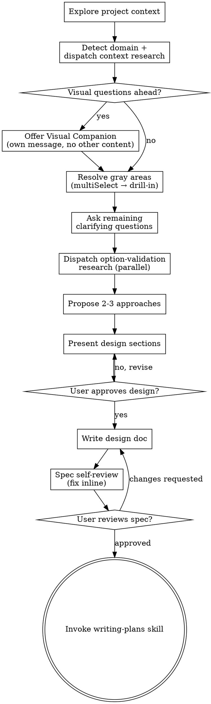

# Brainstorming Ideas Into Designs

Help turn ideas into fully formed designs and specs through natural collaborative dialogue.

Start by understanding the current project context, then ask questions one at a time to refine the idea. Once you understand what you're building, present the design and get user approval.

<HARD-GATE>
Do NOT invoke any implementation skill, write any code, scaffold any project, or take any implementation action until you have presented a design and the user has approved it. This applies to EVERY project regardless of perceived simplicity.
</HARD-GATE>

## Anti-Pattern: "This Is Too Simple To Need A Design"

Every project goes through this process. A todo list, a single-function utility, a config change — all of them. "Simple" projects are where unexamined assumptions cause the most wasted work. The design can be short (a few sentences for truly simple projects), but you MUST present it and get approval.

## Checklist

You MUST create a task for each of these items and complete them in order:

1. **Explore project context** — check files, docs, recent commits
2. **Detect domain + dispatch context research** — classify the work (Visual / API / CLI / Docs / Organization / Data / Integration) and spawn parallel research agents for domain patterns and anti-patterns. See [Research Agents](#research-agents).
3. **Offer visual companion** (if topic will involve visual questions) — this is its own message, not combined with a clarifying question. See the Visual Companion section below.
4. **Resolve gray areas** — present domain-specific ambiguous decision areas via `AskUserQuestion` (multiSelect), then drill into each selected area with batched clarifying questions. See [Gray Areas](#gray-areas).
5. **Ask remaining clarifying questions** — one at a time, for anything not covered by gray-area resolution (purpose, constraints, success criteria)
6. **Dispatch option-validation research** (when proposing approaches) — one research agent per candidate option, in parallel
7. **Propose 2-3 approaches** — with trade-offs, citing research findings, your recommendation
8. **Present design** — in sections scaled to their complexity, get user approval after each section
9. **Write design doc** — save to `docs/quirk/specs/YYYY-MM-DD-<topic>-design.md` and commit
10. **Spec self-review** — quick inline check for placeholders, contradictions, ambiguity, scope (see below)
11. **User reviews written spec** — ask user to review the spec file before proceeding
12. **Transition to implementation** — invoke writing-plans skill to create implementation plan

## Process Flow



**The terminal state is invoking writing-plans.** Do NOT invoke frontend-design, mcp-builder, or any other implementation skill. The ONLY skill you invoke after brainstorming is writing-plans.

## Research Agents

Brainstorming uses parallel **research-agent swarms** (via the `Task` tool) to ground design decisions in current external knowledge — best practices, anti-patterns, post-mortems, and real-world experience reports — instead of leaning purely on training data.

### Agent Types

| Agent | Model | Purpose | Sources/agent |
|-------|-------|---------|---------------|
| `web-research-agent` | haiku | Fast parallel searches; pattern + anti-pattern validation | ~3 |
| `deep-research-agent` | sonnet | Multi-round investigation of the chosen approach (depth=2) | ~5–7 |

### Research Phases

Spawn agents in **a single message** per phase (parallel execution is mandatory — sequential same-phase agents are a defect):

**Get current year first** (used in every prompt to avoid stale results):
```bash
date +%Y
```

**Phase A — Context research (Checklist step 2)** — 2 parallel `web-research-agent`:
- Agent 1: `"[domain from task] simple architecture patterns minimalist implementation [YEAR]"`
- Agent 2: `"[domain/technology] common pitfalls anti-patterns lessons learned post-mortems [YEAR]"`

**Phase B — Option-validation research (Checklist step 6)** — 1 `web-research-agent` per candidate option (typically 3 total, in parallel):
- Per option: `"[option approach name] real world experience pros cons [YEAR]"`

**Phase C (optional) — Deep validation of the chosen approach** — 1 `deep-research-agent` (sonnet, depth=2), only when the chosen approach is novel, high-stakes, or production-bound:
- `"Investigate [chosen approach] for [domain]: implementation best practices, testing strategies, common mistakes, edge cases. Focus on [YEAR] production lessons."`

### When to Skip Research

- **Truly trivial work** (config tweak, single-function utility, obvious one-liner): skip the swarm; the design itself can still be a few sentences.
- **Domain you've already researched in this session**: reuse prior findings; do not re-spawn.
- **Tool unavailable / offline**: continue in offline mode; add a "(research pending)" note in the spec's Industry Insights section.

### Result Integration

From each agent response, extract: **Key Findings** (distilled bullets that change a decision) and **Sources** (URLs/refs for traceability). Feed these into:
- The clarifying questions (refine wording when research surfaces a missed dimension)
- The option proposals (cite findings in pros/cons)
- The design doc's "Industry Insights" section

### Fallback Modes

- **Total failure** (Task tool unavailable): proceed offline; mark spec sections "(offline mode — validation pending)".
- **Partial failure** (some agents fail): proceed with what returned; note which phase lacks coverage.
- **Deep-research fails**: substitute with 2 parallel `web-research-agent` calls.

## Gray Areas

A **gray area** is a domain-specific decision space where the request is ambiguous and multiple defensible answers exist. Resolving gray areas up front — in batched, multi-select form — is faster and clearer than discovering them mid-design.

### Domain Detection

Classify the work from the task description before clarifying questions:

| Domain | Signals |
|--------|---------|
| Visual | "display", "show", "UI", "page", "component", "feed", "dashboard" |
| API | "API", "endpoint", "REST", "GraphQL", "request", "response" |
| CLI | "CLI", "command", "terminal", "script", "tool" |
| Docs | "docs", "documentation", "guide", "README", "tutorial" |
| Organization | "organize", "structure", "migrate", "refactor", "clean up" |
| Data | "import", "export", "ETL", "pipeline", "transform", "process" |
| Integration | "integrate", "sync", "connect", "webhook", "third-party" |

### Expected Gray-Area Catalog

Use these as the seed set for the multi-select question. Pick the 3–4 most relevant for the specific request.

- **Visual**: layout-style, information-density, loading-pattern, empty-state, error-state, interaction-style
- **API**: response-format, error-responses, authentication, versioning, rate-limiting, pagination
- **CLI**: output-format, flag-design, progress-reporting, error-recovery, exit-codes
- **Docs**: structure, tone, examples-depth, versioning, search-discovery
- **Organization**: grouping-criteria, naming-convention, duplicate-handling, exception-handling
- **Data**: input-format, output-format, error-handling, performance-mode, idempotency
- **Integration**: sync-direction, conflict-resolution, retry-policy, data-mapping, auth-storage

### Step 1 — Surface gray areas (multiSelect)

Use `AskUserQuestion` with `multiSelect: true`. Each option is a domain-specific area with a description that explains *why* it's ambiguous:

```
AskUserQuestion:
  questions:
    - question: "Which of these areas should we clarify before designing?"
      header: "Gray areas"
      multiSelect: true
      options:
        - label: "[Area name]"
          description: "[Why this area matters and what's ambiguous about it]"
        # ... 3–4 total
```

### Step 2 — Drill-in per selected area (3–7 questions, batched)

For each selected gray area, generate 3–7 focused questions that progress from **foundational** (core behavior) to **edge-case** (errors, empties, limits). Use `AskUserQuestion` with up to 4 questions per call (2 calls if an area needs 5–7).

Per-question rules:
- `multiSelect: false` (single choice per question)
- 2–4 concrete options, with the **recommended option first** and `(Recommended)` appended to its label
- `description` ≥ 1 sentence explaining implications and trade-offs
- `header` is a short category label (e.g., "Layout", "Auth", "Errors")
- Process **one area at a time** — don't interleave; show a mini-recap of locked decisions after each area before moving on.

Example — Visual / "Layout style" (5 questions):
1. Primary layout pattern? (cards / list / grid)
2. Responsive behavior? (stack / hide columns / scroll)
3. Information density? (compact / comfortable / spacious)
4. Content priority in each item? (title-first / media-first / action-first)
5. Empty state? (illustration / CTA / placeholder skeleton)

### Checkpoint Rules (apply to all gray-area questions)

- **No delegation options**: never offer "You decide", "Whatever you think". If the user says "you decide", pick the recommended option, explain why, and confirm via `AskUserQuestion`.
- **Concrete labels**: name options by what they ARE ("Card layout", "JSON responses") — not "Option A".
- **Recommended option first**, with `(Recommended)` appended.

### Scope Creep Guard (active during gray-area drill-in)

Watch for "also add", "we should also", "what about adding", "could we also", "it would be nice if". When detected:
1. Capture the idea in a running **Deferred Ideas** list (carried into the spec doc).
2. Acknowledge briefly: "Good idea — captured as a deferred item so we don't lose it. Let's stay focused on [current area]."
3. Return to the current question without absorbing the new scope.

## The Process

**Understanding the idea:**

- Check out the current project state first (files, docs, recent commits)
- Before asking detailed questions, assess scope: if the request describes multiple independent subsystems (e.g., "build a platform with chat, file storage, billing, and analytics"), flag this immediately. Don't spend questions refining details of a project that needs to be decomposed first.
- If the project is too large for a single spec, help the user decompose into sub-projects: what are the independent pieces, how do they relate, what order should they be built? Then brainstorm the first sub-project through the normal design flow. Each sub-project gets its own spec → plan → implementation cycle.
- Classify the domain (Visual / API / CLI / Docs / Organization / Data / Integration). Dispatch the **Phase A research swarm** in parallel (see [Research Agents](#research-agents)) so findings are ready by the time you ask clarifying questions. Skip the swarm only if the work is truly trivial or you've already researched this domain in-session.
- After research returns and the visual companion has been offered (if relevant), run the **gray-areas resolution** (see [Gray Areas](#gray-areas)) to batch-resolve domain ambiguity before single-question dialogue.
- Then ask any remaining clarifying questions one at a time
- Prefer multiple choice questions when possible, but open-ended is fine too
- Only one question per message - if a topic needs more exploration, break it into multiple questions
- Focus on understanding: purpose, constraints, success criteria

**Exploring approaches:**

- Before proposing approaches, dispatch the **Phase B option-validation research swarm** (one `web-research-agent` per candidate option, in parallel) so each option's pros/cons cite real-world findings.
- Propose 2-3 different approaches with trade-offs
- Present options conversationally with your recommendation and reasoning, citing relevant research findings (sources can be linked in the spec's Industry Insights section)
- Lead with your recommended option and explain why
- **Advisory**: For decisions with high uncertainty, 3+ gray areas, or meaningful architectural/UX stakes, consider using the `adhd` skill to surface non-obvious options through structured divergent ideation (5-10× cost, opt-in only)
- For novel, high-stakes, or production-bound work, run **Phase C deep-research** on the chosen approach before writing the design doc

**Presenting the design:**

- Once you believe you understand what you're building, present the design
- Scale each section to its complexity: a few sentences if straightforward, up to 200-300 words if nuanced
- Ask after each section whether it looks right so far
- Cover: architecture, components, data flow, error handling, testing
- Be ready to go back and clarify if something doesn't make sense

**Design for isolation and clarity:**

- Break the system into smaller units that each have one clear purpose, communicate through well-defined interfaces, and can be understood and tested independently
- For each unit, you should be able to answer: what does it do, how do you use it, and what does it depend on?
- Can someone understand what a unit does without reading its internals? Can you change the internals without breaking consumers? If not, the boundaries need work.
- Smaller, well-bounded units are also easier for you to work with - you reason better about code you can hold in context at once, and your edits are more reliable when files are focused. When a file grows large, that's often a signal that it's doing too much.

**Working in existing codebases:**

- Explore the current structure before proposing changes. Follow existing patterns.
- Where existing code has problems that affect the work (e.g., a file that's grown too large, unclear boundaries, tangled responsibilities), include targeted improvements as part of the design - the way a good developer improves code they're working in.
- Don't propose unrelated refactoring. Stay focused on what serves the current goal.

## After the Design

**Documentation:**

- Write the validated design (spec) to `docs/quirk/specs/YYYY-MM-DD-<topic>-design.md`
  - (User preferences for spec location override this default)
- Use elements-of-style:writing-clearly-and-concisely skill if available
- Include these sections (in addition to the architecture/components/etc. you already cover):
  - **Decisions Locked** — the gray-area decisions confirmed during drill-in (one bullet per locked decision, grouped by area)
  - **Industry Insights** — distilled key findings from research agents, with source URLs; mark "(offline mode — validation pending)" if research was skipped
  - **Deferred Ideas** — anything captured by the Scope Creep Guard (or "None — discussion stayed within scope")
- Commit the design document to git

**Spec Self-Review:**
After writing the spec document, look at it with fresh eyes:

1. **Placeholder scan:** Any "TBD", "TODO", incomplete sections, or vague requirements? Fix them.
2. **Internal consistency:** Do any sections contradict each other? Does the architecture match the feature descriptions?
3. **Scope check:** Is this focused enough for a single implementation plan, or does it need decomposition?
4. **Ambiguity check:** Could any requirement be interpreted two different ways? If so, pick one and make it explicit.

Fix any issues inline. No need to re-review — just fix and move on.

**User Review Gate:**
After the spec review loop passes, ask the user to review the written spec before proceeding:

> "Spec written and committed to `<path>`. Please review it and let me know if you want to make any changes before we start writing out the implementation plan."

Wait for the user's response. If they request changes, make them and re-run the spec review loop. Only proceed once the user approves.

**Implementation:**

- Invoke the writing-plans skill to create a detailed implementation plan
- Do NOT invoke any other skill. writing-plans is the next step.

## Key Principles

- **One question at a time** (free-form dialogue) — Don't overwhelm. Exception: gray-area drill-ins are explicitly batched via `AskUserQuestion` (up to 4 per call), one *area* at a time.
- **Multiple choice preferred** - Easier to answer than open-ended when possible
- **Research in parallel, never sequentially** - Same-phase agents ship in a single message
- **Resolve gray areas before single-question dialogue** - Multi-select up front, drill into each selected area, then ask remaining open questions one at a time
- **YAGNI ruthlessly** - Remove unnecessary features from all designs
- **Explore alternatives** - Always propose 2-3 approaches before settling
- **Incremental validation** - Present design, get approval before moving on
- **Be flexible** - Go back and clarify when something doesn't make sense

## Visual Companion

A browser-based companion for showing mockups, diagrams, and visual options during brainstorming. Available as a tool — not a mode. Accepting the companion means it's available for questions that benefit from visual treatment; it does NOT mean every question goes through the browser.

**Offering the companion:** When you anticipate that upcoming questions will involve visual content (mockups, layouts, diagrams), offer it once for consent:
> "Some of what we're working on might be easier to explain if I can show it to you in a web browser. I can put together mockups, diagrams, comparisons, and other visuals as we go. This feature is still new and can be token-intensive. Want to try it? (Requires opening a local URL)"

**This offer MUST be its own message.** Do not combine it with clarifying questions, context summaries, or any other content. The message should contain ONLY the offer above and nothing else. Wait for the user's response before continuing. If they decline, proceed with text-only brainstorming.

**Per-question decision:** Even after the user accepts, decide FOR EACH QUESTION whether to use the browser or the terminal. The test: **would the user understand this better by seeing it than reading it?**

- **Use the browser** for content that IS visual — mockups, wireframes, layout comparisons, architecture diagrams, side-by-side visual designs
- **Use the terminal** for content that is text — requirements questions, conceptual choices, tradeoff lists, A/B/C/D text options, scope decisions

A question about a UI topic is not automatically a visual question. "What does personality mean in this context?" is a conceptual question — use the terminal. "Which wizard layout works better?" is a visual question — use the browser.

If they agree to the companion, read the detailed guide before proceeding:
`skills/brainstorming/visual-companion.md`
