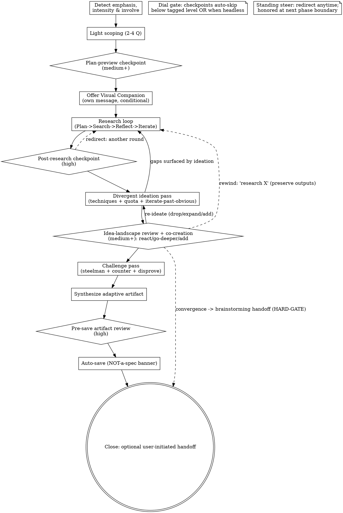

# Exploring Ideas — Deep Research + Brainstorming

Help the user explore a topic through deep research and/or divergent brainstorming, and capture the result as an **exploration artifact** — a cited briefing and/or idea-landscape. This skill deliberately **does not converge to a spec**. Moving toward building anything is always the user's call.

Announce when you start: **"I'm using the exploring-ideas skill to explore this with you — no spec, just research and ideas."**

<HARD-GATE>
This skill EXPLORES. It MUST NOT produce a spec, requirements, locked decisions,
acceptance criteria, an implementation plan, or any implementation action. The only
artifact is an exploration document. Moving toward building is ALWAYS user-initiated —
offer the handoff to `brainstorming`, never perform it automatically.
</HARD-GATE>

## Anti-Pattern: "They obviously want me to just build/decide it"

No. The user invoked exploration. Surfacing the option space, the evidence, and the tensions IS the deliverable. Declaring a winner, writing requirements, or starting to code defeats the purpose. If the user later says "ok, let's build the third one," offer the `brainstorming` handoff — do not silently switch modes.

## Three Dials

These are orthogonal — set all three:

- **Emphasis** (auto-detected) — *what kind of work*: research-heavy ↔ ideation-heavy ↔ blended.
- **Intensity** (`--wild 0.1–1.0`, default 0.5) — *how far past the obvious the ideation pushes*.
- **Involvement** (`--involve low|medium|high`, default medium) — *how much the skill pauses to include you*: checkpoints, steering, and idea-gate co-creation. `low` is exactly today's behavior. See [Involvement & Checkpoints](#involvement--checkpoints).

## Checklist

Create a TodoWrite item per step and complete in order. Steps tagged *(medium+)* / *(high)* run only at that involve level or above; all checkpoints **auto-skip when headless** (see [Involvement & Checkpoints](#involvement--checkpoints)).

1. **Detect emphasis, intensity & involvement** — infer research-vs-ideation lean; read `--wild` (or a bare number) for intensity, else default 0.5; read `--involve` (low/medium/high, default medium), else medium. Detect headless/subagent context → if headless, auto-skip any active checkpoints, and if any were skipped log them as a *Ran headless* line (at `--involve low` there are none, so nothing is logged — low stays identical to today). Confirm emphasis with ONE question only if genuinely ambiguous.
2. **Light scoping** — 2–4 `AskUserQuestion` questions to bound the exploration (see below). Keep it light; exploration stays open.
3. **Plan-preview checkpoint** *(medium+)* — before any agent runs, surface the plan (emphasis + intensity + involve, research facets, queued techniques, rough scope) and invite *go / adjust scope / add-drop a facet / change a dial*. See [interaction-model.md](references/interaction-model.md).
4. **Offer Visual Companion** (conditional, own message) — only if visual output (idea-landscape, option/cluster map, mind map, comparison matrix) is likely. See [Visual Companion](#visual-companion).
5. **Research loop** — Plan → Search → Reflect → Iterate, weighted by emphasis. See [Research Engine](#research-engine).
6. **Post-research checkpoint** *(high)* — surface findings + gaps; invite a redirect before ideation.
7. **Divergent ideation pass** — technique files + quota + iterate-past-obvious, weighted by emphasis & intensity. See [Divergent Ideation Engine](#divergent-ideation-engine).
8. **Idea-landscape review + co-creation** *(medium+)* — surface the N directions (insight-paired); invite react / go-deeper / add-your-own, then **re-ideate** (drop killed, expand flagged, ideate added, one short refill pass holding the quality gate). No ranking. See [interaction-model.md](references/interaction-model.md).
9. **Challenge pass** — steelman + strongest counter-argument + "what would disprove this" for each surviving direction/cluster.
10. **Synthesize the adaptive artifact** — using `exploration-artifact-template.md`.
11. **Pre-save artifact review checkpoint** *(high)* — show the assembled exploration doc, accept edits (still an exploration doc, never a spec), then save.
12. **Auto-save** — write to `docs/quirk/explorations/YYYY-MM-DD-<topic>.md` with the NOT-a-spec banner.
13. **Close with optional handoff** — recap + a user-initiated offer to carry a direction into `brainstorming` → execution (which authors a tech spec when warranted, then plans in context).

## Process Flow

The research loop and divergent pass are weighted by emphasis — one may be brief — and feed each other: research grounds ideation; ideation surfaces new gaps to research. Checkpoints (diamonds) only fire at their tagged involve level or above and disappear entirely when the run is headless; between them the standing-steer invite stays open, honored at the next phase boundary.

## Emphasis Auto-Detection

| Signals in the request | Lean | Effect |
|---|---|---|
| research, investigate, find, sources, evidence, compare, "what is", "state of" | Research-heavy | Deeper research loop (more rounds / `deep-research-agent`); short ideation pass |
| brainstorm, ideas, "what if", "ways to", "could we", imagine, riff | Ideation-heavy | Stronger divergent pass; research loop kept to grounding breadth |
| mixed / unclear | Blended | Balanced; ONE quick confirm question only if genuinely ambiguous |

## Intensity Dial (`--wild`)

Orthogonal to emphasis. Default **0.5**; user-settable and adjustable mid-session ("dial it up" / "keep it grounded").

| Range | Label | Behavior |
|---|---|---|
| 0.1–0.3 | **Grounded** | Adjacent, low-risk variations; mostly conventional framing; quota ≥3 |
| 0.4–0.6 | **Exploratory** (default 0.5) | Genuine divergence; cross-domain analogies welcome; quota ≥5 |
| 0.7–0.9 | **Bold** | Unconventional, contrarian, risk-tolerant; provocation techniques fire; quota ≥7 |
| 1.0 | **Radical** | No filter — provocative directions that would "unsettle a boardroom"; full technique set; as many as genuinely land |

Intensity modulates idea count/quota, unconventionality, risk tolerance, and which techniques fire.

**Invariant — the bar that does NOT move with intensity:** every idea must still pass the insight-pairing quality gate, factual claims stay accurate, and the no-spec HARD-GATE holds. High intensity yields *wilder grounded ideas*, never noise.

## Involvement & Checkpoints

`--involve` (low | medium | high; default **medium**) controls *how much the skill pauses to include you* — frequency of touchpoints, never the quality bar. Read [interaction-model.md](references/interaction-model.md) for the full mechanics; the load-bearing summary:

| Level | Checkpoints | Co-creation |
|---|---|---|
| **low** | none — today's scoping + handoff only | none |
| **medium** *(default)* | plan preview + idea-landscape review | react / go-deeper / add-your-own at the idea gate |
| **high** | medium + post-research + pre-save artifact review | + per-direction depth prompts |

- **Set at invocation** (`--involve high`; `lo`/`med`/`hi` aliases) or **mid-session** — *"check in less"* drops a level, *"check in more"* raises one; changes apply to all later phases.
- **Steering vocabulary** (recognized anytime; between-checkpoint input is honored at the next phase boundary): **Direction** — `go deeper on X` / `drop Y` / `add angle Z`; **Dials** — `dial it up` / `keep it grounded` (→ `--wild`), `check in more` / `less` (→ `--involve`); **Scope** — `narrow to …` / `also explore …`. A steer implying an earlier phase **rewinds** to it, preserving prior outputs and logging a *Branch* note.
- **Checkpoints steer/expand only.** Any convergence move ("this one wins, let's build it") routes to the `brainstorming` handoff — never an inline spec. HARD-GATE holds at every checkpoint.
- **Headless = no checkpoints.** When run non-interactively (subagent/pipeline), all active checkpoints auto-skip and behavior equals today's autonomous pipeline; if any checkpoint was skipped, log it as a *Ran headless* line in the artifact. At `--involve low` there are no checkpoints to skip, so nothing is logged — `low` is byte-for-behavior identical to the pre-`--involve` skill, headless or not.

## Light Scoping

`AskUserQuestion`, recommended-option-first, no "you decide". 2–4 questions, kept light so exploration stays open.

- **Research-leaning:** depth (quick scan / standard / deep multi-round), recency window, source preferences or exclusions, the curiosity/decision it serves.
- **Ideation-leaning:** the goal/problem, hard constraints, what "good" looks like, directions already considered (to avoid re-treading).

Capture any "we should also build…" asides into a **Deferred / Out-of-scope** note rather than absorbing them — this is exploration, not planning.

## Research Engine

Plan → Search → Reflect → Iterate. Reuse the existing agent types (do not reinvent):

1. **Plan** — decompose the scoped topic into facets / sub-questions.
2. **Search (breadth)** — dispatch parallel `web-research-agent` (haiku) across facets in a SINGLE message.
3. **Reflect** — identify gaps, contradictions, unanswered questions.
4. **Iterate (depth)** — for deep requests, spawn `deep-research-agent` (sonnet, depth=2) on the highest-value gaps; loop **1–3 gap-driven rounds**. Stop when marginal new information drops off (guard against both premature stop AND runaway).
5. **Provenance + anti-hallucination** — keep a claim→source map; only sourced claims enter the artifact. Mark anything unverifiable explicitly.

**Fallbacks:** if `deep-research-agent` is unavailable, substitute two parallel `web-research-agent` calls. If research is offline entirely, proceed and mark findings "(offline — unverified)", leaning on the ideation engine; record the gap in the artifact.

## Divergent Ideation Engine

Intensity-aware. Read the relevant technique file(s) from `references/techniques/` ONLY when selected (progressive disclosure), run them, then filter through the quality gate.

- **Technique toolkit (`references/techniques/*.md`)** — each follows *When to Use → The Method → Example → Why It Works*. Select the 1–2 most relevant; Bold/Radical intensities add the disruptive ones.
  - *Classic:* `scamper.md`, `analogical-transfer.md`, `first-principles.md`, `assumption-reversal.md`
  - *Disruptive:* `extreme-casing.md`, `stream-dump.md`, `deliberately-wrong.md`, `contrarian-inversion.md`, `overlooked-value.md`, `radical-simplification.md`, `the-avoided-idea.md`
- **Quota** — surface **N distinct directions** before drilling into any one (N scales with intensity: Grounded ≥3 → Radical "as many as genuinely land").
- **Iterate-past-obvious** — after the first pass, explicitly push for more unconventional variants and discard clichés (first ideas reflect training-data defaults).
- **Insight-pairing (required)** — every surviving direction carries a one-line grounded **"why this might actually work."** A direction with no defensible insight is not a direction.
- **Quality gate (explicit REJECT)** — before a direction enters the artifact it must clear: *clichéd / obvious? → REJECT. Weird with no insight underneath ("random ≠ creative")? → REJECT. A restatement of an existing direction? → REJECT or merge.*
- **Grounding** — seed directions with the research loop's findings so ideas are informed, not free-floating.

## Challenge Pass

For each surviving direction / finding cluster: **steelman** it, then surface the **strongest counter-argument** and **"what would disprove this / why might this fail."** Light and constructive — the goal is honesty, not demolition. Resists sycophancy; AI will not volunteer challenge unless structurally prompted. Captured into the artifact's *Challenge notes*.

## The Artifact

Synthesize using `exploration-artifact-template.md` and **auto-save** to `docs/quirk/explorations/YYYY-MM-DD-<topic>.md`. It opens with a NOT-a-spec banner and contains: Framing · What was explored · Findings / Idea landscape (each direction insight-paired, NO winner declared) · Tensions & trade-offs · Challenge notes · Open questions & gaps · Sources. It contains NO "Decisions Locked", requirements, or implementation steps — by gate.

Remind the user to add `.quirk/` to `.gitignore` if they used the Visual Companion (its session screens live under `.quirk/exploring-ideas/`).

## Close: Optional Handoff

End with a short recap, then:

> "This is exploration only. If you later want to turn a direction into something buildable, invoke `quirk:brainstorming` → an execution skill (which authors a tech spec when warranted, then plans in context). Say the word and I'll carry [direction] over."

Never automatic. If the user asks for a plan/spec mid-session, honor them (user instructions outrank the skill) by offering this handoff rather than silently producing a spec inside this skill.

## Visual Companion

A browser companion for idea-landscapes, option/cluster maps, mind maps, and comparison matrices — useful when the output is genuinely visual. It runs on the shared **Agent Isles** bridge (`bin/agent_isles.py`), the same one the `brainstorming` skill uses; there is nothing to copy.

**Offer it once, in its own message** (no other content), only when you anticipate visual output:

> "Some of what we explore might land better as a picture — an idea map, a cluster view, a comparison matrix. I can render those in a local browser tab as we go. It's still new and a bit token-intensive. Want to try it? (Requires opening a local URL.)"

If they accept, read `visual-companion.md` for the full mechanics. Decide **per question** whether the browser beats the terminal: browser for visual artifacts (maps, matrices, mockups), terminal for text choices and conceptual questions. Screens live under `.quirk/exploring-ideas/<session>/`.

## Key Principles

- **Explore, don't converge** — the HARD-GATE is the whole point. No spec, no winner, no code.
- **Three dials** — emphasis (auto), intensity (`--wild`), involvement (`--involve`).
- **Involvement moves frequency, not the bar** — more checkpoints, never lower standards; `low` == today; headless skips them all.
- **Hold the insight bar constant** — wilder at high intensity, never noisier.
- **Research in parallel, never sequentially** — same-phase agents ship in one message.
- **Insight-pair every direction** — the grounded "why" is mandatory.
- **Challenge actively** — steelman then attack; resist sycophancy.
- **Preserve tensions** — document where directions conflict; don't resolve them.
- **The only onward skill is `brainstorming`, and only if the user asks.**
