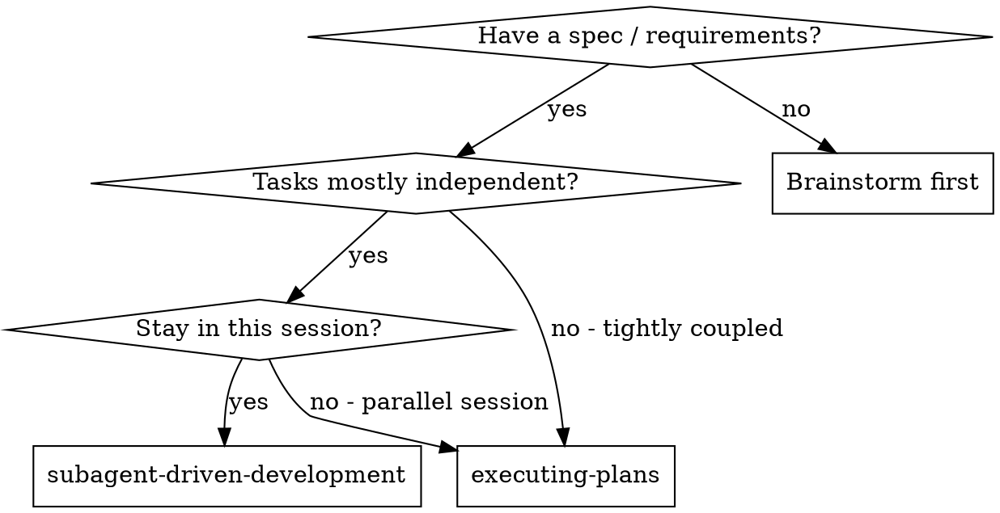
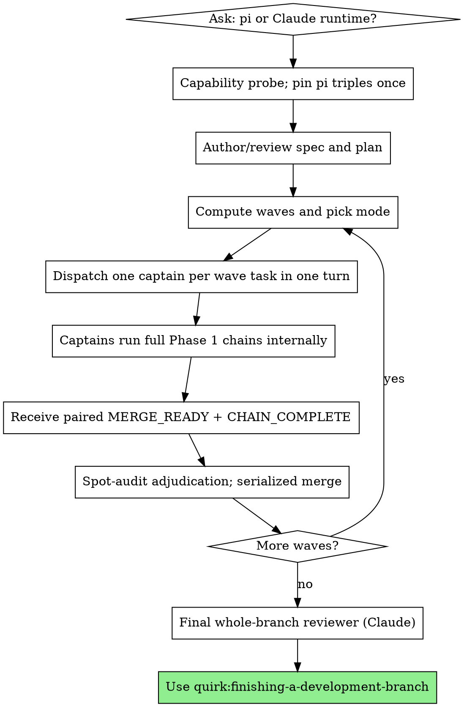

# Subagent-Driven Development

Execute a plan through one fresh **captain sub-orchestrator per task**. Each captain owns the
complete Phase 1 chain—implementer, risk-scaled concurrent review, adjudication, consolidated
fix, and targeted re-review—without returning to the top orchestrator between stages.

**Why captains:** Specialized workers still receive isolated, curated context, while a fresh
captain removes the top-orchestrator turn from every internal stage. The top orchestrator keeps
only runtime/plan gates, wave computation, captain dispatch, the serialized merge lane,
adjudication spot-audits, the escalation ledger, and final whole-branch review.

**Core principle:** one captain per task + one top-orchestrator dispatch turn per wave + the full
pre-merge chain inside each captain = fresh context and conservative quality gates without
stage-by-stage control-plane latency.

## When to Use



You do **not** need a written plan to start — this skill authors a tech spec when warranted,
then plans in context as its first phase (an optional **Step 0a-pre**, then **Step 0a**). You
need the tech spec (`tech.md`) when present, else the logic spec / requirements, to plan *from*;
if you don't have one, brainstorm first. Even when you do, a tech spec may still be authored
during execution (**Step 0a-pre**) if the work clears the complexity tier.

**Parallel by default:** when the chosen path is `subagent-driven-development`, the orchestrator computes waves from declared task independence and selects per-wave between `SEQUENTIAL`, `IN_PLACE_PARALLEL`, `WORKTREE_PARALLEL`, and `TEAM` mode. Sequential is reserved for tasks with hard declared dependencies. See **The Process → Step 0b**.

**vs. Executing Plans (parallel session):**
- Same session (no context switch)
- Fresh captain and workers per task (no context pollution)
- Full risk-scaled review chain remains pre-merge in Phase 1
- Faster iteration (no human or top-orchestrator turn between internal task stages)

## Runtime Selection

**This skill supports two agent runtimes.** Before reading the plan, ask the user
which to use via `AskUserQuestion`:

> **Which agent runtime for this plan?**
> - **Claude subagents** (default) — captain via `Task`/tested nested dispatch, with a hardened
>   headless `claude -p` fallback selected by capability probe
> - **Pi agents** — captain and workers through canonical `pi-watch` dispatch

The choice is locked once and applies uniformly to every per-task captain and its workers. The
final whole-branch reviewer always uses Claude `Task` (`quirk:code-reviewer`), regardless of the
choice; cross-task synthesis benefits from Claude's agent context and pi has no equivalent role.

| Role | Claude path | Pi path |
| --- | --- | --- |
| Per-task captain | `assets/captain-prompt.md` via the probed nested/headless launcher | `assets/pi-captain-prompt.md` via canonical `pi-watch` |
| Implementer | Captain dispatches `Task` (general-purpose) + `assets/implementer-prompt.md` | Captain dispatches pinned codex triple + `assets/pi-implementer-prompt.md` |
| Spec reviewer | Captain dispatches `Task` (general-purpose) + `assets/spec-reviewer-prompt.md` | Captain dispatches pinned gemini triple + `assets/pi-spec-reviewer-prompt.md` |
| Code-quality reviewer | Captain dispatches `Task` (quirk:code-reviewer) + `assets/code-quality-reviewer-prompt.md` | Captain dispatches pinned gemini triple + `assets/pi-code-quality-reviewer-prompt.md` |
| Codex adversarial reviewer | Captain uses `mcp__pal__clink` + `assets/codex-adversarial-prompt.md` | Captain dispatches pinned codex triple + `assets/pi-codex-adversarial-prompt.md` |
| Merge resolver (worktree mode only) | Top orchestrator dispatches `assets/merge-resolver-prompt.md` | Top orchestrator dispatches pinned triple + `assets/pi-merge-resolver-prompt.md` |
| Final whole-branch reviewer | `Task` (quirk:code-reviewer) | `Task` (quirk:code-reviewer) — always Claude |

### Run-start pinning, launcher probe, and context manifests

Before the first dispatch, capability-probe the selected captain path. A probe selects an
available launcher; it cannot create missing nested-dispatch capability. Prefer nested dispatch
where supported. Otherwise use a tested hardened headless launcher with a bounded timeout,
exit-code capture, framed output, signal-safe child cleanup, and no surviving child process. If
neither can launch a captain, use the one-paragraph **Flat chain fallback** below.

For the pi path, consult **quirk:pi-dev**, run `pi-watch --check` / `--list-aliases` **once at run
start**, and record the resolved `provider/model:thinking` triple for every role. Pin those
triples for the run. Every pi captain receives them as Inputs and uses explicit
`--provider`/`--model`/`--thinking`; it never re-resolves an alias per dispatch. A runtime-failure
re-resolution epoch, if the top orchestrator chooses one, is explicit and recorded rather than a
silent mid-chain fallback.

Every captain receives a provenance-bearing **context manifest**, not a bare packet: full task
text, Contract, `scope.files`, `scope.never_touch`, applicable `CLAUDE.md` rules and tech-spec
DO-NOT-CHANGE fences, acceptance commands, risk tier/rationale, worktree/scratch paths, relevant
SHAs, selected launcher, and (pi path) the pinned role triples. Captains do not re-derive these
inputs. Workers may still read source documents when the manifest proves insufficient.

## The Process



The Claude captain uses `assets/captain-prompt.md`; the pi captain uses
`assets/pi-captain-prompt.md`. Those templates select the corresponding worker assets and are
the authoritative home of the implementer → reviewers → adjudication → fix → re-review chain.

### Step 0: Runtime selection (above)

### Step 0a-pre: Author the tech spec (only when complexity warrants)

Before building the plan, apply the **complexity-tier gate** (from
**quirk:writing-tech-spec**): author `tech.md` if execution spans more than one session, crosses
a subsystem boundary, touches ≳3 source files, or the user asked for a tech spec. This is a
direct instruction — **author** or **skip**, not a suggestion to weigh. Record the ruling as
one line (which criterion fired, or "skipped — none met") — and in `logic.md` Status when a
tech spec is authored — before continuing.

**If the gate is met:**

1. **Idempotency:** if a reviewed `tech.md` already exists as the sibling of the actual
   `logic.md` (wherever it was saved — by default `docs/quirk/specs/YYYY-MM-DD-<topic>/tech.md`,
   handed off from another session), load it instead of re-authoring — re-author only if it's
   absent or the user asks for a rewrite.
2. Otherwise, invoke **quirk:writing-tech-spec** as the rubric to author `tech.md` next to the
   logic spec, in the same directory the approved `logic.md` was actually saved to (the path
   above is the default example, not a hard-coded location).
3. Dispatch the tech-spec reviewer (`../writing-tech-spec/tech-spec-reviewer-prompt.md`)
   against the in-context `tech.md` (paste inline — the reviewer reads no file); apply its fixes.
4. Offer the user an **optional** skim (not a gate) — surface the tech spec's anchored
   subsystem/files, its major DO-NOT-CHANGE fences, and its riskiest contracts, so they can veto
   a legal-but-wrong technical bet without reading the whole document.
5. **Feasibility escalation:** if authoring surfaces a conflict with a `logic.md`
   Decisions-Locked entry, **STOP**, present it to the user, and record the resolution in
   `logic.md`'s Amendments log before proceeding — never resolve it silently in `tech.md`.

**If the gate is not met:** skip — proceed straight to **Step 0a** and plan from `logic.md`.

This skill **authors a tech spec when warranted, then plans in context**: `tech.md` (when
authored) becomes `writing-plans`' input for Step 0a, alongside — or instead of — `logic.md`.

### Step 0a: Build the plan in context

Unless a plan already exists (in this conversation, or as a persisted file handed to you),
**build it now** — planning is the first phase of execution, not a prior step:

1. Invoke **quirk:writing-plans** as the rubric, drafting from `tech.md` when Step 0a-pre
   authored or loaded one, else from `logic.md` / requirements. Draft the task breakdown — each
   task with its Contract, Acceptance, optional `independent` / `dependencies` /
   `scope.files` / `scope.never_touch` / `cooperative` fields, and a **required explicit**
   `risk: logic | pattern | mechanical` plus one-line rationale — directly in this conversation
   **and into a TodoWrite list** (one item per task). There is no silent risk default; omission or
   weak downgrade rationale is a plan-review finding. TodoWrite is the durable home for the
   breakdown; it survives context compaction.
2. **Complexity-tier upgrade re-check.** Immediately after writing-plans' File Structure pass
   (part of step 1, above) reveals the real file count and task shape, re-check the
   complexity-tier gate against the actual scope — **before** Step 0a-review (plan review) and
   Step 0b / Step 0c (wave computation). If a previously-skipped run now clears the tier, author
   `tech.md` late (Step 0a-pre's steps 1-5) and re-plan the affected tasks before continuing.
3. **Do not write a plan file** by default. Persist to `docs/quirk/plans/` only if the user asks
   or the plan must outlive this session.
4. If a persisted plan file *was* handed off from another session, read it once to seed the
   in-context plan + TodoWrite, then proceed as above.

### Step 0a-review: Agent reviews the plan (default)

Dispatch the plan-document reviewer (`../writing-plans/plan-document-reviewer-prompt.md`) on the
**in-context plan** (paste the plan text inline — the reviewer does not read a file). Apply its
fixes inline. This is automatic and replaces any human approval gate; only stop for the user if
the reviewer surfaces a genuine ambiguity you cannot resolve.

### Step 0b: Use the in-context plan, compute waves

1. Use the plan from Step 0a — every task's full text and context is already in this conversation
   and in TodoWrite. (Subagents still receive task text **pasted inline**; they never read a plan.)
2. The TodoWrite list of all tasks already exists from Step 0a.
3. For each task, read these optional fields (from the **quirk:writing-plans** rubric):
   - `independent: true` — task can run alongside any other task in its eligible wave
   - `dependencies: [task-id, ...]` — task must wait for all listed tasks to complete. Opt-in
     per-dependency form `dependencies: [T1.contract, ...]` lets the dependent start once T1's
     *contract* is confirmed rather than waiting for T1's full chain (see Step 4 below); plain
     `T1` keeps the full wait.
   - `scope.files: [path, ...]` — files this task is allowed to touch
   - `scope.never_touch: [path, ...]` — forbidden adjacent files; negative scope wins
   - `cooperative: true` — task needs live negotiation with other tasks in its wave (TEAM mode)
   - `risk: logic | pattern | mechanical` — required, with a one-line rationale; scales the
     review chain. No default is inferred. See **Review depth by task risk**.
4. Topologically sort tasks by `dependencies`. A `.contract` dependency is satisfied — for
   wave-computation purposes — once the upstream task is COMMITTED and its spec-compliance
   review has confirmed the exported contracts (interfaces/signatures/schemas the dependent
   consumes); the upstream's remaining review passes (code quality, Codex) continue in parallel
   with the dependent's own work. Plain `dependencies: [T1]` waits for T1's full review chain
   before the dependent starts. Trade-off: if a later upstream finding changes a contract, any
   dependent that started early must be re-checked against the corrected contract — this is the
   accepted cost, which is why the form is opt-in per dependency rather than default. **Git
   topology (`WORKTREE_PARALLEL`):** a dependent that early-starts against `TN.contract` creates
   its worktree branch **from `TN`'s task branch at the contract-confirmed commit** — never from
   the parent branch, which cannot yet see `TN`'s commits. **Merge barrier:** early START against
   a `.contract` dependency is allowed once the contract is confirmed, but early MERGE is not —
   the dependent's own rolling merge into the parent is deferred until `TN`'s branch has itself
   passed its full review chain and merged into the parent first. This guarantees unreviewed
   upstream commits can never enter the parent branch transitively through the dependent.
5. Build successive waves: a wave contains tasks whose dependencies have all been satisfied AND that are mutually compatible (see Step 0c).

### Step 0c: Pick the mode for the current wave

```
if |wave| == 1:
    mode = SEQUENTIAL
elif any task in wave has cooperative: true:
    mode = TEAM
elif |wave| <= N_INPLACE_THRESHOLD AND scopes are provably disjoint at file level:
    mode = IN_PLACE_PARALLEL
else:
    mode = WORKTREE_PARALLEL    # default for 2+ independent tasks
```

`N_INPLACE_THRESHOLD = 2` by default. "Scopes provably disjoint at file level"
means every task in the wave declared `scope.files` AND no two tasks share
any file path.

If a task declared neither `independent: true`, `dependencies`, nor
`scope.files`, place it in its own singleton wave (= SEQUENTIAL). This is
the safe fallback for plans that haven't adopted the new format.

### Mode mechanics

For every mode, the top orchestrator builds each task's context manifest, stages the captain
prompt outside the repository, and dispatches **one captain per task**. For a parallel wave all
captains are launched in one message/control turn; there is no top-orchestrator turn between a
captain's worker stages. The Claude path uses `assets/captain-prompt.md`; the pi path uses
`assets/pi-captain-prompt.md` with the run-pinned triples.

Pi workers must never edit overlapping files in one working directory, and `git worktree add`
operations remain serialized to avoid `.git/config.lock` races. These constraints choose the
safe mode; they do not serialize independent captain chains.

#### SEQUENTIAL

Dispatch one captain for the singleton task. Width 1 uses the same captain state machine and
paired report contract as parallel modes; it is not the degraded flat-chain fallback.

#### IN_PLACE_PARALLEL

Dispatch all wave captains in one turn against the current worktree only when Step 0c proved
file-level-disjoint `scope.files`. Captains enforce both positive and negative scope. If pi
workers cannot commit safely from the shared directory, retain the orchestrator-commits
coordinator: each captain's internal `IMPLEMENTER_DONE` signal queues only that task's declared
files for an automated serialized commit before its reviews start. This is a git-lock
coordination action, not a stage-by-stage top-orchestrator reasoning turn. Any overlap or commit
conflict is a mode-gate defect: stop the wave and emit `ESCALATION`.

#### WORKTREE_PARALLEL (default for 2+ independent tasks)

1. Serialize worktree creation via **quirk:using-git-worktrees**, one isolated worktree per task.
   Branches use `sdd/<run-slug>/<task-id>` (for example `sdd/kestrel/T1`), where `run-slug`
   identifies this plan run. Never prefix the branch with the parent branch: an existing leaf
   such as `refs/heads/main` conflicts with trying to create `refs/heads/main/sdd/...` in Git's
   ref namespace. An explicit `.contract` dependency retains Step 0b's existing opt-in fork from
   the upstream task branch at its contract-confirmed commit.
2. Dispatch all wave captains in one top-orchestrator turn, one per worktree. Each captain runs
   its complete pre-merge chain over isolated commits and writes durable scratch artifacts.
3. As paired reports arrive, feed the task to the **Phase 1 serialized merge lane** below. An
   explicit `.contract` dependent still cannot merge until its upstream full chain has completed
   and the upstream has merged.
4. Tear down a task worktree only after its `CHAIN_COMPLETE`/`MERGE_READY` pair passes audit and
   its branch merges successfully. Preserve parked/conflicted worktrees.

#### TEAM (rare, opt-in via `cooperative: true`)

Create the team, then dispatch one captain per task in one turn. Captains may use the team's
TaskList/SendMessage channel for the live negotiation the plan requested, while each captain
still owns its task's complete Phase 1 chain and report artifacts. Delete the team after all
captains reach `CHAIN_COMPLETE` or are parked and the wave integration gate has run.

### Captain dispatch, Phase 1 merge lane, and audit

Before a wave launch, stage every captain prompt and manifest under external run scratch with
task/role-keyed names and hard-fail if either is absent. Include task/Contract, both scope lists,
acceptance, explicit risk/rationale, worktree, relevant SHAs, rules/fences, launcher selection,
and pinned pi triples where applicable. Dispatch all captains in **one top-orchestrator turn per
wave**. Captains persist worker outputs, timestamps, adjudication, ledger, and events as produced;
if one dies, adopt the orphaned chain from those artifacts and resume or park it.

In **Phase 1**, a captain emits no milestone until its entire pre-merge chain is PASS/resolved.
It then emits `MERGE_READY(candidate SHA + adjudication log)` and
`CHAIN_COMPLETE(timestamps + ledger)` **together**. `MERGE_READY` readiness is tier-specific:
`logic`/`pattern` requires spec-compliance PASS and a green build; `mechanical` requires declared
acceptance evidence and a green build. Because the reports coincide in this phase, the merge
lane accepts a task only after `CHAIN_COMPLETE`, verifies the branch still names the reported
candidate SHA, and spot-audits the captain's adjudication log. The top orchestrator does not
re-adjudicate every finding; it may reopen a questionable call, in which case the captain resumes
and must return a new paired report before merge.

Merges are serialized. For a worktree branch, run `git merge --no-ff <task-branch>` on the parent
only after the paired report and audit; never let a captain edit the parent. On a real overlap,
dispatch the runtime's merge-resolver asset. `SUCCESS` continues the lane;
`UNRESOLVABLE` is recorded and parked with its worktree/conflict state. Run one integration
build/test after all mergeable captains in the wave have landed, then proceed to the next wave.
In-place tasks are already committed on the parent but still require the same paired-report audit
before their wave is considered complete.

**Phase 2 (future)**, not active in this revision, separates these milestones: a
`REBASE_REQUEST`/candidate-SHA attestation permits merge-on-`MERGE_READY`, then quality/Codex
trail on leased worktrees and fixes use `BRANCH_REQUEST` micro-branches. Do not merge before
`CHAIN_COMPLETE` in Phase 1. **Phase 3 (future)** adds `STUB_READY`/implementer-DONE speculative
starts with FORK_SHA/`--onto` barriers, worktree pooling with lease/reset, and rerere with
`rerere.autoUpdate` off. No pooling, lease reuse, rerere, or new speculative start is active here.

### Escalation ledger

`ESCALATION` is the only load-bearing exception event in Phase 1. A captain handles
`NEEDS_CONTEXT` first from its manifest/spec/codebase and records a conservative assumption if
underivable; only a question it still cannot safely resolve reaches the top orchestrator. The top
orchestrator classifies every event against the exhaustive routing table, appends the event and
disposition to the unresolved-findings ledger, and returns a recorded decision or parks the task.
It never silently invents a class or drops an event.

| Escalation class | Phase 1 conservative routing | Phase 2 (future) auto-resolution |
| --- | --- | --- |
| `NEEDS_CONTEXT` after captain attempt | Derive from spec/codebase; use and record the most conservative verifiable assumption, else park | Same recorded conservative default |
| Plan-vs-spec conflict | Follow `logic.md` Decisions-Locked and record the dated Amendments entry; park if that cannot be done without violating scope | Same |
| Capped-out CRITICAL after Codex cycle 2 | Full-chain gate remains closed; park, do not merge | Safest fix interpretation, tagged `AUTO-RESOLVED-CRITICAL`, then verify-or-quarantine |
| Capped-out HIGH | Carry only in the explicit ledger for final review | Same ledger carry-forward |
| Merge resolver `UNRESOLVABLE` | Park branch and preserve worktree/conflict state | Same |
| Failing baseline/worktree preflight | Park affected task; continue other independent work | Same |
| Runtime fallback exhausted (pi and Claude dead for a role) | Park affected task; continue other independent work | Same |
| Any class without a defined row | Park affected task; never invent a default | Same |

Phase 1 keeps the audit portions that are compatible with its conservative gate: all carried or
parked findings remain in the ledger, that ledger is pasted verbatim into the final whole-branch
review prompt, and the run summary lists escalations and parked tasks first. The §4
**verify-or-quarantine gate is Phase 2 (future)**: an `AUTO-RESOLVED-CRITICAL` can finish clean
only after an independent PASS plus green verification on the final branch SHA; failed,
unavailable, missing, or inconclusive verification yields `QUARANTINED`. Phase 1 does not use
that mechanism to force a CRITICAL through its full-chain gate.

`READINESS_REVOKED`, `CONTRACT_CORRECTED`, and `BRANCH_REQUEST` are documented in the captain
templates for forward compatibility but are not active exception paths in Phase 1. Likewise,
`STUB_READY` and `REBASE_REQUEST` are reserved progress events; only internal
`IMPLEMENTER_DONE` is live, and it does not authorize speculative branching. The **Phase 3
(future)** `STUB_READY` gate requires Contract-matching signatures/schemas, green typecheck/build
and baseline tests, and explicit not-implemented placeholder behavior (never plausible fakes);
otherwise only a non-branchable contract artifact is published. The **Phase 2 (future)**
`REBASE_REQUEST` asks the lane for the exact rebased candidate SHA before fresh attestation.

### Flat chain fallback

Only when the run-start capability probe proves that no captain can be dispatched, the top orchestrator runs a degraded flat chain inline with one turn per stage; it applies exactly the same risk-tier reviewer scaling, concurrent initial review, stable-ID severity-normalized adjudication, guarded reviewer patches/consolidated fix, discrepancy check, contract invalidation, targeted re-review, Codex cycle definition/cap, durable artifacts, timestamps, Phase 1 report gate, and escalation routing defined authoritatively in `assets/captain-prompt.md` or `assets/pi-captain-prompt.md`, rather than maintaining a second protocol here.

### Review depth by task risk

Each task carries a required explicit `risk` field from the plan
(`logic | pattern | mechanical`) plus a one-line rationale. There is no silent default: omission
is a plan-review finding, and lower tiers need the strongest justification because they remove
review passes. It scales the reviewers the captain dispatches; the authoritative chain rules in
the captain template apply to whichever subset runs:

| Risk | Reviewers dispatched | When to use |
| --- | --- | --- |
| `logic` | Full three-pass: spec compliance + code quality + Codex adversarial | New behavior, contracts, or algorithms |
| `pattern` | Spec compliance + Codex adversarial (skip the standalone code-quality pass) | Mirrors a pattern already reviewed on this branch (e.g. a second feature rewired the same way as the first) |
| `mechanical` | None — acceptance is the task's own verifiable gate (build/tests/grep, stated in the task) | Deletions, renames, config/doc updates with no new logic; backstopped by the final whole-branch reviewer |

**`.contract` upstream restriction:** a task may be a `.contract` upstream (i.e. a dependent may
declare `dependencies: [TN.contract]` against it) only if its risk tier dispatches a
spec-compliance reviewer — `logic` or `pattern`. `mechanical` tasks dispatch no reviewers at all,
so there is no spec-compliance pass to confirm their contracts; they can never be a `.contract`
upstream.

Rationale: in practice all substantive findings come from `logic` tasks;
adversarial-reviewing a file deletion pays minutes of review latency to
re-read a `git rm`. Risk tier is set when the plan is written (Step 0a) and
holds for the whole run — see the Red Flags entry on not downgrading a tier
mid-run to save time.

### Example (parallel wave under WORKTREE_PARALLEL)

```text
[Plan: T1 risk=logic, T2 risk=pattern, T3 depends on T1]
[Wave 1={T1,T2}; choose WORKTREE_PARALLEL]
[Create sdd/kestrel/T1 and sdd/kestrel/T2 worktrees serially]
[Stage two context manifests and dispatch two captains in one top-orchestrator turn]

T1 captain (internally): implement -> spec ∥ quality ∥ Codex -> adjudicate -> PASS
T2 captain (internally): implement -> spec ∥ Codex -> consolidated fix -> targeted re-review -> PASS

T1 -> MERGE_READY(sha1) + CHAIN_COMPLETE together
[top spot-audits adjudication; serialized merge T1; teardown]
T2 -> MERGE_READY(sha2) + CHAIN_COMPLETE together
[top spot-audits adjudication; serialized merge T2; teardown]
[Wave integration checks pass; compute Wave 2]
[Dispatch one captain for T3]
[After all waves: final Claude quirk:code-reviewer receives the unresolved-findings ledger]
```

## Model Selection

**Captains:** use Sonnet (or the runtime's orchestration-tier equivalent). Captain selection is
separate from task risk and worker model selection.

**Pi path:** Role aliases are resolved once at run start and their exact
`provider/model:thinking` triples are pinned into every captain manifest. Use those recorded
triples for implementer, reviewers, fix worker, and merge resolver; never resolve an alias inside
a live captain. Skip the rest of this section for pi workers.

**Claude workers:** Use the least powerful model that can handle each role to conserve
cost and increase speed.

**Low-complexity implementation tasks** (isolated functions, clear specs, 1-2 files): use a fast, cheap model. Most implementation tasks are low-complexity when the plan is well-specified. This is a model-selection bucket, not the plan's `risk` field — model choice does NOT determine `risk`; a low-complexity change can still be `risk: logic`.

**Integration and judgment tasks** (multi-file coordination, pattern matching, debugging): use a standard model.

**Architecture, design, and review tasks**: use the most capable available model.

**Task complexity signals:**
- Touches 1-2 files with a complete spec → cheap model
- Touches multiple files with integration concerns → standard model
- Requires design judgment or broad codebase understanding → most capable model

## Handling Implementer Status

The captain, not the top orchestrator, handles implementer DONE, DONE_WITH_CONCERNS,
NEEDS_CONTEXT, and BLOCKED according to its runtime's captain template. `IMPLEMENTER_DONE` is an
internal durable Phase 1 signal; it starts risk-tier review but never speculative branching.
`NEEDS_CONTEXT` is self-resolved from the manifest/spec/codebase first. Only a concern the
captain cannot conservatively resolve becomes `ESCALATION`. The top orchestrator handles these
statuses directly only in the degraded **Flat chain fallback**.

## Verification economics

Do not routinely duplicate verification already run and recorded inside a captain. Captains run
affected acceptance checks after guarded patches/fixes and provide readiness evidence. The top
orchestrator re-verifies at three control-plane boundaries only:

1. the wave integration build/test on the merged state;
2. a reopened adjudication/discrepancy or uncertain candidate SHA; and
3. the final branch gate before whole-branch review.

On wave-boundary failure, identify the responsible task from the evidence and re-dispatch/resume
that task's captain with the failure in its manifest. The captain applies its authoritative
adjudication, discrepancy-check, fix, and targeted re-review contract and returns a fresh paired
report. Re-run the wave gate after the fix lands. Spot-reading high-risk diffs is encouraged;
re-running every worker command is not.

## Dispatch hygiene

- **Stage ahead.** The top orchestrator stages all captain prompts/manifests before the wave's
  one-turn launch. Each captain stages the next role prompt while its current worker runs, so
  internal transitions do not wait on prompt assembly.
- **Hard-fail on a missing prompt file.** A dispatch command must refuse to run if its prompt
  file is absent — e.g. `[ -f prompt.md ] || exit 1` before invoking. Never fall back to a
  placeholder (`cat prompt.md || echo MISSING` piped into a live dispatch); a garbage prompt
  burns a full worker round-trip and is far more expensive than failing fast.
- **Stage prompt and artifact files outside the repository.** Write them to run scratch, never
  inside a worktree—a captain/worker with edit tools could commit or clobber them there. Use
  task/role-keyed filenames (`t3-captain.md`, `t3-spec-review.md`, not `prompt.md`) so concurrent
  chains never collide. Reviewer outputs, adjudication, timestamps, ledger, and events are
  appended there as produced so an orphaned captain can be adopted.

## Prompt Templates

All templates live in `assets/`. The dispatch path is selected by the runtime
chosen in **Runtime Selection**.

**Claude path:**
- `assets/captain-prompt.md` — authoritative per-task chain; dispatch the captain through the
  capability-probed nested or hardened headless launcher
- `assets/implementer-prompt.md`, `assets/spec-reviewer-prompt.md`,
  `assets/code-quality-reviewer-prompt.md`, `assets/codex-adversarial-prompt.md` — worker prompts
  selected by the captain and task risk
- `assets/merge-resolver-prompt.md` — top-orchestrator merge-lane resolver for
  `WORKTREE_PARALLEL`

**Pi path:**
- `assets/pi-captain-prompt.md` — authoritative per-task chain and concrete canonical
  `pi-watch --provider ... --model ... --thinking ...` dispatch/failure protocol
- `assets/pi-implementer-prompt.md`, `assets/pi-spec-reviewer-prompt.md`,
  `assets/pi-code-quality-reviewer-prompt.md`, `assets/pi-codex-adversarial-prompt.md` — staged
  worker bodies selected by the captain and task risk
- `assets/pi-merge-resolver-prompt.md` — top-orchestrator merge-lane resolver

In captain mode, the run-pinned exact triples in `assets/pi-captain-prompt.md` supersede the
standalone worker templates' alias-form invocation examples. Implementer/fix workers receive
`read,bash,edit,write`; reviewers receive `read,grep,find,ls`. Follow **quirk:pi-dev** for the
canonical hardened recipe and failure signatures. Every applicable initial reviewer is launched
concurrently by the captain; the top orchestrator never dispatches those stages itself except in
the flat fallback.

## Example Workflow

```text
[Step 0: user selects runtime]
[Probe captain launcher; on pi, resolve and pin every role triple once]
[Step 0a-pre / 0a / 0a-review: author as warranted, plan in context, review plan]
[Step 0b / 0c: compute Wave 1 and select WORKTREE_PARALLEL]
[Create worktrees serially; build provenance-bearing context manifests]
[Dispatch one captain per Wave 1 task in one top-orchestrator turn]

[Captains run their full chains without top-level stage turns and persist artifacts]
Captain T1: MERGE_READY(sha1, adjudication) + CHAIN_COMPLETE(timestamps, ledger)
Captain T2: ESCALATION(class, evidence, artifacts)

[Spot-audit T1; merge in serialized lane]
[Route T2 through exhaustive ledger table; resume or park]
[Run wave integration checks; repeat for later waves]
[Final Claude quirk:code-reviewer receives final SHA + unresolved-findings ledger]
[Use quirk:finishing-a-development-branch]
```

## Final whole-branch review

After all waves' mergeable tasks have passed integration verification, dispatch the final
whole-branch reviewer with Claude `Task` (`quirk:code-reviewer`) regardless of worker runtime.
Bind the prompt to explicit base/head SHAs and include the aggregated task Contracts, parked-task
list, and unresolved-findings ledger verbatim. The reviewer must re-examine every carried HIGH
and every future-schema `AUTO-RESOLVED-CRITICAL` entry. Resolve its accepted findings and run the
final verification gate before `quirk:finishing-a-development-branch`; never hide parked tasks or
ledger entries behind a generally positive verdict.

## Advantages

- Captains preserve fresh worker context and risk-scaled quality gates.
- Concurrent captain chains use the plan's real wave width.
- The top orchestrator pays one dispatch/control turn per wave, not one per worker stage.
- Durable artifacts make a half-finished chain adoptable after captain failure.
- Context manifests and run-pinned pi triples remove repeated planning/model-resolution work.
- Phase 1 keeps every review and fix before merge while the control plane is proven.

## Red Flags

**Never:**
- Start implementation on main/master without explicit user consent.
- Infer a missing risk tier, accept a rationale-free tier, or downgrade risk mid-run.
- Send a captain/worker a bare task packet or omit `scope.never_touch` and applicable fences.
- Re-resolve pi aliases inside a captain or silently change provider/model/runtime mid-chain.
- Dispatch one top-level worker per stage when a captain launcher is available.
- Treat `IMPLEMENTER_DONE` as permission for speculative branching in Phase 1.
- Count missing/unparseable reviewer output as PASS.
- Emit `MERGE_READY` or `CHAIN_COMPLETE` before the full Phase 1 chain is PASS/resolved, or emit
  them separately in this phase.
- Merge a task before its captain's paired `MERGE_READY` + `CHAIN_COMPLETE` report and
  adjudication spot-audit.
- Activate trailing merge, candidate-SHA rebase handshakes, leased/pool worktrees,
  trailing-fix micro-branches, new speculative starts, or rerere; those are Phase 2/3 future.
- Drop an `ESCALATION`, unrecognized class, parked task, or unresolved finding from the ledger.
- Tear down a parked/conflicted worktree or write staged prompts/artifacts inside a repository.
- Reimplement the internal chain from memory; the captain templates are authoritative.

Questions and blockers are handled inside the captain first. If the captain cannot resolve one
conservatively, it emits `ESCALATION`; the top orchestrator uses the exhaustive ledger table,
never an ad hoc retry or silent assumption.

## Pi failure routing

Follow **quirk:pi-dev** failure signatures and the concrete
`assets/pi-captain-prompt.md` policy. Auth/billing failures emit `ESCALATION` rather than causing
a captain to silently fall back. Rate limits get one retry after 60 seconds; empty/missing output
gets one re-dispatch; unparseable reviewer output is never PASS and is synthesized as
`NEEDS_FIX`. Use pi-dev's bounded timeout handling and hardened JSONL/exit-code recipe.

Only the top orchestrator may choose a runtime fallback or recorded re-resolution epoch. It then
issues a new context manifest and requires affected work to be re-reviewed; a live captain never
mutates its pinned triples. If both pi and Claude are dead for a role, use the escalation table's
runtime-fallback-exhausted row and park the task.

## Integration

**Required workflow skills:**
- **quirk:using-git-worktrees** — REQUIRED: set up isolation before starting. In
  `WORKTREE_PARALLEL`, create one worktree per task on `sdd/<run-slug>/<task-id>`, run each
  captain's full chain pre-merge, serialize paired-report merges, and tear down only after
  successful merge. The run slug prevents concurrent-plan collisions without embedding an
  existing parent ref as an invalid namespace prefix.
- **quirk:writing-plans** — The in-context Step 0a rubric. It produces Contracts, acceptance,
  wave fields, both scope lists, and a required explicit `risk` plus rationale. Wave fields feed
  Step 0b/0c; risk scales the captain's reviewer set rather than wave shape.
- **quirk:requesting-code-review** — Code review template for reviewer subagents.
- **quirk:finishing-a-development-branch** — Complete development after all tasks.

**Required when pi runtime is selected:**
- **quirk:pi-dev** - Canonical hardened dispatch recipe, failure detection, reviewer JSON parse fallback, model alias resolution

**Subagents should use:**
- **quirk:test-driven-development** - Subagents follow TDD for each task

**Alternative workflow:**
- **quirk:executing-plans** - Use for parallel session instead of same-session execution
