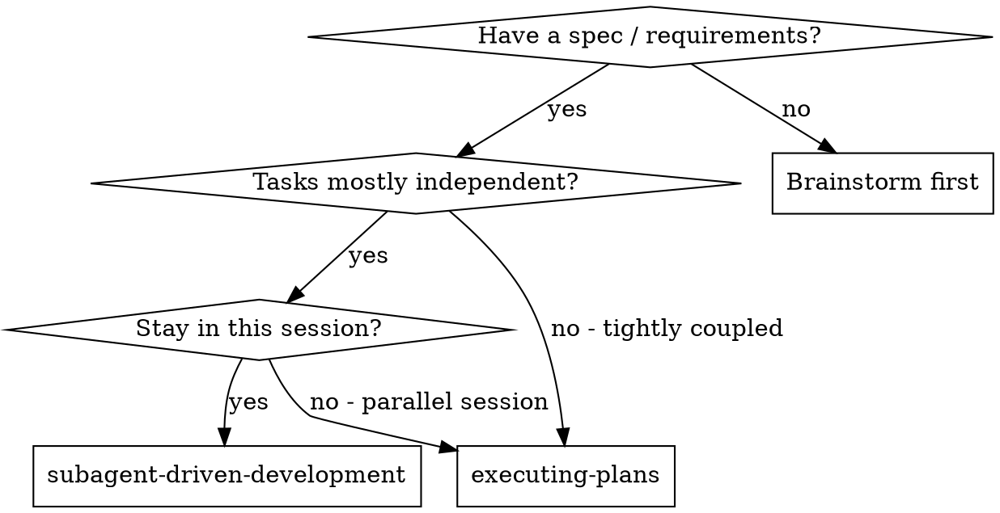
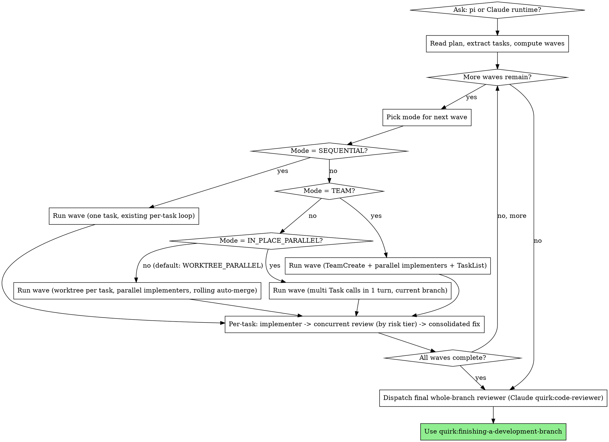

# Subagent-Driven Development

Execute plan by dispatching fresh subagent per task, with a review after each by every reviewer applicable to the task's risk tier — spec compliance, code quality, and Codex adversarial gap-finding for the default `logic` tier (full three-pass), fewer for `pattern`/`mechanical` — dispatched **concurrently**, then reconciled by the orchestrator through adjudication and a single consolidated fix.

**Why subagents:** You delegate tasks to specialized agents with isolated context. By precisely crafting their instructions and context, you ensure they stay focused and succeed at their task. They should never inherit your session's context or history — you construct exactly what they need. This also preserves your own context for coordination work.

**Core principle:** Fresh subagent per task + concurrent review by all reviewers applicable to the task's risk tier (spec, quality, Codex adversarial — full three-pass for `logic` tasks — dispatched together) + orchestrator-adjudicated consolidated fix = high quality, fast iteration

## When to Use



You do **not** need a written plan to start — this skill builds the plan in context as its
first phase (**Step 0a**). You need a spec or requirements to plan *from*; if you don't have
one, brainstorm first.

**Parallel by default:** when the chosen path is `subagent-driven-development`, the orchestrator computes waves from declared task independence and selects per-wave between `SEQUENTIAL`, `IN_PLACE_PARALLEL`, `WORKTREE_PARALLEL`, and `TEAM` mode. Sequential is reserved for tasks with hard declared dependencies. See **The Process → Step 0b**.

**vs. Executing Plans (parallel session):**
- Same session (no context switch)
- Fresh subagent per task (no context pollution)
- Review after each task by every reviewer applicable to the task's risk tier — spec compliance, code quality, Codex adversarial (full three-pass for `logic` tasks) — dispatched concurrently
- Faster iteration (no human-in-loop between tasks)

## Runtime Selection

**This skill supports two agent runtimes.** Before reading the plan, ask the user
which to use via `AskUserQuestion`:

> **Which agent runtime for this plan?**
> - **Claude subagents** (default) — `Task` tool with general-purpose / quirk:code-reviewer agents
> - **Pi agents** — `pi -p` headless dispatch with codex implementer + gemini reviewer

The choice is locked once and applies uniformly to per-task implementer + per-task
spec reviewer + per-task code-quality reviewer for the rest of the run.

**The final whole-branch reviewer always uses the Claude `quirk:code-reviewer`
agent**, regardless of choice — cross-task synthesis benefits from Claude's agent
context, and pi has no equivalent role.

| Role | Claude path | Pi path |
| --- | --- | --- |
| Implementer | `Task` (general-purpose) + `assets/implementer-prompt.md` | `pi-watch --alias codex --thinking xhigh` + `assets/pi-implementer-prompt.md` |
| Spec reviewer | `Task` (general-purpose) + `assets/spec-reviewer-prompt.md` | `pi-watch --alias gemini` + `assets/pi-spec-reviewer-prompt.md` |
| Code-quality reviewer | `Task` (quirk:code-reviewer) + `assets/code-quality-reviewer-prompt.md` | `pi-watch --alias gemini` + `assets/pi-code-quality-reviewer-prompt.md` |
| Codex adversarial reviewer | `mcp__pal__clink` (cli_name=`codex`, role=`codereviewer`) + `assets/codex-adversarial-prompt.md` | `pi-watch --alias codex --thinking xhigh` (`--tools read,bash`) + `assets/pi-codex-adversarial-prompt.md` |
| Merge resolver (worktree mode only) | `Task` (general-purpose) + `assets/merge-resolver-prompt.md` | `pi-watch --alias codex --thinking xhigh` (`--tools read,bash,edit,write`) + `assets/pi-merge-resolver-prompt.md` |
| Final whole-branch reviewer | `Task` (quirk:code-reviewer) | `Task` (quirk:code-reviewer) — always Claude |

`pi-watch` resolves each alias to the newest authed model in its fallback ladder (see
**quirk:pi-dev**); no exact model id is pinned here — hard-pinning via `--provider`/`--model` is
the documented exception, not the default.

When the pi path is selected, **REQUIRED:** consult `quirk:pi-dev` for the
canonical hardened dispatch recipe, failure-detection rules, and reviewer JSON
parse fallback.

## The Process



`<runtime>` in asset paths is `` (empty) for the Claude path and `pi-` for the
pi path. So the implementer template is `assets/implementer-prompt.md` (Claude)
or `assets/pi-implementer-prompt.md` (pi); the Codex adversarial template is
`assets/codex-adversarial-prompt.md` (Claude) or `assets/pi-codex-adversarial-prompt.md` (pi);
and so on for spec reviewer, code-quality reviewer, and merge resolver.

### Step 0: Runtime selection (above)

### Step 0a: Build the plan in context

Unless a plan already exists (in this conversation, or as a persisted file handed to you),
**build it now** — planning is the first phase of execution, not a prior step:

1. Invoke **quirk:writing-plans** as the rubric. Draft the task breakdown — each task with its
   Contract, Acceptance, and optional `independent` / `dependencies` / `scope.files` /
   `cooperative` / `risk` fields — directly in this conversation **and into a TodoWrite list** (one item
   per task). TodoWrite is the durable home for the breakdown; it survives context compaction.
2. **Do not write a plan file** by default. Persist to `docs/quirk/plans/` only if the user asks
   or the plan must outlive this session.
3. If a persisted plan file *was* handed off from another session, read it once to seed the
   in-context plan + TodoWrite, then proceed as above.

### Step 0a-review: Agent reviews the plan (default)

Dispatch the plan-document reviewer (`../writing-plans/plan-document-reviewer-prompt.md`) on the
**in-context plan** (paste the plan text inline — the reviewer does not read a file). Apply its
fixes inline. This is automatic and replaces any human approval gate; only stop for the user if
the reviewer surfaces a genuine ambiguity you cannot resolve.

### Step 0b: Use the in-context plan, compute waves

1. Use the plan from Step 0a — every task's full text and context is already in this conversation
   and in TodoWrite. (Subagents still receive task text **pasted inline**; they never read a plan.)
2. The TodoWrite list of all tasks already exists from Step 0a.
3. For each task, read these optional fields (from the **quirk:writing-plans** rubric):
   - `independent: true` — task can run alongside any other task in its eligible wave
   - `dependencies: [task-id, ...]` — task must wait for all listed tasks to complete. Opt-in
     per-dependency form `dependencies: [T1.contract, ...]` lets the dependent start once T1's
     *contract* is confirmed rather than waiting for T1's full chain (see Step 4 below); plain
     `T1` keeps the full wait.
   - `scope.files: [path, ...]` — files this task is expected to touch
   - `cooperative: true` — task needs live negotiation with other tasks in its wave (TEAM mode)
   - `risk: logic | pattern | mechanical` — scales the review chain for this task; default
     `logic`. See **Review depth by task risk**.
4. Topologically sort tasks by `dependencies`. A `.contract` dependency is satisfied — for
   wave-computation purposes — once the upstream task is COMMITTED and its spec-compliance
   review has confirmed the exported contracts (interfaces/signatures/schemas the dependent
   consumes); the upstream's remaining review passes (code quality, Codex) continue in parallel
   with the dependent's own work. Plain `dependencies: [T1]` waits for T1's full review chain
   before the dependent starts. Trade-off: if a later upstream finding changes a contract, any
   dependent that started early must be re-checked against the corrected contract — this is the
   accepted cost, which is why the form is opt-in per dependency rather than default. **Git
   topology (`WORKTREE_PARALLEL`):** a dependent that early-starts against `TN.contract` creates
   its worktree branch **from `TN`'s task branch at the contract-confirmed commit** — never from
   the parent branch, which cannot yet see `TN`'s commits. **Merge barrier:** early START against
   a `.contract` dependency is allowed once the contract is confirmed, but early MERGE is not —
   the dependent's own rolling merge into the parent is deferred until `TN`'s branch has itself
   passed its full review chain and merged into the parent first. This guarantees unreviewed
   upstream commits can never enter the parent branch transitively through the dependent.
5. Build successive waves: a wave contains tasks whose dependencies have all been satisfied AND that are mutually compatible (see Step 0c).

### Step 0c: Pick the mode for the current wave

```
if |wave| == 1:
    mode = SEQUENTIAL
elif any task in wave has cooperative: true:
    mode = TEAM
elif |wave| <= N_INPLACE_THRESHOLD AND scopes are provably disjoint at file level:
    mode = IN_PLACE_PARALLEL
else:
    mode = WORKTREE_PARALLEL    # default for 2+ independent tasks
```

`N_INPLACE_THRESHOLD = 2` by default. "Scopes provably disjoint at file level"
means every task in the wave declared `scope.files` AND no two tasks share
any file path.

If a task declared neither `independent: true`, `dependencies`, nor
`scope.files`, place it in its own singleton wave (= SEQUENTIAL). This is
the safe fallback for plans that haven't adopted the new format.

### Mode mechanics

**Pi-runtime parallelism note.** Parallel pi workers must never edit OVERLAPPING files — the
pi CLI has no sandbox, so two workers touching the same file will clobber each other's edits.
Sharing a working directory is sanctioned ONLY under the orchestrator-commits fallback below, and
only when the wave's tasks declared disjoint `scope.files`. Separately, `git worktree add` calls
race on `.git/config.lock` and must be issued serially. Neither constraint is a reason to
serialize the wave itself — both have a sanctioned parallel-safe pattern:

1. **WORKTREE_PARALLEL (preferred):** the orchestrator serially creates all of the wave's
   worktrees up front (one `git worktree add` at a time, no lock race), then dispatches all
   workers in parallel — one per worktree, each with its own working directory.
2. **ORCHESTRATOR-COMMITS fallback for IN_PLACE_PARALLEL** (only when the wave's tasks declared
   disjoint `scope.files`): workers edit and verify but do **not** run `git commit` themselves.
   The orchestrator commits each task's declared `scope.files` **as soon as that task's
   implementer reports DONE** — commits are serialized by the orchestrator (one `git commit` at a
   time), so there is no lock race even though multiple workers share the directory. This gives
   the review chain a stable target immediately (BASE_SHA/HEAD_SHA both exist) instead of waiting
   for review to pass before there's anything to diff. The same immediate-commit rule applies to
   the consolidated fix worker's changes later in the chain.

#### SEQUENTIAL

Single Task call; existing per-task pipeline:
implementer -> concurrent review by all reviewers applicable to the task's risk tier (spec ∥ quality ∥ Codex for the default `logic` tier) -> consolidated fix -> mark complete.

#### IN_PLACE_PARALLEL

1. Dispatch all wave implementers in **one message turn** via multiple
   `Task` calls (or multiple `pi -p` invocations on the Pi path).
2. All implementers operate on the current branch in the current worktree.
3. As each implementer finishes, review by all reviewers applicable to its risk tier (spec ∥
   quality ∥ Codex for the default `logic` tier, all dispatched in one message turn) fires
   immediately — per-implementer, not wave-batched, and the applicable passes within a chain run
   concurrently with each other rather than in sequence.
4. By gate (Step 0c), in-place is only used when scopes are provably
   disjoint at file level — concurrent edits to the same file cannot happen,
   so the merge resolver is not invoked in this mode. If the gate is
   somehow violated and an implementer reports a `git` conflict during
   commit, abort the wave and escalate to the user (this is a gate bug,
   not a normal flow).

#### WORKTREE_PARALLEL (default for 2+ independent tasks)

1. For each task in the wave, create a worktree on a task-named branch via
   **quirk:using-git-worktrees**. Branch naming convention:
   `<parent-branch>/sdd/<task-id>`. **Exception:** a task that early-started against
   `TN.contract` (Step 0b) branches from `TN`'s task branch at the contract-confirmed commit, not
   from the parent branch.
2. Dispatch all wave implementers in **one message turn**, each into its own
   worktree.
3. Per-task review chain (spec ∥ quality ∥ Codex, dispatched concurrently in
   one message turn) runs **inside the worktree on the implementer's
   commits**, before merge. Reviewers see clean, isolated diffs.
4. When a task's chain reaches PASS, run **rolling auto-merge**:
   `git merge --no-ff <branch>` from the parent branch. Merges are
   sequential (one at a time) as tasks finish; there is no wave-level
   barrier. **`.contract` dependents:** a task that early-started against `TN.contract` is
   deferred here even after its own chain reaches PASS — its merge waits until `TN`'s branch has
   passed its full review chain and merged first (early START is allowed, early MERGE is not).
5. On true overlapping-hunk conflict during merge: dispatch the **merge
   resolver** (`assets/merge-resolver-prompt.md` for Claude, `assets/pi-merge-resolver-prompt.md` for pi). Worktree is
   preserved until resolution.
   - On `Status: SUCCESS`: continue with the next branch in the rolling
     merge sequence.
   - On `Status: UNRESOLVABLE`: escalate to the user; preserve the worktree
     and the conflicted state.
6. After successful merge, tear down the worktree via
   **quirk:using-git-worktrees**.

#### TEAM (rare, opt-in via `cooperative: true`)

Adopts the persistent-team pattern: TeamCreate -> spawn all wave
implementers in one message turn -> TaskList coordination -> SendMessage
for cross-component negotiation -> TeamDelete after wave completes.

Per-task review chain (all reviewers applicable to the task's risk tier, dispatched concurrently
in one message turn) fires per implementer as each completes. This is the only mode where
the "fresh subagent per task" guarantee is relaxed within a wave; the
relaxation is justified only when tasks need live negotiation that the
orchestrator cannot mediate after the fact.

### Per-task review chain (all modes)

Every task — regardless of mode — proceeds through:

```
implementer (reports DONE)
  -> dispatch spec compliance ∥ code quality ∥ Codex adversarial reviewers,
     ALL IN ONE MESSAGE TURN (concurrent — independent read-only passes over
     the same commits; existing — Task general-purpose / pi gemini, Task
     quirk:code-reviewer / pi gemini, PAL clink codex / pi codex)
  -> orchestrator adjudicates findings across all three reports
  -> dispatch ONE consolidated fix worker with the union of accepted findings
     (skip this step entirely if no findings were accepted)
  -> re-review: re-dispatch only the reviewer(s) whose accepted findings were
     CRITICAL/HIGH; LOW/MEDIUM verified by the orchestrator reading the diff
  -> mark task complete
```

This is the full chain, used for `risk: logic` tasks (the default). See
**Review depth by task risk** below for how `pattern` and `mechanical` tasks
skip passes.

**Concurrent dispatch.** The three reviewers never depend on each other's
output — each reads the same implementer commits independently. Dispatch
every applicable reviewer for a task in a single message turn (multiple
`Task` calls, or multiple `pi -p` invocations on the Pi path). Strict
ordering never applies to this initial dispatch; it only applies to the
**fix loop** below, where adjudicated findings must be resolved before
re-review.

**Adjudication.** Reviewers can be wrong. Before dispatching any fix, read
every finding from all three reports and decide accept/reject for each —
reject findings that contradict the spec, the codebase's verified behavior,
or an earlier deliberate decision. Record the rejection reasoning (even one
line) so the final whole-branch reviewer and the user can audit the call.

**Severity normalization.** Reviewers use different vocabularies; adjudication normalizes every
finding onto one CRITICAL/HIGH/MEDIUM/LOW scale before accept/reject decisions are made:
code-quality's `Critical` → CRITICAL, `Important` → HIGH, `Minor` → LOW; a spec-compliance
missing-requirement or extra-requirement finding defaults to HIGH (spec compliance has no
severity vocabulary of its own). Each accepted finding gets a stable ID (`F1`..`Fn`). The
consolidated fix prompt lists findings by ID, and the fix worker's report must state per-ID
status (fixed / not-applicable / disputed) — this per-ID list is what the discrepancy check
(below) compares against.

**Consolidated fix.** Dispatch a single fix worker (the same implementer
subagent) with the union of all accepted findings — never a separate fix
loop per reviewer. This collapses what used to be up to three sequential
fix-and-re-review round trips into one.

**Discrepancy check (mandatory).** After the fix worker reports, compare its
claimed-fixed list against the requested (accepted) findings list, per finding ID (see
**Adjudication** above). A mismatch — findings silently skipped, vague "addressed most of it"
language, missing per-item confirmation — means the orchestrator re-dispatches the worker with
the gap called out explicitly. The ONE sanctioned exception: if the gap is small (a few lines)
and already fully specified by the finding text (no judgment call left for the orchestrator to
make), the orchestrator may apply the missing fix directly instead of re-dispatching — this is
the exception to "don't try to fix manually" in **Red Flags** below; anything larger is always
re-dispatched. Never accept "all done" on trust.

**Targeted re-review.** Only findings adjudicated CRITICAL or HIGH earn a
re-dispatch of the reviewer that raised them. LOW/MEDIUM findings are
verified by the orchestrator reading the diff directly — no reviewer
re-dispatch needed.

Severity is not the only trigger: re-review is ultimately driven by the **fix's scope**, not only
the original finding's severity. A fix that changes runtime behavior, changes an exported
contract (a `CONTRACT:`/`SCHEMA:` surface), or crosses into files outside the original finding
earns a reviewer re-dispatch even when the finding that prompted it was MEDIUM or LOW — read the
fix diff, not just the finding's severity label, before deciding to skip re-dispatch.

**Contract invalidation.** If a consolidated fix changes an exported contract (the
`CONTRACT:`/`SCHEMA:` surface a `.contract` dependent consumed), the fix INVALIDATES prior
contract confirmations for that task. The spec-compliance reviewer's re-review (above) must
re-confirm the contract explicitly, and any dependent that early-started against the old
confirmation must be re-checked against the corrected contract — and fixed if affected — before
that dependent's own review chain completes or it merges.

The Codex adversarial reviewer specifically:

- Reads files via `absolute_file_paths` (Claude path) or via the worktree
  filesystem (pi path with `--tools read,bash`).
- Returns SEVERITY-tagged findings (`CRITICAL | HIGH | MEDIUM | LOW`) with
  file:line citations and a final `VERDICT: PASS | NEEDS_FIXES |
  CRITICAL_ISSUES`.
- On CRITICAL/HIGH (post-adjudication): included in the consolidated fix,
  then Codex is re-dispatched for that task alone. **Cap: 2 cycles** total
  (see **Cycle definition** below for what counts as one).
- MEDIUM: included in the consolidated fix like any other accepted finding — severity does not
  exempt it from being fixed, only from earning a reviewer re-dispatch (**Targeted re-review**
  above).
- LOW / VERDICT=PASS: no findings from this reviewer to adjudicate.

**Cycle definition.** A "cycle" = one consolidated fix dispatch that included at least one
accepted Codex finding, plus the Codex re-review that follows it. The initial review (before any
fix) is not a cycle. A consolidated fix containing only spec-compliance and/or code-quality
findings — no accepted Codex finding — does not consume a Codex cycle.

**After cycle 2 (cap exhaustion):** any CRITICAL finding still unresolved BLOCKS the task —
escalate to the user; never mark a task complete with an unresolved CRITICAL finding. Any HIGH
finding still unresolved may carry forward, but ONLY into an explicit **unresolved-findings
ledger** (task, finding, severity, why it wasn't resolved) that MUST be pasted verbatim into the
final whole-branch reviewer's dispatch prompt — a capped-out HIGH finding never just silently
disappears from the record. This ledger entry is the sole sanctioned way a task with an
unresolved accepted finding moves forward (see **Red Flags** below).

Spec-compliance and code-quality CRITICAL/HIGH findings trigger a targeted
re-review by the reviewer that raised them, repeating (fix -> re-review)
until the accepted findings are resolved — uncapped, unlike the Codex
2-cycle cap. Each round's fixes are folded into the same consolidated fix
and discrepancy check as Codex findings, not run as separate loops.

### Review depth by task risk

Each task carries an optional `risk` field from the plan (**quirk:writing-plans**
defines it): `logic` (default) | `pattern` | `mechanical`. It scales which
reviewers get dispatched — the concurrent-dispatch and adjudication rules
above still apply to whatever subset runs:

| Risk | Reviewers dispatched | When to use |
| --- | --- | --- |
| `logic` (default) | Full three-pass: spec compliance + code quality + Codex adversarial | New behavior, contracts, or algorithms |
| `pattern` | Spec compliance + Codex adversarial (skip the standalone code-quality pass) | Mirrors a pattern already reviewed on this branch (e.g. a second feature rewired the same way as the first) |
| `mechanical` | None — acceptance is the task's own verifiable gate (build/tests/grep, stated in the task) | Deletions, renames, config/doc updates with no new logic; backstopped by the final whole-branch reviewer |

**`.contract` upstream restriction:** a task may be a `.contract` upstream (i.e. a dependent may
declare `dependencies: [TN.contract]` against it) only if its risk tier dispatches a
spec-compliance reviewer — `logic` or `pattern`. `mechanical` tasks dispatch no reviewers at all,
so there is no spec-compliance pass to confirm their contracts; they can never be a `.contract`
upstream.

Rationale: in practice all substantive findings come from `logic` tasks;
adversarial-reviewing a file deletion pays minutes of review latency to
re-read a `git rm`. Risk tier is set when the plan is written (Step 0a) and
holds for the whole run — see the Red Flags entry on not downgrading a tier
mid-run to save time.

### Example (parallel wave under WORKTREE_PARALLEL)

```
You: I'm using Subagent-Driven Development to execute this plan.

[Read plan; extract 3 tasks]
[Plan declares: T1 independent, T2 independent, T3 depends: [T1]]
[Wave 1 = {T1, T2} (size 2, both independent, scopes overlap on README.md)]
  -> mode = WORKTREE_PARALLEL (overlap forbids IN_PLACE)

[Create worktrees: main/sdd/T1, main/sdd/T2]
[Dispatch implementers for T1 and T2 in one message turn]

T1 implementer finishes -> dispatch spec ∥ quality ∥ Codex concurrently, one
  message turn -> all three PASS -> adjudicate: no findings, nothing to fix
  -> rolling merge: git merge --no-ff main/sdd/T1 -> clean -> teardown worktree

T2 implementer finishes -> dispatch spec ∥ quality ∥ Codex concurrently, one
  message turn -> spec: NEEDS_FIX (missing field), quality: 1 MEDIUM, Codex:
  1 CRITICAL -> adjudicate: accept all three (each verified against the
  spec/diff) -> dispatch ONE consolidated fix worker with all 3 findings
  -> fix worker reports 3/3 fixed -> discrepancy check: claimed list matches
  requested list, proceed -> re-dispatch only spec + Codex (the CRITICAL/HIGH
  sources) [Codex cycle 1 of 2]: both PASS -> quality MEDIUM verified by
  orchestrator reading the diff, confirmed fixed
  -> rolling merge: conflict on README.md -> dispatch merge resolver
  -> resolver: SUCCESS -> teardown worktree

[Wave 1 complete; T3's deps satisfied]
[Wave 2 = {T3} (singleton -> SEQUENTIAL)]
[Run T3 normally]

[All waves done]
[Dispatch final quirk:code-reviewer over the whole branch]
[Use quirk:finishing-a-development-branch]
```

## Model Selection

**Pi path:** Models are fixed by role via pi-dev aliases — `codex` at `xhigh` thinking for the
implementer, Codex adversarial reviewer, and merge resolver; `gemini` (alias default thinking)
for the spec-compliance and code-quality reviewers. `pi-watch` resolves each alias to the newest
authed model; skip the rest of this section.

**Claude path:** Use the least powerful model that can handle each role to conserve
cost and increase speed.

**Low-complexity implementation tasks** (isolated functions, clear specs, 1-2 files): use a fast, cheap model. Most implementation tasks are low-complexity when the plan is well-specified. This is a model-selection bucket, not the plan's `risk` field — model choice does NOT determine `risk`; a low-complexity change can still be `risk: logic`.

**Integration and judgment tasks** (multi-file coordination, pattern matching, debugging): use a standard model.

**Architecture, design, and review tasks**: use the most capable available model.

**Task complexity signals:**
- Touches 1-2 files with a complete spec → cheap model
- Touches multiple files with integration concerns → standard model
- Requires design judgment or broad codebase understanding → most capable model

## Handling Implementer Status

Implementer subagents report one of four statuses. Handle each appropriately:

**DONE:** Dispatch the concurrent review by all reviewers applicable to the task's risk tier (spec compliance ∥ code quality ∥ Codex adversarial, per **Review depth by task risk**) in one message turn.

**DONE_WITH_CONCERNS:** The implementer completed the work but flagged doubts. Read the concerns before proceeding. If the concerns are about correctness or scope, address them before review. If they're observations (e.g., "this file is getting large"), note them and proceed to review.

**NEEDS_CONTEXT:** The implementer needs information that wasn't provided. Provide the missing context and re-dispatch.

**BLOCKED:** The implementer cannot complete the task. Assess the blocker:
1. If it's a context problem, provide more context and re-dispatch with the same model
2. If the task requires more reasoning, re-dispatch with a more capable model
3. If the task is too large, break it into smaller pieces
4. If the plan itself is wrong, escalate to the human

**Never** ignore an escalation or force the same model to retry without changes. If the implementer said it's stuck, something needs to change.

## Verification economics

The orchestrator does **not** routinely re-run builds, tests, or linters a worker already ran
and reported — worker-reported verification is trusted. Re-verify only:

1. **At wave boundaries** — one integration build/test on the merged state.
2. **On a discrepancy** — claimed-fixed doesn't match requested, results are vague, numbers are
   missing (see the discrepancy check in **Per-task review chain**).
3. **At the final gate** — before the whole-branch review.

**On wave-boundary failure:** if the integration build/test at a wave boundary fails, the
orchestrator identifies the offending task from the failure output (stack trace, failing test
name, file path) and dispatches that task's implementer with the failure details — this is a fix
dispatch like any other, subject to the normal discrepancy check (**Per-task review chain**).
Re-run the wave-boundary verification after the fix lands. The task's prior reviews are not
invalidated by this alone — only a fix that changes reviewed behavior earns a reviewer
re-dispatch (**Targeted re-review**).

Spot-reading the diff of high-risk changes is encouraged and cheap; wholesale re-execution of a
worker's own verification is not — it burns exactly the wall-clock this set of amendments exists
to remove.

## Dispatch hygiene

- **Stage the next prompt while a worker runs.** Write out the next task's full dispatch prompt
  during the current worker's turn so the gap between one worker finishing and the next starting
  is near zero.
- **Hard-fail on a missing prompt file.** A dispatch command must refuse to run if its prompt
  file is absent — e.g. `[ -f prompt.md ] || exit 1` before invoking. Never fall back to a
  placeholder (`cat prompt.md || echo MISSING` piped into a live dispatch); a garbage prompt
  burns a full worker round-trip and is far more expensive than failing fast.
- **Stage prompt files outside the repository.** Write staged prompts to the session scratch
  directory (or equivalent), never inside the worktree — a worker with `edit`/`write`/`bash`
  tools could commit, clobber, or read a staged prompt meant for a later dispatch if it lives
  inside the repo it's working on. Use task/role-keyed filenames (`t3-spec-review.md`, not a
  generic `prompt.md`) so concurrent staged prompts for different tasks and roles never collide.

## Prompt Templates

All templates live in `assets/`. The dispatch path is selected by the runtime
chosen in **Runtime Selection**.

**Claude path:**
- `assets/implementer-prompt.md` — dispatch implementer via `Task` (general-purpose)
- `assets/spec-reviewer-prompt.md` — dispatch spec compliance reviewer via `Task` (general-purpose)
- `assets/code-quality-reviewer-prompt.md` — dispatch code quality reviewer via `Task` (quirk:code-reviewer)
- `assets/codex-adversarial-prompt.md` — dispatch Codex adversarial reviewer via `mcp__pal__clink` (cli_name=`codex`, role=`codereviewer`)
- `assets/merge-resolver-prompt.md` — dispatch merge resolver via `Task` (general-purpose) — only used in `WORKTREE_PARALLEL` mode

**Pi path:** (`--tools read,bash` grants shell access, not enforced read-only — the prompt body
forbids edits behaviorally, not via the tool grant; see `assets/pi-spec-reviewer-prompt.md` →
Invocation for the actually-read-only `read,grep,find,ls` alternative)
- `assets/pi-implementer-prompt.md` — pi-dev `codex` alias, `xhigh` thinking, with `--tools read,bash,edit,write`
- `assets/pi-spec-reviewer-prompt.md` — pi-dev `gemini` alias with `--tools read,bash`
- `assets/pi-code-quality-reviewer-prompt.md` — pi-dev `gemini` alias with `--tools read,bash`
- `assets/pi-codex-adversarial-prompt.md` — pi-dev `codex` alias, `xhigh` thinking, with `--tools read,bash`
- `assets/pi-merge-resolver-prompt.md` — pi-dev `codex` alias, `xhigh` thinking, with `--tools read,bash,edit,write` — only used in `WORKTREE_PARALLEL` mode

The pi templates reference **quirk:pi-dev** for the canonical hardened dispatch
recipe (timeout wrapper, exit-code capture, JSONL events file) and failure-detection
rules. Use that recipe verbatim when scripting; the pi templates show the minimum
interactive form.

All reviewer templates are written for concurrent dispatch — once the implementer reports
DONE, dispatch every applicable reviewer in one message turn per **Per-task review chain
(all modes)** above.

## Example Workflow

```
You: I'm using Subagent-Driven Development. First I'll build the plan in context.

[Step 0a: invoke writing-plans rubric → draft 5 tasks (contracts, acceptance, parallelism)
 in context + TodoWrite — no file]
[Step 0a-review: dispatch plan-document reviewer on the in-context plan; apply fixes]
[Step 0b: tasks already in context + TodoWrite; compute waves]

Task 1: Hook installation script

[Get Task 1 text and context (already extracted)]
[Dispatch implementation subagent with full task text + context]

Implementer: "Before I begin - should the hook be installed at user or system level?"

You: "User level (~/.config/quirk/hooks/)"

Implementer: "Got it. Implementing now..."
[Later] Implementer:
  - Implemented install-hook command
  - Added tests, 5/5 passing
  - Self-review: Found I missed --force flag, added it
  - Committed

[Implementer reports DONE — dispatch spec ∥ quality ∥ Codex in one message turn]
Spec reviewer: ✅ Spec compliant - all requirements met, nothing extra
Code reviewer: Strengths: Good test coverage, clean. Issues: None. Approved.
Codex: VERDICT: PASS — no gaps found between spec and implementation.

[Adjudicate: no findings from any reviewer — nothing to fix]
[Mark Task 1 complete]

Task 2: Recovery modes

[Get Task 2 text and context (already extracted)]
[Dispatch implementation subagent with full task text + context]

Implementer: [No questions, proceeds]
Implementer:
  - Added verify/repair modes
  - 8/8 tests passing
  - Self-review: All good
  - Committed

[Implementer reports DONE — dispatch spec ∥ quality ∥ Codex in one message turn]
Spec reviewer: ❌ Issues:
  - Missing: Progress reporting (spec says "report every 100 items")
  - Extra: Added --json flag (not requested)
Code reviewer: Strengths: Solid. Issues (Important): Magic number (100)
Codex: VERDICT: NEEDS_FIXES — CRITICAL: repair mode can corrupt state on a
  partial write (recovery.py:42)

[Adjudicate all three reports: accept the 2 spec findings (verified against
 plan text), accept the magic-number finding (verified: 100 is a bare
 literal), accept the CRITICAL finding (verified: reproducible from the
 diff) — 4 findings accepted, 0 rejected]

[Dispatch ONE consolidated fix worker with the union of accepted findings]
Implementer: Removed --json flag, added progress reporting, extracted
  PROGRESS_INTERVAL constant, fixed partial-write corruption with an atomic
  rename. Claimed-fixed: all 4 items.

[Discrepancy check: claimed-fixed list matches the 4 requested items — proceed]

[CRITICAL came from Codex, HIGH-equivalent from spec (missing requirement) —
 re-dispatch spec reviewer and Codex only, cycle 1 of 2 for Codex]
Spec reviewer: ✅ Spec compliant now
Codex: VERDICT: PASS

[Magic-number finding (MEDIUM, code quality) verified by orchestrator
 reading the diff — PROGRESS_INTERVAL constant confirmed present]

[Mark Task 2 complete]

...

[After all tasks]
[Dispatch final code-reviewer]
Final reviewer: All requirements met, ready to merge

Done!
```

## Advantages

**vs. Manual execution:**
- Subagents follow TDD naturally
- Fresh context per task (no confusion)
- Parallel-safe (subagents don't interfere)
- Subagent can ask questions (before AND during work)

**vs. Executing Plans:**
- Same session (no handoff)
- Continuous progress (no waiting)
- Review checkpoints automatic

**Efficiency gains:**
- No file reading overhead (controller provides full text)
- Controller curates exactly what context is needed
- Subagent gets complete information upfront
- Questions surfaced before work begins (not after)

**Quality gates:**
- Self-review catches issues before handoff
- Review dispatched concurrently by all reviewers applicable to the task's risk tier: spec compliance, code quality, and Codex adversarial (full three-pass for `logic` tasks)
- Adjudicated, consolidated fix loop ensures fixes actually work without serial round-trips
- Spec compliance prevents over/under-building
- Code quality ensures implementation is well-built

**Cost:**
- More subagent invocations (implementer + up to 3 reviewers per task, scaled by risk tier: spec, quality, Codex)
- Controller does more prep work (extracting all tasks upfront, adjudicating findings)
- One consolidated fix pass plus targeted re-review adds an iteration when findings land
- But catches issues early (cheaper than debugging later) without paying serial review latency

## Red Flags

**Never:**
- Start implementation on main/master branch without explicit user consent
- Skip reviews a task's risk tier requires (and never downgrade a tier mid-run to save time)
- Proceed with unfixed, accepted findings — the ONLY sanctioned exception is a HIGH finding that
  exhausted the 2-cycle Codex cap and was recorded in the unresolved-findings ledger passed to
  the final whole-branch reviewer (**The Codex adversarial reviewer specifically**); an unresolved
  CRITICAL finding always BLOCKS the task, cap or no cap
- Make subagent read plan file (provide full text instead)
- Skip scene-setting context (subagent needs to understand where task fits)
- Ignore subagent questions (answer before letting them proceed)
- Accept "close enough" on spec compliance (spec reviewer found issues = not done)
- Skip the fix-and-re-review loop (accepted findings = one consolidated fix = targeted re-review)
- Let implementer self-review replace actual review (both are needed)
- **Dispatch reviewers one-at-a-time when they could run concurrently** (reviews are independent read-only passes — serializing them wastes a full review-latency per pass)
- **Dispatch a fix worker without first adjudicating findings** (blind fix loops implement reviewers' mistakes)
- Move to next task while any adjudicated (accepted) finding remains unresolved — see the ledger exception above
- Skip the wave gate / dispatch parallel implementers without computing a wave first
- Run reviews against a merged branch instead of the worktree's pre-merge commits
- Auto-merge a worktree branch before its review chain has reached PASS
- Force-resolve a merge conflict manually as orchestrator instead of dispatching the merge resolver
- Exceed 2 Codex adversarial fix cycles
- **Serialize a wave whose tasks declared disjoint scopes because of git-lock concerns** — use worktrees or the orchestrator-commits fallback; the waves exist to be used

**If subagent asks questions:**
- Answer clearly and completely
- Provide additional context if needed
- Don't rush them into implementation

**If reviewers find issues:**
- Adjudicate every finding across all reports before dispatching anything — reject findings that contradict the spec, verified codebase behavior, or an earlier deliberate decision, and record why
- Dispatch ONE consolidated fix worker (same implementer subagent) with the union of accepted findings
- Run the discrepancy check: claimed-fixed vs. requested, by ID — re-dispatch anything silently skipped; apply a small, fully-specified gap directly only as the documented exception
- Re-dispatch the reviewer(s) whose accepted findings were CRITICAL/HIGH, or whose fix changed behavior/an exported contract/crossed files regardless of severity; verify remaining LOW/MEDIUM fixes by reading the diff
- Don't skip the discrepancy check or the targeted re-review

**If subagent fails task:**
- Dispatch fix subagent with specific instructions
- Don't try to fix manually (context pollution) — except the small, fully-specified omitted-fix
  exception in the discrepancy check (**Per-task review chain**)

## Fallback (Pi runtime only)

Pi has no built-in retries beyond rate-limit backoff and no auto-detect for stale
versions. The table below is this skill's concrete failure-detection ruleset — there is no single
"Failure detection" section in `quirk:pi-dev` to defer to; the underlying primitives are spread
across **quirk:pi-dev → reference/orchestration.md → Failure handling at scale** and
**reference/json-mode.md → Failure signatures inside the stream**. Apply these rules in order. On
detection:

| Failure | Action |
|---|---|
| Auth (401, invalid api key, authentication_error) | **Fall back to Claude** for the rest of the run. Warn the user once. Don't consume retry budget — every worker hits the same wall. |
| Billing (`insufficient_quota`, `quota.exceeded`) | **Fall back to Claude** for the rest of the run. Warn the user once. |
| Rate limit (429, `rate_limit_error`, `RESOURCE_EXHAUSTED`) | One retry with 60s backoff. If the retry also fails, fall back to Claude for that role only. |
| Timeout (`gtimeout` exit 124) | Treat the worker as FAIL. Re-dispatch once with a longer timeout; if it times out again, fall back to Claude for that role. |
| Empty/missing JSONL events | Worker hung or never started. Re-dispatch once. If still empty, fall back to Claude for that role. |
| Unparseable reviewer output | No dedicated parse-cascade section exists in `quirk:pi-dev` to defer to — apply this rule directly: never count unparseable output as PASS. Synthesize a NEEDS_FIX verdict and let the implementer fix-and-retry. |
| Pi version < 0.65.1 (preflight check) | Don't dispatch any pi worker. Tell the user to upgrade (`pnpm add -g @mariozechner/pi-coding-agent`) or fall back to Claude. |


The same failure-detection rules apply uniformly to the new pi roles introduced for parallel mode and Codex review:

- **Codex adversarial reviewer (pi codex)** — same auth/billing/rate-limit/timeout/empty-events handling as the implementer. On unrecoverable failure for this role only, fall back to the **Claude PAL clink codex** path (`assets/codex-adversarial-prompt.md`). Never count an unparseable Codex review as PASS.
- **Merge resolver (pi codex)** — same auth/billing/rate-limit/timeout/empty-events handling. On unrecoverable failure, fall back to the **Claude `Task` general-purpose** path (`assets/merge-resolver-prompt.md`). On UNRESOLVABLE verdict, escalate to the user; do not retry the resolver in a loop.
When falling back, mark any partially completed task as needing re-review on the
Claude path before continuing to the next task. Don't silently continue with a
mixed-runtime task.

## Integration

**Required workflow skills:**
- **quirk:using-git-worktrees** — REQUIRED: Set up isolated workspace before starting. **Now load-bearing in `WORKTREE_PARALLEL` mode**: orchestrator creates one worktree per task in the wave (branch convention `<parent-branch>/sdd/<task-id>`), runs reviews inside the worktree pre-merge, rolling-merges back to the parent branch as each task's review chain passes, and tears down the worktree on success.
- **quirk:writing-plans** — The planning rubric this skill runs **in context** as its first phase (**Step 0a**), not a prior step. It produces the task breakdown — held in the conversation + TodoWrite, file optional — including the optional task fields (`independent`, `dependencies`, `scope.files`, `cooperative`) the orchestrator uses for wave compute and mode decision in **Step 0b** / **Step 0c**, plus `risk` (**Review depth by task risk**), which scales the per-task review chain rather than affecting wave shape.
- **quirk:requesting-code-review** — Code review template for reviewer subagents.
- **quirk:finishing-a-development-branch** — Complete development after all tasks.

**Required when pi runtime is selected:**
- **quirk:pi-dev** - Canonical hardened dispatch recipe, failure detection, reviewer JSON parse fallback, model alias resolution

**Subagents should use:**
- **quirk:test-driven-development** - Subagents follow TDD for each task

**Alternative workflow:**
- **quirk:executing-plans** - Use for parallel session instead of same-session execution
