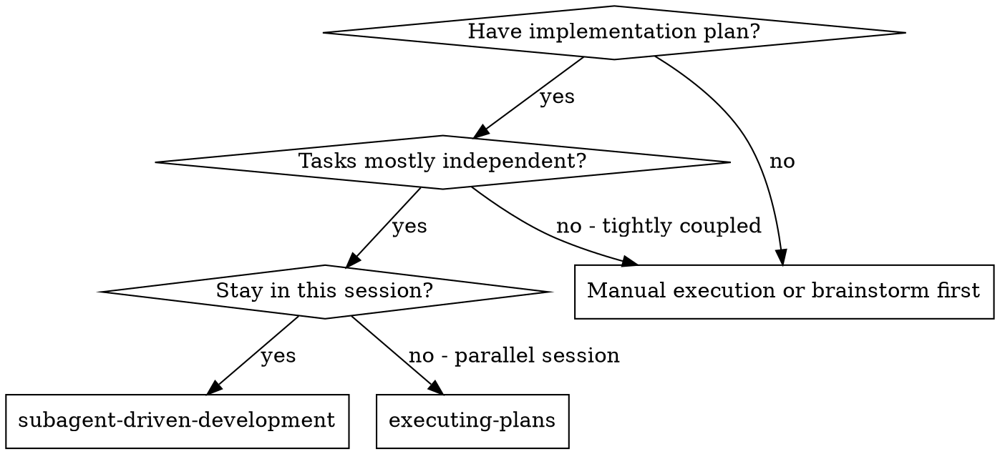
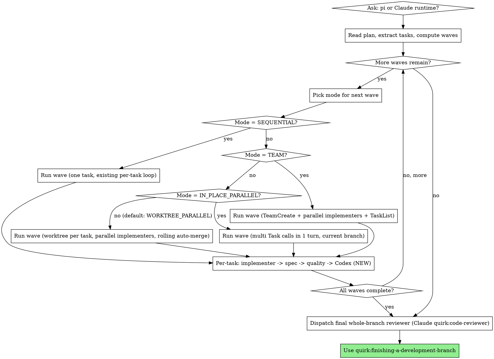

# Subagent-Driven Development

Execute plan by dispatching fresh subagent per task, with two-stage review after each: spec compliance review first, then code quality review.

**Why subagents:** You delegate tasks to specialized agents with isolated context. By precisely crafting their instructions and context, you ensure they stay focused and succeed at their task. They should never inherit your session's context or history — you construct exactly what they need. This also preserves your own context for coordination work.

**Core principle:** Fresh subagent per task + two-stage review (spec then quality) = high quality, fast iteration

## When to Use



**Parallel by default:** when the chosen path is `subagent-driven-development`, the orchestrator computes waves from declared task independence and selects per-wave between `SEQUENTIAL`, `IN_PLACE_PARALLEL`, `WORKTREE_PARALLEL`, and `TEAM` mode. Sequential is reserved for tasks with hard declared dependencies. See **The Process → Step 0b**.

**vs. Executing Plans (parallel session):**
- Same session (no context switch)
- Fresh subagent per task (no context pollution)
- Two-stage review after each task: spec compliance first, then code quality
- Faster iteration (no human-in-loop between tasks)

## Runtime Selection

**This skill supports two agent runtimes.** Before reading the plan, ask the user
which to use via `AskUserQuestion`:

> **Which agent runtime for this plan?**
> - **Claude subagents** (default) — `Task` tool with general-purpose / quirk:code-reviewer agents
> - **Pi agents** — `pi -p` headless dispatch with codex implementer + gemini reviewer

The choice is locked once and applies uniformly to per-task implementer + per-task
spec reviewer + per-task code-quality reviewer for the rest of the run.

**The final whole-branch reviewer always uses the Claude `quirk:code-reviewer`
agent**, regardless of choice — cross-task synthesis benefits from Claude's agent
context, and pi has no equivalent role.

| Role | Claude path | Pi path |
| --- | --- | --- |
| Implementer | `Task` (general-purpose) + `assets/implementer-prompt.md` | `pi -p` codex (`openai-codex/gpt-5.3-codex:xhigh`) + `assets/pi-implementer-prompt.md` |
| Spec reviewer | `Task` (general-purpose) + `assets/spec-reviewer-prompt.md` | `pi -p` gemini (`google/gemini-3.1-pro-preview:high`) + `assets/pi-spec-reviewer-prompt.md` |
| Code-quality reviewer | `Task` (quirk:code-reviewer) + `assets/code-quality-reviewer-prompt.md` | `pi -p` gemini (`google/gemini-3.1-pro-preview:high`) + `assets/pi-code-quality-reviewer-prompt.md` |
| Codex adversarial reviewer | `mcp__pal__clink` (cli_name=`codex`, role=`codereviewer`) + `assets/codex-adversarial-prompt.md` | `pi -p` codex (`openai-codex/gpt-5.3-codex:xhigh`, `--tools read,bash`) + `assets/pi-codex-adversarial-prompt.md` |
| Merge resolver (worktree mode only) | `Task` (general-purpose) + `assets/merge-resolver-prompt.md` | `pi -p` codex (`openai-codex/gpt-5.3-codex:xhigh`, `--tools read,bash,edit,write`) + `assets/pi-merge-resolver-prompt.md` |
| Final whole-branch reviewer | `Task` (quirk:code-reviewer) | `Task` (quirk:code-reviewer) — always Claude |

When the pi path is selected, **REQUIRED:** consult `quirk:pi-dev` for the
canonical hardened dispatch recipe, failure-detection rules, and reviewer JSON
parse fallback.

## The Process



`<runtime>` in asset paths is `` (empty) for the Claude path and `pi-` for the
pi path. So the implementer template is `assets/implementer-prompt.md` (Claude)
or `assets/pi-implementer-prompt.md` (pi); the Codex adversarial template is
`assets/codex-adversarial-prompt.md` (Claude) or `assets/pi-codex-adversarial-prompt.md` (pi);
and so on for spec reviewer, code-quality reviewer, and merge resolver.

### Step 0: Runtime selection (above)

### Step 0b: Read plan, extract tasks, compute waves

1. Read the plan file once. Extract every task with its full text and surrounding context.
2. Build a TodoWrite list of all tasks.
3. For each task, look for these optional fields (added by **quirk:writing-plans**):
   - `independent: true` — task can run alongside any other task in its eligible wave
   - `dependencies: [task-id, ...]` — task must wait for all listed tasks to complete
   - `scope.files: [path, ...]` — files this task is expected to touch
   - `cooperative: true` — task needs live negotiation with other tasks in its wave (TEAM mode)
4. Topologically sort tasks by `dependencies`.
5. Build successive waves: a wave contains tasks whose dependencies have all been satisfied AND that are mutually compatible (see Step 0c).

### Step 0c: Pick the mode for the current wave

```
if |wave| == 1:
    mode = SEQUENTIAL
elif any task in wave has cooperative: true:
    mode = TEAM
elif |wave| <= N_INPLACE_THRESHOLD AND scopes are provably disjoint at file level:
    mode = IN_PLACE_PARALLEL
else:
    mode = WORKTREE_PARALLEL    # default for 2+ independent tasks
```

`N_INPLACE_THRESHOLD = 2` by default. "Scopes provably disjoint at file level"
means every task in the wave declared `scope.files` AND no two tasks share
any file path.

If a task declared neither `independent: true`, `dependencies`, nor
`scope.files`, place it in its own singleton wave (= SEQUENTIAL). This is
the safe fallback for plans that haven't adopted the new format.

### Mode mechanics

#### SEQUENTIAL

Single Task call; existing per-task pipeline:
implementer -> spec compliance -> code quality -> Codex adversarial -> mark complete.

#### IN_PLACE_PARALLEL

1. Dispatch all wave implementers in **one message turn** via multiple
   `Task` calls (or multiple `pi -p` invocations on the Pi path).
2. All implementers operate on the current branch in the current worktree.
3. As each implementer finishes, its three-pass review chain
   (spec -> quality -> Codex) fires concurrently — per-implementer, not
   wave-batched.
4. By gate (Step 0c), in-place is only used when scopes are provably
   disjoint at file level — concurrent edits to the same file cannot happen,
   so the merge resolver is not invoked in this mode. If the gate is
   somehow violated and an implementer reports a `git` conflict during
   commit, abort the wave and escalate to the user (this is a gate bug,
   not a normal flow).

#### WORKTREE_PARALLEL (default for 2+ independent tasks)

1. For each task in the wave, create a worktree on a task-named branch via
   **quirk:using-git-worktrees**. Branch naming convention:
   `<parent-branch>/sdd/<task-id>`.
2. Dispatch all wave implementers in **one message turn**, each into its own
   worktree.
3. Per-task review chain (spec -> quality -> Codex) runs **inside the
   worktree on the implementer's commits**, before merge. Reviewers see
   clean, isolated diffs.
4. When a task's chain reaches PASS, run **rolling auto-merge**:
   `git merge --no-ff <branch>` from the parent branch. Merges are
   sequential (one at a time) as tasks finish; there is no wave-level
   barrier.
5. On true overlapping-hunk conflict during merge: dispatch the **merge
   resolver** (`assets/<runtime>merge-resolver-prompt.md`). Worktree is
   preserved until resolution.
   - On `Status: SUCCESS`: continue with the next branch in the rolling
     merge sequence.
   - On `Status: UNRESOLVABLE`: escalate to the user; preserve the worktree
     and the conflicted state.
6. After successful merge, tear down the worktree via
   **quirk:using-git-worktrees**.

#### TEAM (rare, opt-in via `cooperative: true`)

Adopts the persistent-team pattern: TeamCreate -> spawn all wave
implementers in one message turn -> TaskList coordination -> SendMessage
for cross-component negotiation -> TeamDelete after wave completes.

Per-task review chain fires per implementer as each completes. This is
the only mode where the "fresh subagent per task" guarantee is relaxed
within a wave; the relaxation is justified only when tasks need live
negotiation that the orchestrator cannot mediate after the fact.

### Per-task review chain (all modes)

Every task — regardless of mode — proceeds through:

```
implementer
  -> spec compliance reviewer  (existing — Task general-purpose / pi gemini)
  -> code quality reviewer     (existing — Task quirk:code-reviewer / pi gemini)
  -> Codex adversarial reviewer (NEW — PAL clink codex / pi codex; gap-finder, severity-tagged)
  -> mark task complete
```

The Codex adversarial reviewer:

- Reads files via `absolute_file_paths` (Claude path) or via the worktree
  filesystem (pi path with `--tools read,bash`).
- Returns SEVERITY-tagged findings (`CRITICAL | HIGH | MEDIUM | LOW`) with
  file:line citations and a final `VERDICT: PASS | NEEDS_FIXES |
  CRITICAL_ISSUES`.
- On CRITICAL/HIGH: dispatch the same implementer subagent with the
  findings; re-run Codex. **Cap: 2 cycles** total. After cycle 2, mark the
  task complete with unresolved findings flagged for the final
  whole-branch reviewer.
- MEDIUM: noted in the final report; does not block.
- LOW / VERDICT=PASS: task complete.

Existing spec-compliance and code-quality fix loops remain unbounded
(unchanged).

### Example (parallel wave under WORKTREE_PARALLEL)

```
You: I'm using Subagent-Driven Development to execute this plan.

[Read plan; extract 3 tasks]
[Plan declares: T1 independent, T2 independent, T3 depends: [T1]]
[Wave 1 = {T1, T2} (size 2, both independent, scopes overlap on README.md)]
  -> mode = WORKTREE_PARALLEL (overlap forbids IN_PLACE)

[Create worktrees: main/sdd/T1, main/sdd/T2]
[Dispatch implementers for T1 and T2 in one message turn]

T1 implementer finishes -> spec review (PASS) -> quality review (PASS) -> Codex review (PASS)
  -> rolling merge: git merge --no-ff main/sdd/T1 -> clean -> teardown worktree

T2 implementer finishes -> spec review (NEEDS_FIX) -> implementer fixes
  -> spec review (PASS) -> quality review (PASS) -> Codex review (CRITICAL_ISSUES)
  -> implementer fixes -> Codex review (PASS) [cycle 2 of 2]
  -> rolling merge: conflict on README.md -> dispatch merge resolver
  -> resolver: SUCCESS -> teardown worktree

[Wave 1 complete; T3's deps satisfied]
[Wave 2 = {T3} (singleton -> SEQUENTIAL)]
[Run T3 normally]

[All waves done]
[Dispatch final quirk:code-reviewer over the whole branch]
[Use quirk:finishing-a-development-branch]
```

## Model Selection

**Pi path:** Models are fixed by role — codex (`openai-codex/gpt-5.3-codex:xhigh`) for the
implementer, gemini (`google/gemini-3.1-pro-preview:high`) for both reviewers. Skip the
rest of this section.

**Claude path:** Use the least powerful model that can handle each role to conserve
cost and increase speed.

**Mechanical implementation tasks** (isolated functions, clear specs, 1-2 files): use a fast, cheap model. Most implementation tasks are mechanical when the plan is well-specified.

**Integration and judgment tasks** (multi-file coordination, pattern matching, debugging): use a standard model.

**Architecture, design, and review tasks**: use the most capable available model.

**Task complexity signals:**
- Touches 1-2 files with a complete spec → cheap model
- Touches multiple files with integration concerns → standard model
- Requires design judgment or broad codebase understanding → most capable model

## Handling Implementer Status

Implementer subagents report one of four statuses. Handle each appropriately:

**DONE:** Proceed to spec compliance review.

**DONE_WITH_CONCERNS:** The implementer completed the work but flagged doubts. Read the concerns before proceeding. If the concerns are about correctness or scope, address them before review. If they're observations (e.g., "this file is getting large"), note them and proceed to review.

**NEEDS_CONTEXT:** The implementer needs information that wasn't provided. Provide the missing context and re-dispatch.

**BLOCKED:** The implementer cannot complete the task. Assess the blocker:
1. If it's a context problem, provide more context and re-dispatch with the same model
2. If the task requires more reasoning, re-dispatch with a more capable model
3. If the task is too large, break it into smaller pieces
4. If the plan itself is wrong, escalate to the human

**Never** ignore an escalation or force the same model to retry without changes. If the implementer said it's stuck, something needs to change.

## Prompt Templates

All templates live in `assets/`. The dispatch path is selected by the runtime
chosen in **Runtime Selection**.

**Claude path:**
- `assets/implementer-prompt.md` — dispatch implementer via `Task` (general-purpose)
- `assets/spec-reviewer-prompt.md` — dispatch spec compliance reviewer via `Task` (general-purpose)
- `assets/code-quality-reviewer-prompt.md` — dispatch code quality reviewer via `Task` (quirk:code-reviewer)

**Pi path:**
- `assets/pi-implementer-prompt.md` — `pi -p` codex with `--tools read,bash,edit,write`
- `assets/pi-spec-reviewer-prompt.md` — `pi -p` gemini with `--tools read,bash` (read-only review)
- `assets/pi-code-quality-reviewer-prompt.md` — `pi -p` gemini with `--tools read,bash` (read-only review)

The pi templates reference **quirk:pi-dev** for the canonical hardened dispatch
recipe (timeout wrapper, exit-code capture, JSONL events file) and failure-detection
rules. Use that recipe verbatim when scripting; the pi templates show the minimum
interactive form.

## Example Workflow

```
You: I'm using Subagent-Driven Development to execute this plan.

[Read plan file once: docs/quirk/plans/feature-plan.md]
[Extract all 5 tasks with full text and context]
[Create TodoWrite with all tasks]

Task 1: Hook installation script

[Get Task 1 text and context (already extracted)]
[Dispatch implementation subagent with full task text + context]

Implementer: "Before I begin - should the hook be installed at user or system level?"

You: "User level (~/.config/quirk/hooks/)"

Implementer: "Got it. Implementing now..."
[Later] Implementer:
  - Implemented install-hook command
  - Added tests, 5/5 passing
  - Self-review: Found I missed --force flag, added it
  - Committed

[Dispatch spec compliance reviewer]
Spec reviewer: ✅ Spec compliant - all requirements met, nothing extra

[Get git SHAs, dispatch code quality reviewer]
Code reviewer: Strengths: Good test coverage, clean. Issues: None. Approved.

[Mark Task 1 complete]

Task 2: Recovery modes

[Get Task 2 text and context (already extracted)]
[Dispatch implementation subagent with full task text + context]

Implementer: [No questions, proceeds]
Implementer:
  - Added verify/repair modes
  - 8/8 tests passing
  - Self-review: All good
  - Committed

[Dispatch spec compliance reviewer]
Spec reviewer: ❌ Issues:
  - Missing: Progress reporting (spec says "report every 100 items")
  - Extra: Added --json flag (not requested)

[Implementer fixes issues]
Implementer: Removed --json flag, added progress reporting

[Spec reviewer reviews again]
Spec reviewer: ✅ Spec compliant now

[Dispatch code quality reviewer]
Code reviewer: Strengths: Solid. Issues (Important): Magic number (100)

[Implementer fixes]
Implementer: Extracted PROGRESS_INTERVAL constant

[Code reviewer reviews again]
Code reviewer: ✅ Approved

[Mark Task 2 complete]

...

[After all tasks]
[Dispatch final code-reviewer]
Final reviewer: All requirements met, ready to merge

Done!
```

## Advantages

**vs. Manual execution:**
- Subagents follow TDD naturally
- Fresh context per task (no confusion)
- Parallel-safe (subagents don't interfere)
- Subagent can ask questions (before AND during work)

**vs. Executing Plans:**
- Same session (no handoff)
- Continuous progress (no waiting)
- Review checkpoints automatic

**Efficiency gains:**
- No file reading overhead (controller provides full text)
- Controller curates exactly what context is needed
- Subagent gets complete information upfront
- Questions surfaced before work begins (not after)

**Quality gates:**
- Self-review catches issues before handoff
- Two-stage review: spec compliance, then code quality
- Review loops ensure fixes actually work
- Spec compliance prevents over/under-building
- Code quality ensures implementation is well-built

**Cost:**
- More subagent invocations (implementer + 2 reviewers per task)
- Controller does more prep work (extracting all tasks upfront)
- Review loops add iterations
- But catches issues early (cheaper than debugging later)

## Red Flags

**Never:**
- Start implementation on main/master branch without explicit user consent
- Skip reviews (spec compliance OR code quality)
- Proceed with unfixed issues
- Dispatch multiple implementation subagents in parallel (conflicts)
- Make subagent read plan file (provide full text instead)
- Skip scene-setting context (subagent needs to understand where task fits)
- Ignore subagent questions (answer before letting them proceed)
- Accept "close enough" on spec compliance (spec reviewer found issues = not done)
- Skip review loops (reviewer found issues = implementer fixes = review again)
- Let implementer self-review replace actual review (both are needed)
- **Start code quality review before spec compliance is ✅** (wrong order)
- Move to next task while either review has open issues

**If subagent asks questions:**
- Answer clearly and completely
- Provide additional context if needed
- Don't rush them into implementation

**If reviewer finds issues:**
- Implementer (same subagent) fixes them
- Reviewer reviews again
- Repeat until approved
- Don't skip the re-review

**If subagent fails task:**
- Dispatch fix subagent with specific instructions
- Don't try to fix manually (context pollution)

## Fallback (Pi runtime only)

Pi has no built-in retries beyond rate-limit backoff and no auto-detect for stale
versions. Apply the **quirk:pi-dev → Failure detection** rules in order. On
detection:

| Failure | Action |
|---|---|
| Auth (401, invalid api key, authentication_error) | **Fall back to Claude** for the rest of the run. Warn the user once. Don't consume retry budget — every worker hits the same wall. |
| Billing (`insufficient_quota`, `quota.exceeded`) | **Fall back to Claude** for the rest of the run. Warn the user once. |
| Rate limit (429, `rate_limit_error`, `RESOURCE_EXHAUSTED`) | One retry with 60s backoff. If the retry also fails, fall back to Claude for that role only. |
| Timeout (`gtimeout` exit 124) | Treat the worker as FAIL. Re-dispatch once with a longer timeout; if it times out again, fall back to Claude for that role. |
| Empty/missing JSONL events | Worker hung or never started. Re-dispatch once. If still empty, fall back to Claude for that role. |
| Unparseable reviewer output | Apply **quirk:pi-dev → Reviewer JSON parse fallback**. Never count unparseable as PASS — synthesize a NEEDS_FIX verdict and let the implementer fix-and-retry. |
| Pi version < 0.65.1 (preflight check) | Don't dispatch any pi worker. Tell the user to upgrade (`pnpm add -g @mariozechner/pi-coding-agent`) or fall back to Claude. |

When falling back, mark any partially completed task as needing re-review on the
Claude path before continuing to the next task. Don't silently continue with a
mixed-runtime task.

## Integration

**Required workflow skills:**
- **quirk:using-git-worktrees** - REQUIRED: Set up isolated workspace before starting
- **quirk:writing-plans** - Creates the plan this skill executes
- **quirk:requesting-code-review** - Code review template for reviewer subagents
- **quirk:finishing-a-development-branch** - Complete development after all tasks

**Required when pi runtime is selected:**
- **quirk:pi-dev** - Canonical hardened dispatch recipe, failure detection, reviewer JSON parse fallback, model alias resolution

**Subagents should use:**
- **quirk:test-driven-development** - Subagents follow TDD for each task

**Alternative workflow:**
- **quirk:executing-plans** - Use for parallel session instead of same-session execution
