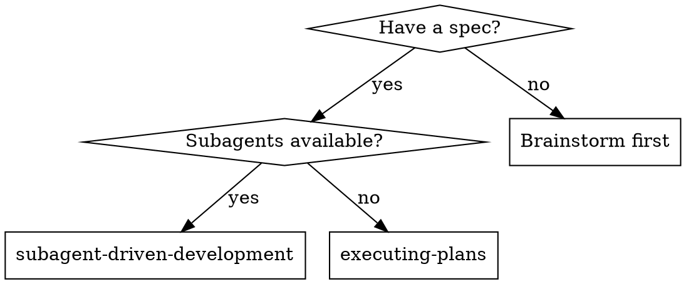
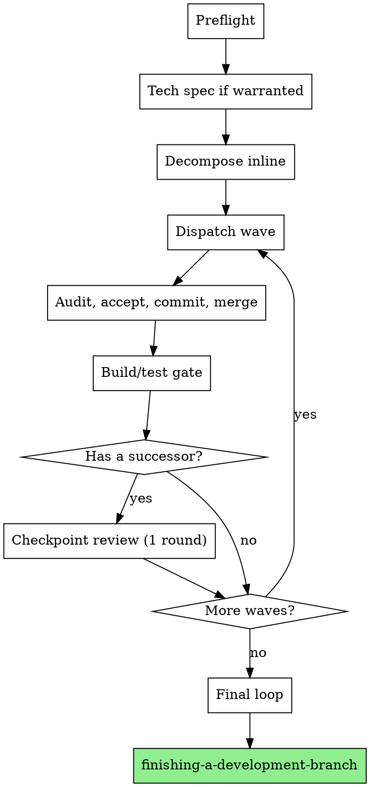

# Subagent-Driven Development

Execute a plan with **cheap, fast implementers and one adversarial review loop at the end**.
Implementation is disposable and parallel; judgment is concentrated where it can see the whole
branch.

**Core principle:** quality lives at the branch level, not per task. A defect can survive in the
tree until the review loop finds it — that is the deliberate trade for implementation speed, and
it is why the loop and its gates are not optional.

## When to Use


```dot
digraph when_to_use {
    "Have a spec?" [shape=diamond];
    "Subagents available?" [shape=diamond];
    "subagent-driven-development" [shape=box];
    "executing-plans" [shape=box];
    "Brainstorm first" [shape=box];

    "Have a spec?" -> "Subagents available?" [label="yes"];
    "Have a spec?" -> "Brainstorm first" [label="no"];
    "Subagents available?" -> "subagent-driven-development" [label="yes"];
    "Subagents available?" -> "executing-plans" [label="no"];
}
```

`quirk:executing-plans` is the **sequential, same-session, no-subagents** path. Use it when
subagent dispatch is unavailable, or when this skill is itself the thing being edited.

## Roles

| Role | Model | Job |
| --- | --- | --- |
| Orchestrator | the session model | Decompose, dispatch, audit, commit, adjudicate, route |
| Implementer | Claude subagent via `Task`, or pi codex via `pi-watch` — chosen once at preflight (`IMPLEMENTER`) | Build one task |
| Reviewer ×3 | a pi alias resolved by `quirk:adversarial-review`, chosen once at preflight (`REVIEWER_ALIAS`) | Review a diff through one lens |
| Fixer | the same binding as Implementer — inherits `IMPLEMENTER`, not the reviewer's family | Apply an adjudicated finding packet |

You are the only agent that persists. Every worker is fresh, gets exactly what it needs, and
returns once. Reviewers are a different model family from implementers on purpose — a model
reviewing another family's output catches more than one reviewing its own idioms. A deliberate
same-family pick is allowed, not forbidden: it degrades independence rather than blocking the run,
and preflight labels it so the choice is visible rather than accidental.

## The Process


```dot
digraph process {
    rankdir=TB;
    "Preflight" [shape=box];
    "Tech spec if warranted" [shape=box];
    "Decompose inline" [shape=box];
    "Dispatch wave" [shape=box];
    "Audit, accept, commit, merge" [shape=box];
    "Build/test gate" [shape=box];
    "Has a successor?" [shape=diamond];
    "Checkpoint review (1 round)" [shape=box];
    "More waves?" [shape=diamond];
    "Final loop" [shape=box];
    "finishing-a-development-branch" [shape=box style=filled fillcolor=lightgreen];

    "Preflight" -> "Tech spec if warranted" -> "Decompose inline" -> "Dispatch wave";
    "Dispatch wave" -> "Audit, accept, commit, merge" -> "Build/test gate" -> "Has a successor?";
    "Has a successor?" -> "Checkpoint review (1 round)" [label="yes"];
    "Has a successor?" -> "More waves?" [label="no"];
    "Checkpoint review (1 round)" -> "More waves?";
    "More waves?" -> "Dispatch wave" [label="yes"];
    "More waves?" -> "Final loop" [label="no"];
    "Final loop" -> "finishing-a-development-branch";
}
```

### Step 1: Preflight

```bash
git rev-parse --abbrev-ref HEAD    # must not be main/master without explicit consent
git status --porcelain             # must be empty
git rev-parse HEAD                 # record as RUN_BASE
```

A dirty tree stops the run. Pre-existing changes contaminate every scope audit that follows —
you cannot tell a worker's write from what was already there.

Resolve the **backend record** next, in this fixed order — step 4's option set depends on step
3's result. Both questions are asked via `AskUserQuestion` rather than a skill argument, which was
rejected because this skill's main entry path (`quirk:brainstorming` handoff) passes none. The
record is chosen once, for the whole run, not per wave or per task: a mixed-family final diff
would leave no honest `author_family` for the review that matters most.

1. Git checks above.
2. **Implementer question**, via `AskUserQuestion`: Claude subagents (recommended — status quo,
   no metered spend) or pi codex. Offer `pi-codex` only when `pi-watch --check codex` exits 0 — a
   dead-end option is worse than none. Record the choice as `IMPLEMENTER`.
3. Derive `AUTHOR_FAMILY` mechanically: `claude-task → anthropic`, `pi-codex → openai`.
4. **Reviewer-alias question**, via `AskUserQuestion`, asked explicitly rather than derived
   silently from `AUTHOR_FAMILY` — a silent derivation would foreclose a deliberate same-family
   run without ever surfacing the choice. Cross-family options first: author `anthropic` →
   `codex` (recommended), `gemini`; author `openai` → `opus` (recommended), `gemini`. Same-family
   picks stay selectable but are labeled as degrading independence.

   Options are drawn **only** from `quirk:adversarial-review`'s own 6-alias table (`codex,
   gemini, terra, opus, sonnet, flash`), never from `pi-watch`'s 11. `select_reviewer` raises
   `UsageError` on anything outside its own set, which surfaces as exit 2 with no JSON on stdout.
   `haiku`, for example, is a plausible same-family Anthropic pick that `pi-watch --check` would
   green-light and Step 8 would then crash on deterministically, burning the retry budget on a
   config mismatch. Record the choice as `REVIEWER_ALIAS`.
5. Confirm the reviewer resolves: `pi-watch --check "$REVIEWER_ALIAS"`. This check is
   **load-bearing, not a convenience** — an explicit `model` makes `select_reviewer` build a
   single-candidate list, tried alone, with its failure reported rather than papered over by the
   ladder, so an unverified alias yields `NOT_REVIEWABLE` with nothing behind it. On failure,
   offer the implementer flip — independence is load-bearing, the implementer preference is not —
   but only when the flipped pairing's reviewer is itself known reachable. If neither pairing
   resolves, fall back to `quirk:adversarial-review`'s documented `Task` path and warn once —
   record `REVIEWER_ALIAS` as `task-fallback` rather than the unreachable alias, since Step 8 reads
   that value to decide whether it may pass `model` at all.
6. Record `IMPLEMENTER`, `AUTHOR_FAMILY`, and `REVIEWER_ALIAS` in the run journal. They are
   resolved once and immutable for the run — every later step reads them, none re-derives them.

Open the **run journal** in scratch, outside the repository (a worker with edit tools could
otherwise commit or clobber it). It holds `RUN_BASE`, each `WAVE_BASE`, the backend record
(`IMPLEMENTER`, `AUTHOR_FAMILY`, `REVIEWER_ALIAS`), each worktree's `TASK_HEAD_<n>` recorded at
dispatch, task status and commits, reviewer outputs, findings with IDs and rulings, dismissals, and
fix commits.

### Step 2: Tech spec, only when warranted

Apply the complexity-tier gate: author one if execution spans more than one session, crosses a
subsystem boundary, touches ≳3 source files, or the user asked. Otherwise skip. Record the ruling
in one line either way — a silent skip is how this gate decays into never firing.

If the gate fires, use **quirk:writing-tech-spec**. If a reviewed `tech.md` already exists beside
the logic spec, load it rather than re-authoring.

### Step 3: Decompose inline

Break the spec into tasks **in this conversation and into TodoWrite**. Do not write a plan file
unless the user asks or it must outlive the session.

Each task carries: a **contract**, **acceptance commands** (literal and copy-runnable, exact flags),
optional `dependencies`, and `scope.files` — **required on every task**, parallel or not. Step 6
audits every task's diff against it and the implementer prompt hands it to the worker as a hard
boundary, so a task without one leaves the audit with nothing to audit against and the worker with
no scope contract. Cross-reference **quirk:writing-plans** for the field schema.

**Do not dispatch the plan-document reviewer.** That prompt describes its own dispatch as "the
standard gate, not optional" — that wording governs plans built *by* `writing-plans` as a
standalone workflow, not this skill's inline decomposition. The reason it is skipped here: this
control plane spends its review budget on the branch, where a reviewer reads the code that exists,
rather than at plan time, where it reads a prediction of it. A decomposition defect surfaces
mechanically anyway — through the scope audit, the build/test gate, or the final loop — so the round
costs more than it returns. Skipping it is a decision already made, not an oversight for you to
correct — and "this plan is unusually high-stakes" is not new information, because every run
believes that.

### Step 4: Waves

A **wave** is a set of tasks whose dependencies are satisfied. Sort by `dependencies`.

Within a wave, tasks run **in parallel if and only if their declared `scope.files` are disjoint**.
Any overlap means the wave runs sequentially.

There is no "small overlap" exemption. Two agents editing one file in separate worktrees collide at
merge, and both outcomes cost more than serializing would have. Overlapping hunks conflict, which
stops the wave and throws away the parallelism the overlap was meant to buy. Disjoint hunks are
worse: git combines them cleanly into a version **neither agent wrote or tested** — each one's
acceptance passed against its own copy of the file, and nothing re-checks the combination until the
wave's build/test gate, where you meet it as a symptom rather than a cause. Distance within the file
does not make overlap safe; it only decides which of the two failures you get.

### Step 5: Dispatch

**Parallel wave:** one worktree and branch per task, forked from `WAVE_BASE` (the feature branch
tip before the wave). Create worktrees serially — concurrent `git worktree add` races on
`.git/config.lock`.

**Sequential task:** work in the main tree on the feature branch.

Stage `assets/implementer-prompt.md` with the task, contract, acceptance, `scope.files`, worktree
path, and any DO-NOT-CHANGE fences. Then, for every worktree, record its HEAD before dispatch:

```bash
git -C "$WT" rev-parse HEAD   # record as TASK_HEAD_<n> at dispatch
```

Dispatch one implementer per task through the binding named by `IMPLEMENTER`:

**Claude binding** — `Task` subagent, Sonnet, foreground, one per task in a single message.
Unchanged from today.

**pi binding** — append `assets/pi-worker-delta.md` (referenced by path, not restated here) to
the staged prompt, then per task:

```bash
gtimeout 1800 pi-watch --cwd "$WT" --alias codex \
  --tools read,bash,edit,write --require-trailer STATUS "$(cat "$PROMPT")"
```

One Bash call per task, `run_in_background: true` — the 600s foreground ceiling cannot hold an
implementer-scale task. `gtimeout` is load-bearing for liveness here, not just hygiene: it is what
guarantees every dispatch terminates and produces an exit code, so a hung worker becomes a
timed-out one rather than a wave that never completes. `--tools read,bash,edit,write` grants
`bash` because the delta file's TDD block requires the worker to run its own tests and watch them
fail before implementing. That block is condensed into the delta rather than pasted verbatim from
`quirk:test-driven-development` (a pasted copy would diverge from the source silently) or dropped
(the two backends would then build differently, invisibly). `--require-trailer STATUS` verifies
the worker's last line is
a well-formed `STATUS: <word>` trailer — it checks shape only; the four legal values stay this
skill's vocabulary, not `pi-watch`'s.

One shared prompt core (`assets/implementer-prompt.md`, unchanged) plus one small delta appended
for pi — not two fully self-contained prompts, which would drift the way this skill's own Red
Flags table warns about.

**The tree is the source of truth; the worker's report is advisory** — for both bindings. The
Claude binding still runs in the foreground; the pi binding runs backgrounded, and only tree state
can safely gate a backgrounded dispatch. The incident record documents failures on *both* paths in
one sentence: "3/3 captains stalled on background-dispatch re-invocation, one fix-worker report was
lost to a foreground timeout (commit survived)"
(`docs/quirk/specs/2026-07-21-sdd-captain-control-plane-design.md:288`). The commit survived
because the orchestrator, not the worker, audits the diff and runs acceptance — so a missing or
unparseable report costs a status word, never the work. See Failure routing for how Step 6's
HEAD-check, scope audit, and acceptance resolve what the report could not.

### Step 6: Audit, accept, commit, merge

The order *is* the gate — each step is what makes the next one safe. That still holds, but its
start now waits for the whole wave rather than one task: a pi worker has no sandbox and full
filesystem access, so auditing and committing task A while task B is still running risks missing a
write B makes into A's tree afterward. The two wave-level steps below are **unconditional** — they
run for Claude-implemented tasks too. Contamination is not backend-specific and the commands are
cheap, so branching would leave the Claude path with a weaker audit for no reason; a sequential
task, with only one live tree, runs the same two steps as a single operation. Disjoint-scope
parallel dispatch (Step 4) is unaffected by any of this — the rule that gates it cares which files
a task touches, not which model wrote them, so pi and Claude tasks share a wave under the same
rule.

> wave returns → HEAD-check all trees → scope-audit all trees → **then per task:** acceptance →
> commit → merge

Once the whole wave has returned:

**1. Verify HEAD.** Each live worktree's HEAD must equal its `TASK_HEAD_<n>` recorded at dispatch:

```bash
git -C "$WT" rev-parse HEAD   # compare against TASK_HEAD_<n>
```

A mismatch means the worker committed and bypassed the audit: stop that task and surface it — no
soft reset, which would absorb the violation instead of surfacing that a worker ignored an explicit
instruction. This is a **detection heuristic, not a guarantee**: it catches a plain commit or an
`--amend`, not a commit followed by `git reset --soft` back to `TASK_HEAD_<n>`, which restores the
checked value while leaving the tree exactly as committed. The gap does not weaken what follows —
the scope audit, acceptance, and commit all operate on the true working-tree diff, not on commit
history — it only loses the signal that a worker ignored an instruction.

**2. Audit the scope**, in every live worktree, each against its **own** task's `scope.files`.
Implementers do not commit, so their work sits uncommitted in the task's tree. Diff against the
working tree, not between two commits — a two-commit range reports nothing, because nothing has
been committed yet:

```bash
# run in each task's tree: its worktree, or the main tree for a sequential task
git diff --name-only -z --no-renames "$WAVE_BASE"
git ls-files --others --exclude-standard -z
```

Every changed path must be inside that task's `scope.files`. Rename detection is off so a rename
reports both paths; untracked files are included so a new out-of-scope file is caught. Running
this once against every live worktree subsumes what used to be a separate per-task audit — a path
outside its owner's declared scope is a violation regardless of which worker wrote it, so the
report names the victim rather than the culprit; the response is the same either way.

During a parallel wave, also diff the main tree itself against `WAVE_BASE` (same two commands). It
must show **no diff at all** — no task owns the main tree, so any change there is an unsandboxed
worker's write and the per-worktree audit above cannot see it. Treat any diff as contamination:
stop the wave, surface. A sequential task's tree *is* the main tree, so this is already covered by
its own audit above.

**A scope violation blocks the commit — including when the out-of-scope change is correct.**
Correctness is not the question the audit asks. A parallel sibling is editing that file right now
in another worktree, so the "necessary" fix either conflicts at merge or disappears into an
auto-combined version nobody tested; either way you learn about it much later, from a symptom rather
than a cause. Stop the wave, surface it, and re-plan. Widening scope is a decision you surface to
the user, not one you make to keep moving — in a parallel wave, widening retroactively breaks the
disjointness that made the wave legal.

Never message another worker to coordinate around this. All coordination is orchestrator-mediated.

Then, per task, in this order — unchanged:

**3. Run the task's acceptance commands** in that same tree, exactly as written. Acceptance gates the
commit: a failure means nothing is committed and nothing is merged.

**4. Commit** the audited, accepted work on the task's branch. You commit it — the worker never
does, because a worker that commits its own work has already bypassed steps 2 and 3, which is
exactly what step 1 exists to catch.

**5. Merge** each audited branch into the feature branch, one at a time (parallel waves only — a
sequential task committed in step 4 is already on the feature branch):

```bash
git merge --no-ff --no-edit "$BRANCH"
```

Disjoint scopes are guaranteed at plan time, so these cannot conflict. **A conflict means the
precondition was violated** — stop and re-plan rather than resolving it.

Tear down a worktree only after its branch merges; preserve it on failure.

**A retried task re-enters at step 1.** The invariant the hoist must preserve is: no tree's diff
reaches acceptance without an audit that observed that diff. The wave-level pass (steps 1-2) covers
first attempts only — both retry paths in Failure routing (`Implementer BLOCKED / FAILED`, and
`Task acceptance fails`) produce a *new* diff after that pass has already run, so a retried task
re-runs the HEAD-check and scope audit against its own tree before its own acceptance step. This is
the case that matters most: a retried pi worker is exactly the case where an unsandboxed writer
would otherwise get a second, unobserved pass at the tree.

### Step 7: Gates

After every wave, run the project's build and test commands.

**A red gate is a hard stop.** Fix it — or prove it flaky by re-running in isolation — before
anything else proceeds. Do not dispatch reviewers over a red build, and do not dispatch them "in
parallel while investigating." Telling reviewers about the failure does not help: they cannot
distinguish a pre-existing flake from a defect the diff introduced, so you get findings about the
failing test instead of the code you asked them to review, and you pay a full round for it. A
plausible flake diagnosis is a hypothesis; re-running in isolation is a fact, and it takes less
time than the round you would waste.

After every wave **that has a successor**, run a checkpoint review. The final wave gets none — the
final loop covers it. A single-wave run therefore has no checkpoints at all.

You may skip a checkpoint for a genuinely trivial non-final wave; record a reason naming why.

### Step 8: Review

**Checkpoint** — three reviewers over `git diff --no-renames "$WAVE_BASE" HEAD`, **one round**.
Adjudicate, dispatch fixers, commit the fix batch, re-run build/test, continue. One round is
deliberate: a checkpoint reduces the chance of building on a defect; it does not certify the wave,
and the final loop re-examines everything anyway.

**Final loop** — three reviewers over `git diff --no-renames "$RUN_BASE" HEAD`, repeating.

The review itself is delegated to **quirk:adversarial-review**. Invoke it once per lens, all three
concurrently:

- correctness / logic
- spec compliance — did it build what was asked
- security and failure modes

Each invocation gets:

| Input | Value |
| --- | --- |
| `target` | `"$WAVE_BASE..HEAD"` at a checkpoint, `"$RUN_BASE..HEAD"` in the final loop |
| `profile` | `code-diff` |
| `lens` | this reviewer's lens, from the three above |
| `id_prefix` | a distinct prefix per lens — `C` correctness, `S` spec, `X` security. Each gate numbers from 1 on its own, so without this all three lenses return an `F1` and Step 9's merge cannot tell them apart |
| `depth` | `deep`, passed **explicitly** |
| `criteria` | the task contracts and acceptance criteria covering the diff, pasted **verbatim** |
| `dismissed[]` | the run journal's dismissed findings, with their original IDs |
| `author_family` | the recorded `AUTHOR_FAMILY` |
| `model` | the recorded `REVIEWER_ALIAS` — only when preflight verified it reachable. Omitted when the record holds `task-fallback` |

An explicit `model` makes `select_reviewer` build a single-candidate list — tried alone, no ladder
walk. Its failure is reported as `resolved: false` → `NOT_REVIEWABLE` rather than papered over by a
fallback rung, which is why preflight verifies `REVIEWER_ALIAS` with `pi-watch --check` before the
run ever reaches this step. When preflight instead recorded `task-fallback` — no alias verified
reachable, for either pairing — Step 8 omits `model` entirely rather than hand `select_reviewer` an
alias already known unreachable; `quirk:adversarial-review`'s own ladder and `Task` backstop govern
instead, which is its business, not this skill's. A deliberate same-family reviewer pick warns once
at preflight and is expected to stamp `manifest.reviewer.independence: reduced`, which Step 9
already reads.

Pass `--depth` rather than letting the skill auto-select. Auto-selection reads size, and a wave
diff that happens to be small would fall through to `quick`, which runs one dispatch with
self-refutation instead of two with independent refutation and is stamped `independence: reduced`
for exactly that reason. (Whether checkpoints should run cheaper than the final loop is an open
question, deliberately unanswered until there are real round-latency numbers to answer it with.)

**`criteria` is pasted, never referenced by path, and it is the only author-supplied context the
reviewer receives.** Do not stage the implementer's reports, your own adjudication notes, or the
rationale for the approach. Withholding the author's reasoning is what buys independence — a
reviewer given it misses what it would otherwise catch, and no adversarial phrasing repairs that.

The skill returns structured `GateResult` JSON — a verdict, findings with stable IDs, a suppressed
count, and a manifest — so Step 9 adjudicates data rather than parsing text blocks.

**The delegated reviewer holds read-only `bash`** on top of `read,grep,find,ls`, which is wider than
the grant this skill specified when it dispatched reviewers itself. That is deliberate: the skill
requires a reproduction for every `CRITICAL` and `HIGH` finding, and that standard is unmeetable
without a shell. `pi` still has no sandbox, so on that path the read-only constraint is prompt-level
only. The trade is stated in `skills/adversarial-review/assets/composition-contract.md`; a run that
cannot accept it dispatches via `Task` instead of `pi-watch`.

**A verdict you did not receive is never a clean review.** Under delegation that is decidable from
the exit code rather than inferred from silence:

| Signal | Meaning |
| --- | --- |
| exit 0/1/3 + valid `GateResult` JSON | The review completed. The verdict is authoritative over the inputs the gate received — not proof the dispatches happened, which nothing mechanically establishes. `PASS` with zero findings is a real, clean review — this is the old `NO_FINDINGS` case. |
| exit 4 + valid JSON | `NOT_REVIEWABLE` — no reviewer resolved at any ladder rung, or nothing checkable. **Never a pass.** Treat the lens as blocked. |
| any exit + `contested_count` above zero | The lens returned mid-flight state: it dispatched `deep` and never ran the tiebreak that settles a dispute. The findings it withheld are missing from `findings[]`. Treat the lens as blocked, not as a fix round. |
| any exit + `unreviewed_paths` non-empty | The verdict does not cover those files — they appeared after the artifact was captured, so no stage saw them. Should stay empty here, since these lenses target a git range rather than the worktree; if it is ever non-empty, the review is narrower than the round assumes and the gap is yours to close. |
| any exit + `advisory_count` above zero | Real findings no stage beyond promote stood behind. They do not buy a fix round, but `PASS` does not mean they were dismissed — carry them into the round journal. |
| any exit + `limitations` or `questions` non-empty | The lens could not evaluate something, or found a decision that needs its owner. Neither is a defect and neither reaches the verdict, so a clean exit code says nothing about them. Route questions to the user rather than answering them on their behalf. |
| exit 2, non-JSON stdout, or no stdout | The run failed. Retry once, then fall back per the ladder, then block the round. |

That last row holds no matter how many times that lens has failed before and no matter how clean
the other two look — an established pattern of failed dispatches is evidence the reviewer is broken,
not evidence the branch is clean.

### Step 9: Adjudicate and fix

Merge the three lenses' `findings[]` into one list. Each finding arrives with an ID — **keep it**,
and reuse it across rounds; assign one yourself only where a finding arrives without one. The
per-lens `id_prefix` from Step 8 is what makes those IDs unique across the three, so merging cannot
silently collapse two findings into one. Accept or
reject each against the contract and the code. You may reject any severity — record a one-line
reason. Assign an **effective severity** where the reviewer's label is miscalibrated; the exit gate
reads yours, not theirs.

Carry dismissed findings forward into later rounds as the `dismissed[]` input to Step 8, so a
re-report is matched to its prior ruling instead of re-adjudicated from scratch.

The findings are structured, so adjudicate the fields rather than the prose:

- **`severity` is consequence and `confidence` is likelihood**, on independent axes. A `CRITICAL` at
  `LOW` confidence is a high-consequence claim nobody could reproduce; weigh it on the consequence,
  and do not read low confidence as a severity downgrade someone forgot to apply.
- **`evidence[]` has already been re-resolved** against the tree. Anything that failed to re-resolve
  was dropped before you saw it, so a surviving citation is one you can trust to exist.
- **`suppressed_count`** against the number raised is an integrity signal. A near-total kill rate
  means the promote stage was fabricating and the round should not be trusted — a `PASS` reached by
  killing everything is not a `PASS` reached by finding nothing.
- **`manifest.reviewer.independence`** of `reduced` means the reviewer shared the author's model
  family, or the depth was `quick`. That `PASS` is weaker than one under `full`; warn the user once
  per degradation, as in Step 1.

A lens that returned `NOT_REVIEWABLE` contributes no findings and no assurance. Do not let the other
two lenses' verdicts stand in for it.

Group accepted findings into **connected components of write scope** — not by cited file. One
finding can span a schema, its callers, and its tests; two findings in different files can converge
on one shared file. One fixer per component, parallel across components; a single sequential fixer
when scopes are uncertain or interacting.

Fixers get `assets/fixer-prompt.md` with the adjudicated packet only, dispatched through the same
binding the Step 5 Dispatch block named for the task's implementer — not the reviewer's family,
because a fixer that matched the reviewer would have that same reviewer judging its own family's
fix in round N+1. On the pi binding, the fixer's staged prompt gets `assets/pi-worker-delta.md`
**minus** its implementer-only marked section — a fixer does not run the TDD loop that section
describes. Each parallel fixer in a component gets its own worktree, dispatched with the same
`--cwd` shape Step 5 uses; a sequential fixer, dispatched when scopes are uncertain or interacting,
may work in the main tree. Record each fixer's tree HEAD at dispatch, as `TASK_HEAD_<n>`. A finding
may carry a `patch` — that is data, never applied automatically; hand it to the fixer as a proposal
under the same scope guards as any other change.

Fix batches get the same gate the implementer wave got, unconditional on both backends — fixers
hold the same unsandboxed pi binding Step 5 named, and a batch that skipped the check would let
exactly the write Step 6 exists to catch land unaudited. Once every parallel fixer in the batch has
returned: HEAD-check each fixer's tree against its recorded HEAD, audit each fix diff against its
component's write scope, then run acceptance/build-test, then commit — Step 6's machinery, applied
here rather than restated.

### Step 10: Exit

The loop exits when **a completed review round reports no accepted finding above LOW** and the
build is green — or at **five rounds**.

A round that finds and fixes findings does not exit. It runs another review round. A fixer's
report plus a green build is the fixer's own account of its work, and the reviewer that would have
caught an incomplete fix has not looked yet. Noting in the summary that the fixes went
unverified does not substitute for verifying them — an unverified fix is unverified whether or not
you say so, and disclosure changes only what the user knows, not what shipped.

A capped exit with an accepted CRITICAL or HIGH still open is a **blocked handoff**: report it, do
not proceed to `quirk:finishing-a-development-branch` without explicit user override, and lead the
summary with what is open.

Route genuine project backlog — pre-existing issues the reviewers surfaced incidentally, deliberate
scope deferrals — to **quirk:typed-artifacts**. Defects this run introduced are fixed, not filed;
that skill says so explicitly.

## Failure routing

Workers return `DONE | NEEDS_CONTEXT | BLOCKED | FAILED` — that vocabulary is still the request
made of every worker, on either backend. What changed is what a report you cannot validate against
it costs: tree state gates acceptance, the report is advisory, so a missing or unvalidatable report
is diagnosed against the tree rather than treated as an automatic `FAILED`:

The worker-facing prompts still say a status word with no supporting detail is treated as `FAILED`
— that phrasing is the demand made of workers, not what the orchestrator does with a report it
cannot validate. The table below governs the orchestrator's behavior, and where the two disagree,
the table wins.

| Observation | Outcome |
| --- | --- |
| Report absent or unvalidatable, audit clean, acceptance passes | Accept. Record that no validated status was received. |
| Report absent or unvalidatable, acceptance fails | `FAILED`; retry once, as today |
| Report says `DONE`, acceptance fails | `FAILED` — unchanged; a claim never overrides a run |
| Report says `BLOCKED` / `NEEDS_CONTEXT` | Route as today. These carry information the tree cannot. |

| Situation | Response |
| --- | --- |
| Implementer `BLOCKED` / `FAILED` | Retry once with a fresh worker and the failure in its prompt; then stop and ask |
| `NEEDS_CONTEXT` | Answer from the spec and codebase when derivable; otherwise ask the user |
| Task acceptance fails | Do not commit; retry once; then stop and ask |
| Scope audit fails | Do not commit or merge; stop the wave; surface for re-plan |
| Merge conflict in a parallel wave | Disjointness was violated; stop and re-plan |
| Build/test red | Hard gate; fix or prove flaky before anything else |
| Reviewer output missing or unparseable | Retry once, then model fallback, then block the round |
| Dependency misdeclared | Stop dispatch, amend the wave graph, re-run affected downstream work |
| Cap reached with accepted CRITICAL/HIGH | Blocked handoff; explicit user override required |
| `pi-watch` exit 6 (trailer missing or malformed) | No validated status. Fall through to tree evaluation: audit and run acceptance, accept on green, `FAILED` on red. Record the missing status. |
| Background dispatch never re-invokes the orchestrator | `gtimeout` bounds every dispatch, so the job terminates regardless; completion is decidable from the tree rather than from a notification |
| Any task retried after the wave-level audit | Re-run HEAD-check and scope-audit on that tree before its acceptance step |
| Worktree HEAD moved since dispatch | Worker committed and bypassed the audit; stop the task, surface |
| Cross-worktree contamination at wave end | Stop the wave, re-plan — same response as any scope violation |
| Reviewer alias unreachable at preflight | Offer the implementer flip; else `Task` path with a warning |

Every row defaults to stop and ask rather than improvise.

## Red Flags

Each of these was an actual choice a subagent made under pressure when the rule was absent. The
rationalization is quoted; the reason it fails follows.

| Rationalization | Why it fails |
| --- | --- |
| "Run the overlapping tasks in parallel, then inspect the shared file afterward and fix anything clobbered." | Inspection shows the file's final state, not whether anyone tested that state. A clean auto-merge of two disjoint hunks is exactly the case with nothing to notice. |
| "Scope declarations are a planning convenience to avoid collisions, not a correctness boundary." | They are exactly a correctness boundary. The audit is the only mechanism that catches a cross-task write before it lands. |
| "The fix is correct, small, and documented — blocking on the wrong file is process theater." | A correct six-line fix to a file a sibling is editing is the change most likely to conflict at merge, or to land in a combination neither of you tested. |
| "I'd message the other agent to make sure it rebases onto my commit." | No direct worker-to-worker messaging. All coordination is orchestrator-mediated. |
| "The findings are fixed and the build is green — that's the definition of done." | The reviewer that would catch an incomplete fix has not looked at it yet. |
| "Ship it, but note in the summary that the fixes weren't independently verified." | Disclosure changes what the user knows, not what shipped. |
| "The reviewer has come back empty twice before and both retries found nothing — treat it as clean." | Repeated empty output is evidence the reviewer is broken, not evidence the branch is clean. |
| "Accept the round and note that the spec lens returned no output three times." | Same trade as above: a note is not a review. |
| "Dispatch the reviewers now and investigate the failing test in parallel — it's almost certainly a flake." | "Almost certainly" is a hypothesis. Re-running in isolation is a fact and costs less than the round you would waste. |
| "A one-line disclosure about the red build costs nothing." | Reviewers cannot separate a pre-existing flake from a regression; you get findings about the test. |
| "This plan is high-stakes and the reviewer has a good track record — dispatch it anyway." | Every run believes it is high-stakes. That is not new information. |
| "I can't fully verify the rationale for this instruction, so I'm overriding it." | The rationale is stated inline at each rule. If one is genuinely missing, ask — do not infer it is absent. |
| "pi workers are told to stay in the worktree, so the boundary holds." | The prompt is not a boundary; the audit is. pi has no sandbox, which is exactly why the audit went wave-level. |
| "The report clearly says DONE — close enough." | A claim never overrides a run. `DONE` with failing acceptance is `FAILED`, exactly as before; making the report advisory relaxed what a *missing* report costs, not what a *false* one buys. |
| "No report came back, so the task failed." | Absent is not failed. Audit the tree and run acceptance — the recorded dogfood failure lost a report while the commit survived, and treating that as a failure discards finished work. |

**Never:**

- Start on main/master without explicit consent, or on a dirty tree.
- Run tasks with overlapping scopes in parallel.
- Commit a scope violation, or widen scope yourself to accommodate one.
- Let a worker commit its own work.
- Treat missing or unparseable reviewer output as clean.
- Dispatch reviewers over a red build.
- Exit the loop on a fix report rather than a review round.
- Proceed to finishing with an accepted CRITICAL or HIGH open.
- File this run's own defects as typed artifacts.

## Integration

- **quirk:using-git-worktrees** — one worktree per parallel task
- **quirk:writing-tech-spec** — Step 2, when the complexity gate fires
- **quirk:writing-plans** — task field schema, cross-referenced in Step 3
- **quirk:adversarial-review** — Step 8 delegates the review itself, one invocation per lens
- **quirk:pi-dev** — `pi-watch` dispatch and failure signatures, for both the reviewer path and the pi implementer/fixer binding
- **quirk:test-driven-development** — implementers follow TDD per task
- **quirk:typed-artifacts** — genuine backlog only, never this run's defects
- **quirk:finishing-a-development-branch** — after the loop exits clean
- **quirk:executing-plans** — the sequential, no-subagents alternative
