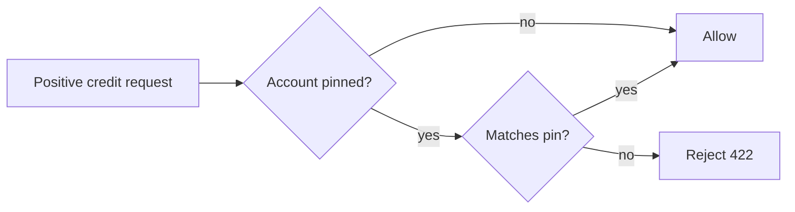

# Worked examples

One before/after pair for each of the 28 checks in `writing-scannable-prose`. See [SKILL.md](SKILL.md) for what each check means, its tag, and why it exists — this file only illustrates them. Groups are ordered F, A, B, C, D, E, matching SKILL.md.

Each entry shows a short **Before**, the **After**, and one line naming what changed. Markdown-in-markdown (headings, bold, tables) is fenced so it renders as literal text rather than being interpreted by this document.

## F — Does this section belong?

### F1 — Name the reader and the decision

**Before**

```markdown
This PR reworks the credit guard so a pinned account can no longer receive a
mismatched-rate top-up.
```

**After**

```markdown
**Reader: the on-call engineer — Decision: whether to enable
`multicurrency_credit_issuance_enabled`.** Everything below is tested against
that decision.

This PR reworks the credit guard so a pinned account can no longer receive a
mismatched-rate top-up.
```

Changed: added the one line naming who reads this and what they decide next, in the `Reader: <who> — Decision: <what they do next>` form, sourced from the flag's rollout ticket rather than guessed.

Full case: [verbose_example.md](../../docs/quirk/specs/2026-07-29-writing-scannable-prose/verbose_example.md) → [scannable_example.md](../../docs/quirk/specs/2026-07-29-writing-scannable-prose/scannable_example.md).

### F2 — Section materiality

**Before**

```markdown
## History of the Locking Approach

An earlier draft used a Redis lock instead of `SELECT ... FOR UPDATE`; that
was dropped in review because the lock provider is shared with an unrelated
rate limiter and contention there was unpredictable.
```

**After**

```markdown
(section removed)
```

Changed: the section's absence doesn't change whether the on-call enables the flag, so it fails materiality outright — not shortened, removed. This removal was proposed and approved before it was made.

Full case: [verbose_example.md](../../docs/quirk/specs/2026-07-29-writing-scannable-prose/verbose_example.md) → [scannable_example.md](../../docs/quirk/specs/2026-07-29-writing-scannable-prose/scannable_example.md).

### F3 — Re-home before removing

**Before**

```markdown
## Review Feedback Addressed

### Round 1 — review notes

| Feedback                          | Change              |
| ---------------------------------- | -------------------- |
| Comments read like a review transcript | Trimmed throughout |
| Counter naming was unclear         | Renamed              |

**Deferred — keep full precision everywhere.** The 2-decimal rounding stays
for now; the downstream renderer isn't precision-tolerant, so fixing it is a
separate change with its own blast radius.
```

**Wrong after — a residue stub**

```markdown
## Review Feedback Addressed

- Comment cleanup applied per the team standard.
- Deferred: kept 2-decimal rounding for now — see rationale above.
```

The section survives, shrunk to the two items someone judged load-bearing. It passes every clause-grain check — tight bullets, no dead words — while still being a section the reader never wanted: review-round history with no bearing on the on-call's decision.

**Right after**

```markdown
(no "Review Feedback Addressed" heading)

...

Ledger precision stays at 2 decimals for now: the downstream renderer isn't
precision-tolerant, so widening it is a separate change with its own blast
radius.
```

Changed: the section fails F2 in full, so F3 requires re-homing its survivors before it goes, not compressing it in place. The deferred-decision sentence moves into the section that already discusses precision — it changes what a reader concludes, so it stays somewhere. The comment-cleanup note has no reader-facing destination and is dropped.

Full case: [verbose_example.md](../../docs/quirk/specs/2026-07-29-writing-scannable-prose/verbose_example.md) → [scannable_example.md](../../docs/quirk/specs/2026-07-29-writing-scannable-prose/scannable_example.md) — the real "Review Feedback Addressed" section is removed entirely, and its still-relevant reviewer-guidance material is promoted to its own top-level heading rather than left behind as a stub. This is the exact failure the fixture pair was built to document.

### F4 — Detail level

**Before**

```markdown
We considered a Redis-backed queue for the fan-out first, but abandoned it
after load-testing showed connection churn under bursty traffic; Postgres
`LISTEN/NOTIFY` handles the same fan-out without a second datastore.
```

**After**

```markdown
Fan-out uses Postgres `LISTEN/NOTIFY` (approaches considered and rejected are
recorded in ADR-0032).
```

Changed: "approaches tried and rejected" is author-facing detail with a destination that isn't this document. ADR-0032 was already in the task's scope, so the move was performed; had it not been, F4 would have proposed the move and left the material in place until authorized. The surviving fact, which mechanism is in use, stays.

Full case: [verbose_example.md](../../docs/quirk/specs/2026-07-29-writing-scannable-prose/verbose_example.md) → [scannable_example.md](../../docs/quirk/specs/2026-07-29-writing-scannable-prose/scannable_example.md) — note what the fixture *keeps*: the rejected beta-flag decision and its rationale survive into the after-state, because a decision deliberately not made is the one author-facing-looking category F4 leaves in place. It tells the reader why the obvious alternative is absent.

## A — What a cut may touch

### A1 — Name the operation

**Before**

```markdown
The retry logic will generally succeed unless the queue is under heavy load,
in which case it may back off substantially before completing, due to the
fact that each attempt widens the backoff window.
```

*Operation named before editing: word-level — replacing a circumlocution. The hedges are not in scope for this cut.*

**After**

```markdown
The retry logic will generally succeed unless the queue is under heavy load,
in which case it may back off substantially before completing, because each
attempt widens the backoff window.
```

Changed: the only edit is lexical — "due to the fact that" becomes "because," a circumlocution with no information lost. "generally" and "may" are hedges scoping the claim; naming them correctly means handing them to A2/A4 rather than cutting them here. The heavy-load caveat survives intact either way.

### A2 — Scope conditions stay with the claim

**Before**

```markdown
Batch export completes quickly.[^1]

[^1]: Only true for exports under 50k rows; larger exports fall back to the
async job queue.
```

**After**

```markdown
Batch export completes quickly — for exports under 50k rows; larger exports
fall back to the async job queue.
```

Changed: the row-count caveat moved from a footnote into the same sentence as the claim it scopes. Wording can tighten; the fact can't be demoted out of the claim's visual unit.

### A3 — Orphan check

**Before**

```markdown
The service retries failed calls with exponential backoff (details in the
section below). For this reason, the client-side timeout was also shortened
to 2s.
```

*(the section below gets cut)*

**After**

```markdown
The service retries failed calls with exponential backoff, so the
client-side timeout was shortened to 2s to match.
```

Changed: the orphaned pointer is "(details in the section below)" — its referent, the section itself, is what gets cut, so both are removed together, A3's cut-pointer-with-referent resolution. "For this reason" points at the retry claim in the same sentence, which survives the cut and was never orphaned; it's reworded to "so" only because the two sentences merged into one.

### A4 — Cut license by content class

**Before**

```markdown
To deploy the change, you will want to first make sure that you have checked
out the latest version of the main branch, and then you can proceed to run
the migration script.
```

**After**

```markdown
Pull the latest `main`, then run the migration script.
```

Changed: "you will want to first make sure that you have" and "and then you can proceed to" dropped as filler, leaving bare imperatives. "the latest version of" survives as "latest" — it names an operation (a stale local branch must be updated), not padding. Procedural prose cuts hard toward imperatives; it does not cut steps.

### A5 — Dead words

**Before**

```markdown
It is important to note that the function performs a validation of the
input prior to utilization.
```

**After**

```markdown
The function validates input before using it.
```

Changed: expletive construction dropped, nominalization ("validation", "utilization") converted back to verbs.

### A6 — Route before deleting

**Before**

```markdown
...run `migrate.sh`. (As an aside, this script originally shipped as part of
the v1 tooling before the CLI rewrite, and its name hasn't changed since.)
```

**After**

```markdown
...run `migrate.sh`.
```
```markdown
Appendix — Historical note: `migrate.sh` predates the CLI rewrite; the name
was kept for continuity.
```

Changed: true, relevant material that doesn't change the reader's next step moved to an appendix instead of blocking the step or being deleted outright.

## B — Which device carries the logic

### B1 — Reversal test

**Before**

```markdown
- Back up the database.
- Run the migration.
- Restart the service.
```

**After**

```markdown
Back up the database before running the migration, because a failed
migration needs a rollback point; restart the service only after the
migration completes, since the process caches the old schema at boot.
```

Changed: reversing these steps changes what's safe to do, so they're a chained pair — moved out of a bare list into prose with explicit *because*-class connectives. Independent items would have stayed bulleted.

### B2 — Label the list relation

**Before**

```markdown
Supported deploy targets:

- AWS
- GCP
- On-prem
```

**After**

```markdown
Choose one deploy target:

- AWS
- GCP
- On-prem
```

Changed: a bare list reads as an implicit AND. Labelling it "choose one" removes the ambiguity about whether all three must be supported at once.

### B3 — Countable tables

**Before**

```markdown
| Pinned | Request | Outcome |
| ------ | ------- | ------- |
| yes    | credit  | reject  |
| yes    | debit   | allow   |
| no     | credit  | allow   |
```

**After**

```markdown
| Pinned | Request | Outcome |
| ------ | ------- | ------- |
| yes    | credit  | reject  |
| yes    | debit   | allow   |
| no     | credit  | allow   |
| no     | debit   | allow   |
```

Changed: two conditions with two states each means four rows. The `no`/`debit` combination was silently missing; the row count is now checked against the condition cardinalities and every combination is present.

### B4 — Figures need real shape

**Before**

```markdown

```

*(a single rounded box, no caption, no internal structure)*

**After**

````markdown

The diagram shows the guard's four-branch decision path: a positive credit is
allowed unless the account is pinned and the rate disagrees with the pin.
````

Changed: the flat image had no spatial or sequential shape to justify a figure. Replaced with a text-based diagram carrying a real decision structure, captioned in one sentence, and expressed as text so it diffs.

### B5 — Code answers "how", not "why"

**Before**

```python
guard.check(account, amount)
```

**After**

```python
guard.check(account, amount)
```

```markdown
Both `create_credit_adjustment` and the grant path call this before their own
write — the grant path is the one that establishes a pin, so it needs the
same check even though it never looked like it needed one.
```

Changed: the snippet alone answers "how do I call this." Composition across call sites and the rationale for calling it from the grant path needed prose; another snippet wasn't invented to carry them.

## C — Order and repetition

### C1 — Tail-chain test

**Before**

```markdown
The guard runs on both write paths, which is worth noting. It handles the
grant path too, as mentioned. This matters for correctness, as discussed
above.
```

**After**

```markdown
The guard runs on both write paths: the adjustment endpoint and the grant
path. The grant path establishes a pin, so it needs the same check. Skipping
it there would leave the one write the guard never sees.
```

Changed: reading the sentence-final words in isolation — "noting. mentioned. above." — showed pure filler. The after advances a fact at every line end.

### C2 — Subject-swap test

**Before**

```markdown
The guard rejects the request. A 422 is then returned by the error handler.
```

**After**

```markdown
The guard rejects the request. The error handler then returns a 422.
```

Changed: the passive's subject ("a 422") didn't echo the prior sentence, so it's rewritten active. A passive that does echo the prior subject — "The guard writes the opening row. The opening row is read back on the replica." — is left alone.

### C3 — Lead with the conclusion

**Before**

```markdown
## Known Limitation

Probed directly inside `db_session.begin()`: MySQL reports `@@autocommit = 1`,
and SQLAlchemy reports `in_transaction = True`. Given that combination, the
lock does not actually serialize anything.
```

**After**

```markdown
## Known Limitation — the row lock does not serialize anything

Probed directly: MySQL reports `@@autocommit = 1`, and SQLAlchemy reports
`in_transaction = True` — the combination that produces the gap.
```

Changed: the conclusion moved into the heading, so a reader who stops there still has the takeaway.

### C4 — Restate only where needed

**Before**

```markdown
## Post Deploy Monitoring

As explained above, the guard only reaches its decision clauses when the
account has a currency pin, and as detailed earlier, no accounts have pins in
production yet, so nothing will fire.
```

**After**

```markdown
## Post Deploy Monitoring

With zero pinned accounts (per the Known Limitation above), the guard
returns before it ever reaches a pinned account.
```

Changed: a heading intervened since the fact was last stated, so some restatement is warranted — but one orienting clause replaces two separate re-explanations.

## D — Emphasis and the linear channel

### D1 — Bold must be lexically complete

**Before**

```markdown
This change is **inert** on deploy — the guard never reaches a pinned
account because zero rows have the flag set.
```

**After**

```markdown
**The guard never reaches a pinned account: zero rows carry the flag.**
```

Changed: before, bold sat on a single word that meant nothing stripped of its sentence. After, the bold span is the complete, standalone claim — strip the bold and the claim is still there in the surrounding prose.

### D2 — Emphasis goes to unrecoverable risk

**Before**

```markdown
**Run `terraform plan` first.** Skipping the pinned-account check silently
issues credit at the wrong rate, and there is no way to detect it after the
fact.
```

**After**

```markdown
Run `terraform plan` first. Skipping the pinned-account check silently
issues credit at the wrong rate, and **there is no way to detect it after
the fact.**
```

Changed: bold moved from a routine reminder to the claim whose misreading is actually unrecoverable.

### D3 — Heading outline stands alone

**Before**

```markdown
## Overview
#### Details
```

**After**

```markdown
## Guard Behavior
### Decision Clauses
```

Changed: generic labels and a skipped heading level both break a reader navigating by headings alone; renamed and leveled correctly.

### D4 — Nothing load-bearing in decoration alone

**Before**

```markdown
| Change           | Status |
| ---------------- | ------ |
| Guard rollout     | 🟢     |
| Schema migration  | 🔴     |
```

**After**

```markdown
| Change           | Status                                              |
| ---------------- | ---------------------------------------------------- |
| Guard rollout     | Safe to deploy — inert until the flag is on          |
| Schema migration  | Blocks deploy — requires the backfill job to finish   |
```

Changed: color alone carried the distinction, invisible in the linear channel. The words now carry the same information the color used to carry alone.

### D5 — List length by channel

**Before**

```markdown
Changes: renamed helper, added guard clause, removed flush, widened opening
exemption, added service tests, added helper tests, fixed NaN handling,
updated docstring, removed banner comments, dropped ticket refs, ...
```

*(a flat list in a notification digest the reader can't scroll back through)*

**After**

```markdown
Three groups of changes: the guard itself (new clause, widened exemption,
removed the pre-lock flush); test coverage (service and helper cases,
including the NaN/Infinity fix); and comment cleanup (banners and ticket
refs removed per the team standard).
```

Changed: an unaided digest can't be visually re-consulted, so the flat list was grouped into three short spans instead of trimmed. A list in a document the reader can scroll and re-read may stay long.

### D6 — Table accessibility

**Before**

```html
<table>
<tr><td></td><td>AWS</td><td>GCP</td></tr>
<tr><td>Guard</td><td>Yes</td><td>No</td></tr>
</table>
```

**After**

```html
<table>
<caption>Guard support by deploy target</caption>
<tr><th scope="col"></th><th scope="col">AWS</th><th scope="col">GCP</th></tr>
<tr><th scope="row">Guard</th><td>Yes</td><td>No</td></tr>
</table>
```

Changed: added a caption and `scope` on every header cell, so a screen reader can announce which column or row a given cell belongs to.

## E — Staying true

### E1 — Perishable facts point at their source

**Before**

```markdown
The default timeout is 30 seconds.
```

**After**

```markdown
The default timeout is set by `DEFAULT_GUARD_TIMEOUT_SECONDS` in
`config.py`.
```

Changed: a value that changes at code speed was pointed at its source instead of restated, so the doc can't drift from the code independently.

### E2 — Executable examples

**Before**

```markdown
Run something like `curl -X POST .../credit_adjustments -d '{"amount": ...}'`
to test the guard.
```

**After**

````markdown
```bash
curl -X POST "$API_BASE/api/credit_accounts/$PINNED_ACCOUNT_ID/credit_adjustments" \
  -H 'Content-Type: application/json' \
  -d '{"amount": "100.00", "type": "credit"}'
```
`API_BASE` and `PINNED_ACCOUNT_ID` come from the test fixture; CI runs this exact
invocation via `pytest test_credit_adjustments_api.py::test_pinned_account_rejects_topup`.
````

Changed: the hand-waved call became the literal invocation CI runs, parameterized from the fixture rather than a placeholder host that cannot resolve, so drift between doc and behavior fails a test instead of shipping silently.

### E3 — Never gate on a readability score

**Before**

```markdown
This section scored 62 on Flesch-Kincaid, so it's simple enough to ship
as-is.
```

**After**

```markdown
This section states the guard's four outcomes and nothing else; the gate is
whether a reader can name the outcome for their case.
```

Changed: a readability score was standing in for whether the section works for its reader. Replaced with the actual thing the section has to do.
