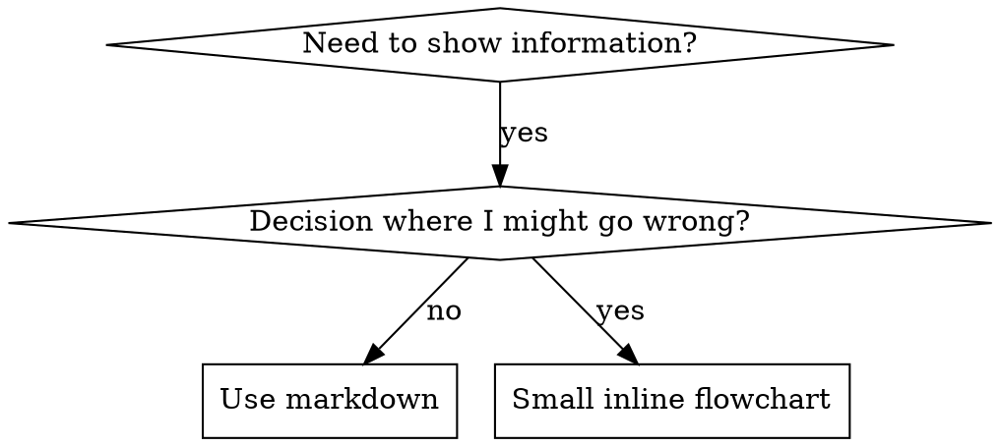

# Writing Skills

## Overview

A **skill** is a reusable reference for a proven technique, pattern, or tool that future agents can find and apply. Skills are reusable guides — NOT narratives about how you solved something once.

**Every skill has two independent failure modes. Design and test for both:**

- **Activation** — the skill never fires; the model doesn't invoke it, so the body never runs. Fixed in the **description**. See [activation-testing.md](activation-testing.md).
- **Execution** — the skill fires, but the model doesn't do what the body says. Fixed in the **body** and its type-scoped tests.

They have different causes and different fixes. Don't conflate them: a perfectly written body is worthless if the skill never activates, and a reliably-firing skill is worthless if its body is ignored.

**Lineage (so you know which rules are which):** the RED-GREEN-REFACTOR discipline, the "Iron Law", "CSO", and rationalization-resistance in this skill come from the community `obra/superpowers` tradition. Anthropic's own framing is lighter — "evaluation-driven development" — and its bundled best-practices doc ([anthropic-best-practices.md](anthropic-best-practices.md)) never mentions rationalization or persuasion. Where the two diverge, this skill says so. Treat the superpowers-heritage rules as sharp tools for a specific job, not universal law.

## When to Create a Skill

**Create when:**
- Technique wasn't intuitively obvious to you
- You'd reference this again across projects
- Pattern applies broadly (not project-specific)
- Others would benefit

**Don't create for:**
- One-off solutions
- Standard practices well-documented elsewhere
- Project-specific conventions (put in CLAUDE.md)
- Mechanical constraints (if it's enforceable with regex/validation, automate it—save documentation for judgment calls)

## Skill vs Command vs Subagent vs CLAUDE.md vs MCP

Pick the mechanism before writing:

- **External access** (APIs, databases, live state) → **MCP server**.
- **Context isolation / a specialist persona** → **subagent**.
- **Reusable procedural knowledge the model should apply on its own** → **skill**.
- **Something you want to fire only on explicit command** → **slash command** (or a skill gated from auto-invocation).
- **Always-on project rules/context** → **CLAUDE.md** — but keep it lean; over-stuffed always-loaded context measurably degrades results.

These compose: a subagent can apply a skill that calls an MCP tool. "Which one" is usually "the right layer for this piece", not "only one".

## Skill Types

### Technique
Concrete method with steps to follow (condition-based-waiting, root-cause-tracing)

### Pattern
Way of thinking about problems (flatten-with-flags, test-invariants)

### Reference
API docs, syntax guides, tool documentation (office docs)

### Discipline-enforcing
Enforces a rule the agent is tempted to rationalize away (TDD, verification-before-completion, safety gates). Highest testing bar.

### Creative / subjective
Shapes voice, tone, design, or ideation, where "correct" is a judgment call, not a binary. Validated by rubric + human read, not a failing test.

## Directory Structure

```
skills/
  skill-name/
    SKILL.md              # Main reference (required)
    supporting-file.*     # Only if needed
```

**Flat namespace** - all skills in one searchable namespace

**Separate files for:**
1. **Heavy reference** (100+ lines) - API docs, comprehensive syntax
2. **Reusable tools** - Scripts, utilities, templates

**Keep inline:**
- Principles and concepts
- Code patterns (< 50 lines)
- Everything else

## SKILL.md Structure

**Frontmatter (YAML):**
- Two required fields: `name` and `description` (see [agentskills.io/specification](https://agentskills.io/specification) for all supported fields)
- Max 1024 characters total
- `name`: Use letters, numbers, and hyphens only (no parentheses, special chars)
- `description`: Third person, states both what the skill does and when to use it (see Activation, below, for why)
  - Front-load concrete triggers: symptoms, situations, phrasings a user would type
  - Keep under 500 characters if possible

```markdown
---
name: Skill-Name-With-Hyphens
description: Use when [specific triggering conditions and symptoms] — [what the skill does]
---

# Skill Name

## Overview
What is this? Core principle in 1-2 sentences.

## When to Use
[Small inline flowchart IF decision non-obvious]

Bullet list with SYMPTOMS and use cases
When NOT to use

## Core Pattern (for techniques/patterns)
Before/after code comparison

## Quick Reference
Table or bullets for scanning common operations

## Implementation
Inline code for simple patterns
Link to file for heavy reference or reusable tools

## Common Mistakes
What goes wrong + fixes

## Real-World Impact (optional)
Concrete results
```

## Activation — getting the skill to fire

The model decides whether to invoke a skill from its `name` + `description` alone. This is the most common real-world failure: the skill never fires.

- Description states **both what the skill does AND when to use it** — front-load the trigger phrases a user would actually type (symptoms, file types, error wording, synonyms).
- Be specific and assertive enough to fire. Anthropic's own skill-creator advises making descriptions a little "pushy" because models tend to *under*-trigger. (This is about the description's *content*, not a license for caps-heavy body prose.)
- `name` uses lowercase letters, numbers, hyphens; gerund/active voice; and matches the skill's directory name.
- Prefer small, single-purpose skills — tightly-scoped descriptions compete less and trigger more predictably than one broad skill.
- Watch the other direction too: an over-eager description causes false-positive triggering that wastes tokens and derails tasks.

**Test activation explicitly** — write should-trigger and should-not-trigger prompts and observe. See [activation-testing.md](activation-testing.md).

### Keyword Coverage

Use words Claude would search for:
- Error messages: "Hook timed out", "ENOTEMPTY", "race condition"
- Symptoms: "flaky", "hanging", "zombie", "pollution"
- Synonyms: "timeout/hang/freeze", "cleanup/teardown/afterEach"
- Tools: Actual commands, library names, file types

### Descriptive Naming

**Use active voice, verb-first:**
- ✅ `creating-skills` not `skill-creation`
- ✅ `condition-based-waiting` not `async-test-helpers`

**Name by what you DO or core insight:**
- ✅ `condition-based-waiting` > `async-test-helpers`
- ✅ `using-skills` not `skill-usage`
- ✅ `flatten-with-flags` > `data-structure-refactoring`
- ✅ `root-cause-tracing` > `debugging-techniques`

**Gerunds (-ing) work well for processes:**
- `creating-skills`, `testing-skills`, `debugging-with-logs`
- Active, describes the action you're taking

## The "description body-skip" hypothesis (reframed)

Older versions of this skill asserted: *if a description summarizes the workflow, the model follows the description and skips reading the body.* Treat that as a **hypothesis, not a law.**

It traces to a single, unreplicated report (`obra/superpowers`): one skill did one review instead of two after its description summarized the workflow, attributed to the model following the description over the body. No controlled experiment has isolated this, and official Anthropic guidance points the other way on description *content* — a description should state **both what the skill does and when to use it**, and be assertive enough to fire.

**So:** keep descriptions terse and trigger-forward for **activation** (well-evidenced), but don't starve the description of "what it does" on the theory that it prevents body-skipping (not evidenced). If a loaded skill isn't being followed, that's an **execution** problem — fix it in the body with explicit steps and checks, not by trimming the description. If you want to know whether summarizing hurts *your* skill, test it (fittingly, this specific claim was never itself tested).

## Execution — getting it right once loaded

Once a skill fires, these determine whether the body is actually followed:

- **Progressive disclosure.** SKILL.md is a hub; push heavy material into reference files linked one level deep. Keep the always-on body lean.
- **Match freedom to fragility.** High-freedom prose for flexible tasks; low-freedom exact scripts for fragile, must-be-consistent operations.
- **Operationalize rules; don't just describe them.** The highest-leverage execution fix, independently reproduced by practitioners: telling the model *what to say back*, what an acceptable reply looks like, and what failure looks like constrains behavior; a stated principle gets rationalized away. Prefer explicit checklists and worked steps over exhortation.
- **One excellent example** beats many mediocre ones.

### Token Efficiency (Critical)

**Problem:** getting-started and frequently-referenced skills load into EVERY conversation. Every token counts.

**Target word counts:**
- getting-started workflows: <150 words each
- Frequently-loaded skills: <200 words total
- Other skills: <500 words (still be concise)

**Techniques:**
- **Move details to tool help.** Don't document every flag in SKILL.md; reference `--help` instead.
- **Use cross-references, not repetition.** Point to another skill by name (`REQUIRED: Use [other-skill-name]`) instead of re-explaining its workflow inline.
- **Compress examples.** A tight two-line example teaches the same pattern as a verbose multi-paragraph one.
- **Eliminate redundancy.** Don't repeat what's in cross-referenced skills, don't explain what's obvious from the command, don't include multiple examples of the same pattern.

**Verification:** `wc -w skills/path/SKILL.md` against the targets above.

### Cross-Referencing Other Skills

**When writing documentation that references other skills:**

Use skill name only, with explicit requirement markers:
- ✅ Good: `**REQUIRED SUB-SKILL:** Use quirk:test-driven-development`
- ✅ Good: `**REQUIRED BACKGROUND:** You MUST understand quirk:systematic-debugging`
- ❌ Bad: `See skills/testing/test-driven-development` (unclear if required)
- ❌ Bad: `@skills/testing/test-driven-development/SKILL.md` (force-loads, burns context)

**Why no @ links:** `@` syntax force-loads files immediately, consuming context before you need them.

### Flowchart Usage



**Use flowcharts ONLY for:**
- Non-obvious decision points
- Process loops where you might stop too early
- "When to use A vs B" decisions

**Never use flowcharts for:**
- Reference material → Tables, lists
- Code examples → Markdown blocks
- Linear instructions → Numbered lists
- Labels without semantic meaning (step1, helper2)

See [graphviz-conventions.dot](graphviz-conventions.dot) for graphviz style rules.

**Visualizing for your human partner:** Use `render-graphs.js` in this directory to render a skill's flowcharts to SVG:
```bash
./render-graphs.js ../some-skill           # Each diagram separately
./render-graphs.js ../some-skill --combine # All diagrams in one SVG
```

### Code Examples

**One excellent example beats many mediocre ones**

Choose most relevant language:
- Testing techniques → TypeScript/JavaScript
- System debugging → Shell/Python
- Data processing → Python

**Good example:**
- Complete and runnable
- Well-commented explaining WHY
- From real scenario
- Shows pattern clearly
- Ready to adapt (not generic template)

**Don't:**
- Implement in 5+ languages
- Create fill-in-the-blank templates
- Write contrived examples

You're good at porting - one great example is enough.

## File Organization

### Self-Contained Skill
```
defense-in-depth/
  SKILL.md    # Everything inline
```
When: All content fits, no heavy reference needed

### Skill with Reusable Tool
```
condition-based-waiting/
  SKILL.md    # Overview + patterns
  example.ts  # Working helpers to adapt
```
When: Tool is reusable code, not just narrative

### Skill with Heavy Reference
```
pptx/
  SKILL.md       # Overview + workflows
  pptxgenjs.md   # 600 lines API reference
  ooxml.md       # 500 lines XML structure
  scripts/       # Executable tools
```
When: Reference material too large for inline

## Testing & validation — scoped by skill type

Match rigor to skill type. Anthropic's own guidance conditions testing on type: objectively-verifiable skills benefit from test cases; subjective/creative skills often don't need them ("you can tell by reading two paragraphs whether the voice is right").

- **Discipline-enforcing → the Iron Law applies: NO SUCH SKILL WITHOUT A FAILING TEST FIRST.** Watch the agent violate the rule *without* the skill before you write it (RED), write the minimal skill that closes those exact rationalizations (GREEN), then plug new loopholes (REFACTOR). Full method: [testing-skills-with-subagents.md](testing-skills-with-subagents.md).
- **Technique → apply it to a fresh scenario; probe for gaps.**
- **Pattern → recognition + counter-examples.**
- **Reference → retrieval + correct application.**
- **Creative/subjective → rubric + human read, not a binary failing test.**

**The Iron Law is scoped, not universal.** It is the right default for discipline-enforcing skills only. Trivial, non-behavioral edits (typos, rewording, reordering) don't need a fresh RED phase; edits that change a rule, a workflow step, or a discipline constraint do.

**Activation is a separate test axis** from all of the above — a skill can have a flawless body and still never fire. Test triggering separately: [activation-testing.md](activation-testing.md).

### Testing All Skill Types, in detail

| Type | Examples | Test with | Success criteria |
|---|---|---|---|
| Discipline-enforcing | TDD, verification-before-completion, designing-before-coding | Academic questions (do they understand the rule?); pressure scenarios; multiple pressures combined (time + sunk cost + exhaustion); identify rationalizations and add explicit counters | Agent follows the rule under maximum pressure |
| Technique | condition-based-waiting, root-cause-tracing, defensive-programming | Application scenarios; variation/edge-case scenarios; missing-information tests for gaps | Agent successfully applies the technique to a new scenario |
| Pattern | reducing-complexity, information-hiding | Recognition scenarios; application scenarios; counter-examples (do they know when NOT to apply it?) | Agent correctly identifies when/how to apply the pattern |
| Reference | API docs, command references, library guides | Retrieval scenarios; application of what was retrieved; gap testing for common use cases | Agent finds and correctly applies the reference information |

### For discipline-enforcing skills only: resisting rationalization

The tools below (rationalization tables, red-flag lists, "violating the letter is violating the spirit", persuasion framing in [persuasion-principles.md](persuasion-principles.md)) are for guardrail skills that must survive adversarial pressure. **Do not apply them by default.** For everything else, prefer explaining the *why* over caps-heavy MUST/NEVER rules — Anthropic's own style guidance flags all-caps absolutism as a "yellow flag".

**Psychology note:** Understanding WHY persuasion techniques work helps you apply them systematically. See [persuasion-principles.md](persuasion-principles.md) for the research foundation on authority, commitment, scarcity, social proof, and unity principles.

#### Close every loophole explicitly

Don't just state the rule — forbid specific workarounds. Weak: "Write code before test? Delete it." Strong: "Write code before test? Delete it. Start over. No exceptions: don't keep it as reference, don't adapt it while writing tests, don't look at it. Delete means delete."

#### Address "spirit vs letter" arguments

State early: **"Violating the letter of the rules is violating the spirit of the rules."** This cuts off the entire class of "I'm following the spirit" rationalizations.

#### Build a rationalization table

Capture every excuse agents make during baseline testing, paired with the reality:

| Excuse | Reality |
|--------|---------|
| "Too simple to test" | Simple code breaks. Test takes 30 seconds. |
| "I'll test after" | Tests passing immediately prove nothing. |
| "Skill is obviously clear" | Clear to you ≠ clear to other agents. Test it. |
| "Testing is overkill" | Untested skills have issues. A few minutes of testing saves hours. |
| "I'm confident it's good" | Overconfidence guarantees issues. Test anyway. |
| "No time to test" | Deploying untested skill wastes more time fixing it later. |

**All of these mean: test before deploying. No exceptions — for discipline-enforcing skills.**

#### Create a red-flags list

Make it easy for agents to self-check when rationalizing — e.g. "code before test", "I already manually tested it", "this is different because..." All of these mean: delete, start over.

#### Update the description for violation symptoms

Add symptoms of when the agent is *about to* violate the rule, e.g. `description: use when implementing any feature or bugfix, before writing implementation code`.

### RED-GREEN-REFACTOR for skills

Follow the TDD cycle: **RED** — run the pressure scenario with a subagent WITHOUT the skill; document exact choices and verbatim rationalizations (you must watch it fail before writing the skill). **GREEN** — write the minimal skill addressing those specific rationalizations, then re-run; the agent should now comply. **REFACTOR** — new rationalization surfaces, add an explicit counter, re-test until bulletproof.

**Full methodology** (pressure scenario design, pressure types, plugging holes systematically, meta-testing): [testing-skills-with-subagents.md](testing-skills-with-subagents.md).

## Skills in subagents and Teams

Skill availability is NOT guaranteed inside a dispatched worker. Before relying on a skill in a subagent or Team task:

- **Don't assume a dispatched subagent sees your custom skills.** Availability differs from the main session.
- **Built-in agents may not access custom skills at all.** If a worker must apply a skill, verify it can — or inline the needed guidance in the dispatch prompt.
- **In the GREEN phase, confirm the skill actually loaded.** A subagent that "passes" may have passed *without* the skill — then you've tested nothing. Check that it was invoked, not just that the output looked right.

Exact mechanics change across Claude Code versions; verify current behavior rather than trusting a fixed rule.

## Anti-Patterns

### ❌ Narrative Example
"In session 2025-10-03, we found empty projectDir caused..."
**Why bad:** Too specific, not reusable

### ❌ Multi-Language Dilution
example-js.js, example-py.py, example-go.go
**Why bad:** Mediocre quality, maintenance burden

### ❌ Code in Flowcharts
```dot
step1 [label="import fs"];
step2 [label="read file"];
```
**Why bad:** Can't copy-paste, hard to read

### ❌ Generic Labels
helper1, helper2, step3, pattern4
**Why bad:** Labels should have semantic meaning

### ❌ Force-Loaded Cross-References
```markdown
@skills/testing/test-driven-development/SKILL.md
```
**Why bad:** `@` syntax force-loads the file immediately, burning context before it's needed. Use a markdown link and a `**REQUIRED SUB-SKILL:**` marker instead.

## Security & trust (brief)

Skills are trusted-by-proxy: a loaded skill steers the agent. When **authoring**, follow the principle of least surprise (behavior matches description; frontmatter tool lists are documentation, not a sandbox). When **installing** someone else's skill, vet every file (including scripts and test fixtures), scan for hidden/invisible instructions, and confirm stated purpose matches actual instructions. Full checklist: [security-vetting.md](security-vetting.md).

## Before moving to the next skill

Validate each skill before you commit it — shipping an unvalidated skill ships unverified behavior, the same way shipping untested code does. Batching several skills and validating none is the failure mode to avoid.

What "validated" means depends on the type:

- **Discipline-enforcing skills:** the full gate applies — you can't skip the RED-before-GREEN failing test, so finish that cycle before committing.
- **Everything else:** complete the skill's type-appropriate validation (see "Testing & validation — scoped by skill type" above) before moving on — a fresh-scenario application for a technique, recognition + counter-examples for a pattern, retrieval for a reference, a rubric read for creative work.

The deployment checklist below walks through this per skill.

## Skill Creation Checklist (TDD Adapted)

**IMPORTANT: Use TodoWrite to create todos for EACH checklist item below.**

**RED Phase - Write Failing Test (for discipline-enforcing skills):**
- [ ] Create pressure scenarios (3+ combined pressures for discipline skills)
- [ ] Run scenarios WITHOUT skill - document baseline behavior verbatim
- [ ] Identify patterns in rationalizations/failures

**GREEN Phase - Write Minimal Skill (for discipline-enforcing skills):**
- [ ] Name uses only letters, numbers, hyphens (no parentheses/special chars)
- [ ] YAML frontmatter with required `name` and `description` fields (max 1024 chars; see [spec](https://agentskills.io/specification))
- [ ] Description states both triggers/symptoms AND what the skill does
- [ ] Description written in third person
- [ ] Description tested for activation (should-trigger / should-not-trigger)
- [ ] Keywords throughout for search (errors, symptoms, tools)
- [ ] Clear overview with core principle
- [ ] Address specific baseline failures identified in RED
- [ ] Code inline OR link to separate file
- [ ] One excellent example (not multi-language)
- [ ] Run scenarios WITH skill - verify agents now comply

**REFACTOR Phase - Close Loopholes:**
- [ ] Identify NEW rationalizations from testing
- [ ] Add explicit counters (if discipline skill)
- [ ] Build rationalization table from all test iterations
- [ ] Create red flags list
- [ ] Re-test until bulletproof

**Quality Checks:**
- [ ] Small flowchart only if decision non-obvious
- [ ] Quick reference table
- [ ] Common mistakes section
- [ ] No narrative storytelling
- [ ] Supporting files only for tools or heavy reference

**Deployment:**
- [ ] Commit skill to git and push to your fork (if configured)
- [ ] Consider contributing back via PR (if broadly useful)

**Distribution:** default to team-private — commit skills you rely on to your own repo (`.claude/skills/`). Publish publicly only when a skill solves a generalizable problem, is battle-tested, and you'll maintain it. There is no official verified marketplace or signing.

## Discovery Workflow

How future Claude finds your skill:

1. **Encounters problem** ("tests are flaky")
2. **Finds SKILL** (description matches)
3. **Scans overview** (is this relevant?)
4. **Reads patterns** (quick reference table)
5. **Loads example** (only when implementing)

**Optimize for this flow** - put searchable terms early and often.

## The Bottom Line

Skills fail in exactly two ways: they don't fire (activation), or they fire but aren't followed (execution). Design and test each independently. For discipline-enforcing skills, that means the Iron Law and RED-GREEN-REFACTOR; for everything else, lighter validation scoped to type — but activation testing applies across the board.
